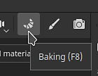

# 如何烘焙網格貼圖

Substance 3D Painter 的專用烘焙模式讓你輕鬆烘焙網格貼圖，能驅動優秀的智慧材質和其他工具。 繼續閱讀，或觀看下方影片，學習如何開始使用 Substance 3D Painter 烘焙。

## 1 - 切換到烘焙模式

預設情況下，Painter 在建立或開啟專案時會以繪畫模式啟動。 要烘焙網格貼圖，你需要切換到烘焙模式。 請使用以下選項之一切換到烘焙模式：

* 請在視窗右上角的情境工具列中使用 <b>烘焙模式按鈕</b> （<b>可頌圖示</b>）

  

  >[!NOTE]
  >
  > 有時 <b>烘焙模式按鈕</b>會隱藏在其他面板後面，視你工作區的配置而定。
* 使用模式選單，選擇 <b>烘焙網格貼圖。\
  </b>
* 請使用 <b>F8</b> 鍵盤快捷鍵。

### 2 - 選擇材質集與 UV 圖塊

在材質集清單</b>中<b>，使用每個材質集旁的勾選框（如果有 UV 磚塊編號）來選擇要烘焙的部分：

### 3 - 精選烘焙師

在 Mesh Map Bakers 視窗中，使用勾選框選擇你想要烘焙的貼圖：

### 4 - 更改常見設定

在 Mesh Map bakers 面板中，點選共用設定，以更改像是烘焙地圖解析度、膨脹寬度和高多邊形參數等所有貼圖共用的設定：

在通用設定中，你可以定義哪些檔案要用作高畫質網格。 選擇高畫質網格可以讓你定義籠子如何為你的網格產生：

* 基於距離：將頂點從網格膨脹到均勻的距離，形成籠狀結構。
* 自動（實驗）：Painter 會分析你的網格並自動生成籠子，盡量讓籠子靠近表面而不產生交叉點，以達到最佳效果。
* 自訂檔案：匯入你已建立的檔案作為籠子使用。 請注意，匯入的檔案頂點數必須與基礎網格相同，才能正常運作。

如果你不是從高多邊形網格烘焙，請啟用 <b>「使用低多邊形網格作為高多邊形網格</b> 」的勾選框。

### 5 - 調整籠子

根據你使用的籠子方法，有不同的調整方式可供選擇。 使用距離為基礎的籠子，你可以調整正面和後方距離，以減少籠子與網格之間的交叉點。

>[!NOTE]
>
> 當籠子與模型幾何結構交會時，會出現紅點。 交叉籠子通常會導致交叉區域出現瑕疵和問題。

### 6 - 開始烘焙過程

在視窗底部，點擊烘焙按鈕開始烘焙過程。

### 7 - 檢查烘焙日誌是否有錯誤

烘焙過程結束後，你可以查看烘焙日誌視窗，檢查是否有錯誤回報。

如果有，請使用錯誤訊息旁的箭頭查看相關的烘焙設定：

