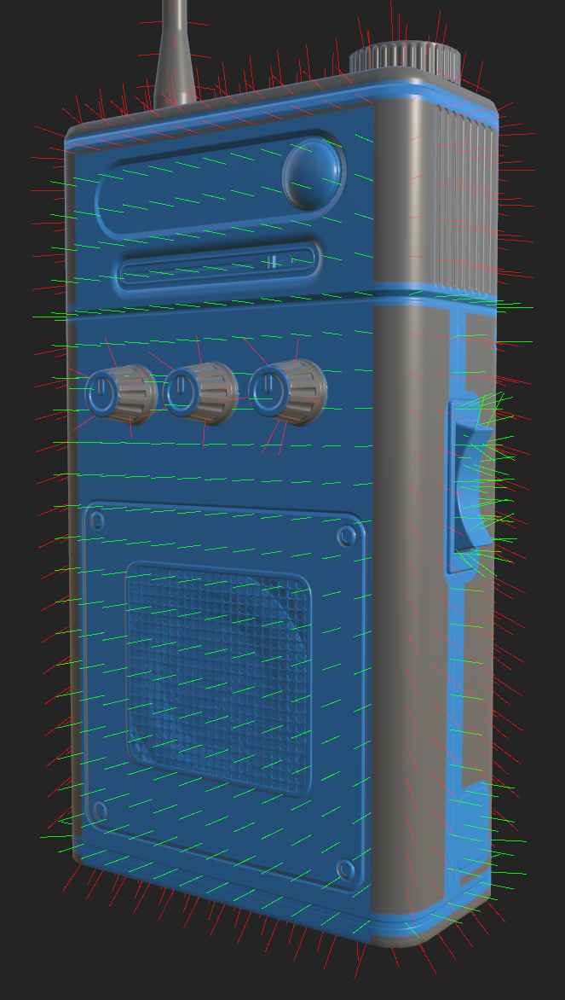

# 偏斜修正

<table>
  <tr style="border: 0;">
    <td style="border: 0; width: 35%" valign="top"></td>
    <td style="border: 0; width: 65%" valign="top">有時候從高多邊形模型烘焙到低多邊形時，細節可能會看起來變形或歪斜。 這通常是因為籠狀法線和表面法線對齊不好時發生的。 自動烘焙會根據這些法線值將高多邊形投影到低多邊形上，如果這些值不正確，烘焙後的結果就會很差。 幸運的是，有 Skew 校正（或稱 Skew 映射）技術可以幫助修正這類偽影。 偏斜校正允許你直接在低多邊形網格上繪製數值，重新導向烘焙時使用的投影，而不需要建立自訂籠子。</td>
  </tr>
</table>

>[!NOTE]
>
> 傾斜修正會繪在烘焙模式&#x200B;**中**，並依照材質集儲存。

## 油漆偏斜修正

斜角修正繪圖允許你手動調整網格的表面法線，專門用於烘焙。 雖然你可以不烘焙來繪製偏斜修正，但先[&#128279;](how-to-bake-mesh-maps.md)烘焙你的網格貼圖會有幫助。

*切換到烘烤模式以進入偏斜校正設定。*

>[!IMPORTANT]
>
> 斜角校正繪畫需要以下設定：
>
> * 需要選擇一個高多邊形場景。 斜繪僅在從高多邊形烘焙到低多邊形時可用;如果&#x200B;**勾選了「使用低多邊形網格」作為高多邊形網格**，則無法&#x200B;**使用斜斜修正繪製**。
> * **&#x200B;**&#x200B;籠子必須設定為&#x200B;**距離為基礎**。
> * **必須檢查平均常態值** 。

使用上述設定後，你可以在&#x200B;**「共用設定」面板**&#x200B;點選&#x200B;**「繪圖偏斜修正**」開始上色。當你第一次進入偏斜修正繪圖模式時， **正常通道的自動重新烘焙** 會自動開啟。 如果需要，你可以關閉&#x200B;**自動重新烘焙**，或在網格地圖烘焙面板&#x200B;**[&#128279;](../interface/baking-panels/mesh-map-bakers.md)中**&#x200B;更改所選通道。

### 繪畫工具

在繪製偏斜修正時，你可以使用許多你在繪畫模式中習慣的工具和快捷鍵，包括 **橡皮擦** 和 **多邊形填充** 工具。

* 你可以在工具列切換 **刷子**、 **橡皮擦**&#x200B;和 **多邊形填充** ，或使用繪畫模式的標準 [鍵盤快捷鍵](../interface/settings/shortcuts.md) 。
* 使用筆刷或橡皮擦工具時，你可以根據視窗&#x200B;**頂部**&#x200B;的參數調整筆刷大小、流度、透明度和間距。你也可以使用相關的 [快捷鍵](../interface/settings/shortcuts.md) （如果有的話）。

### 邊緣保護

邊緣保護會忽略邊緣附近繪製的斜斜修正，以維持表面法線的平滑漸層。 你可以在傾斜修正&#x200B;**區段切換**&#x200B;邊緣保護&#x200B;**。**&#x200B;啟用邊緣校正&#x200B;**後**，你可以調整邊緣距離和邊緣對比度，以達到最佳效果。

* 邊緣距離：控制邊緣保護生效的距離。
* 邊緣對比度：控制邊緣保護的漸層。 低對比度會產生更平滑的漸層。

>[!TIP]
>
> 邊緣距離&#x200B;**與**&#x200B;邊緣對比&#x200B;**度的數值**&#x200B;是根據網格大小而定。對於細節相較於網格大小非常小的網格，手動輸入小值可能比使用滑桿更簡單。

>[!NOTE]
>
> 邊緣保護是基於 **硬邊** 網格貼圖，該貼圖綁定在網格的幾何體上，而非 UV 邊界。

### 偏向量視覺化

預設情況下，當你開始繪製偏斜修正時，網格表面法線會在視窗&#x200B;**中**&#x200B;以紅、黃、綠三色線條呈現。你可以在&#x200B;**&#x200B;**&#x200B;視窗中出現&#x200B;**的視覺化選單**&#x200B;中&#x200B;**，修改這些線條的外觀或完全關閉它們。**

* **向量長度**：調整視窗中線條的長度。 較長的線條能讓理解向量的方向變得更容易。
* **向量 UV 密度**：改變網格表面上的線條數量。 向量放置在 UV 空間中，因此如果網格的像素密度不一致，單位表面積的向量數量會隨多邊形大小在 UV 映射中變化。
* **向量不透明度**：讓向量變得較透明或更透明。

向量的顏色表示在每個向量位置施加的偏斜修正量。

* 紅色向量表示沒有偏斜修正——使用預設的表面法線。
* 綠色向量表示表面法線完全校正且垂直於表面。

*低流量值的繪畫能細緻控制偏斜修正的強度。*

## 優化效能

### 組織 UV

**自動重新烘焙** 優化為嘗試限制重新烘焙區域，僅在繪製偏斜修正時，被每一筆觸影響。 當你繪製筆觸時， **自動重新烘焙** 會在 UV 空間中畫出一個包圍框，並重新烘焙該框內的所有元素。 這表示如果你的筆觸只覆蓋一小段 UV 空間，重烤的區域會非常有限，讓操作效率很高。

然而，如果筆劃恰巧穿越 UV 空間兩側的兩個 UV 島，即使是很小的筆劃，也可能需要重新烘焙整個貼圖，導致優化失效。

因此，我們建議組織網格 UV，使得在 3D 空間中彼此接近的 UV 島嶼也在 UV 空間中彼此接近。 這提升了自動重烘焙&#x200B;**的效能**。

### 將對齊設定為 UV

一般來說，將 **投影>對齊** 設定為 UV 來繪製偏斜修正會更有效率。 更改 **陣營**：

1. 選擇 **「油漆偏斜修正** 」，並裝備畫 **筆** 或 **橡皮擦**。
1. 在視窗&#x200B;**中右鍵點擊**&#x200B;即可開啟&#x200B;**筆刷設定面板**。
1. 往下滑到 **投影**。
1. 將對齊&#x200B;**設定**&#x200B;為 **UV**。

當 **對齊** 設定為 **UV** 時，要在 UV 島接縫上繪製平滑筆觸會比較困難，不過這通常在繪製斜斜修正時不如貼圖時重要。

>[!NOTE]
>
> 刷&#x200B;**子和**&#x200B;橡皮擦&#x200B;**的參數**&#x200B;分別儲存。為了最大化兩個工具的效能，你需要分別設定 **對齊** 。

## 偏斜修正與復原堆疊

烘焙和繪畫有著相同的歷史。 在烘焙模式與繪製模式間切換本身就是無法操作的步驟，啟用或關閉偏斜修正也可以被撤銷。 在繪製模式下，烘焙動作中復原時，烘焙模式會自動重新開啟，避免步驟還沒完成，所以動作在發生時的模式外永遠不會被撤銷。