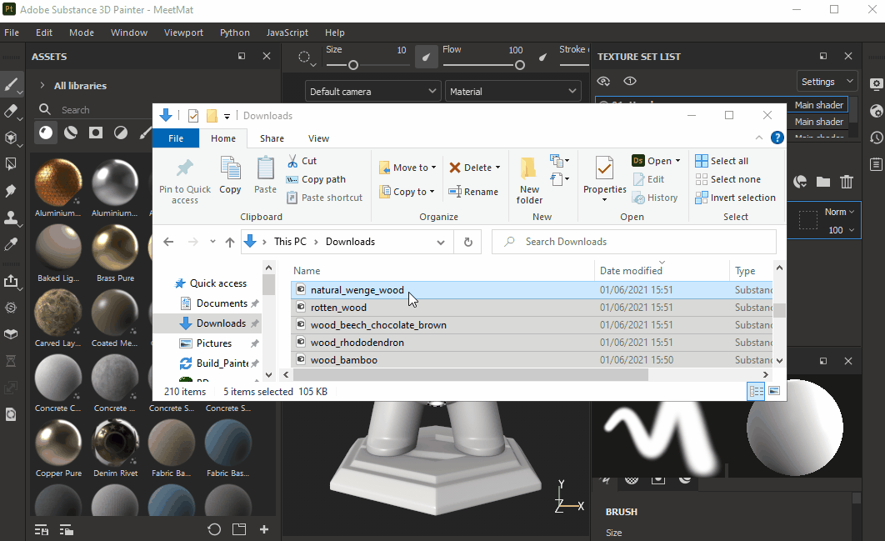

# 透過匯入視窗新增資源

## 開啟匯入視窗

在 Substance 3D Painter 中開啟匯入視窗有三種不同的方式：

* 透過  **檔案>匯入資源...**  選單輸入

* 透過&#x200B;**資產視窗中的專用按鈕**

* 透過  **拖放**  一個或多個檔案/資料夾到資產視窗

{width="700px"}

## 設定匯入視窗

* **1 - 新增資源**：允許選擇更多檔案匯入，這些檔案會被加入匯入視窗的清單顯示中。
* **2 - 移除選取資源：** 移除列表中所選的檔案。
* **3 - 下拉選單篩選**&#x200B;器：允許依使用情況篩選檔案清單。 這對於隔離具有「未定義」類型的資源非常有用。
* **4 - 使用**  方式：有多種不同的使用類型可供選擇。 所建議的使用清單可能會依你匯入的檔案格式而有所不同。 如果你的檔案格式只有一種使用類型（例如，Painter 預設的 .sppr 會自動定義為一種），或是原始 Designer 圖形中已由其創建者預先設定，使用法可能會被預先選擇。
* **5 - 前綴**  ：前綴可以是資料夾路徑，用以定義資源的存放位置。
* **6 - 檔名**  ：目前資源名稱。 有時會標示資源存放的資料夾，但匯入過程中不會使用這些資訊。
* **7 - 進口地點**  ：可以是以下兩種 -
  * **目前會話**  ：進入臨時會話時，重新啟動應用程式後資源會被損失。
  * **專案「專案名稱」**  ：進入目前已開啟的專案檔案。 資源嵌入在  **spp**  檔案中。
  * **書架「書架名稱」**  ：進入目前定義為可寫入的函式庫。 更多資訊請參見此頁面： [圖書館設定](../../interface/settings/libraries-configuration.md)。

你可以在匯入視窗多重選擇資源（使用系統常用捷徑），快速編輯使用情況。
