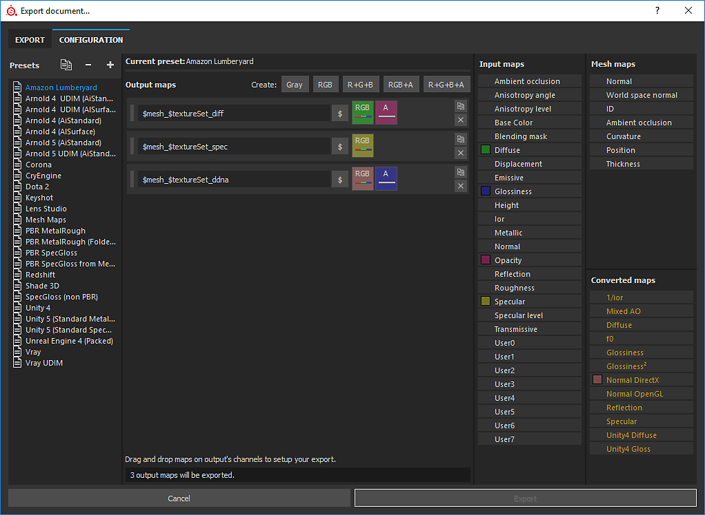

# 建立輸出範本

本頁說明如何建立與修改自訂輸出範本。 輸出範本控制匯出材質的命名與設定。 建立自訂輸出範本能讓你有能力設定匯出內容，使其完全符合你的工作流程。

匯出視窗的設定標籤分為三個主要部分：

* <b>預設清單：</b> （左）允許選擇編輯或複製現有範本的範本。
* <b>輸出材質清單</b>：（中間）列出所選預設的內容，並顯示命名規則及通道打包選項。
* <b>通道</b> 與 <b>轉換材質</b>列表：（右）列出用於合成匯出材質內容的通道與材質清單。

{width="800px"}

>[!NOTE]
>
> 輸出範本會以獨立檔案</b>形式儲存在磁碟<b>上，並可與其他 Substance 3D Painter 使用者分享。\
> 你可以在 Substance 3D Painter 檔案[&#128279;](../pipeline-and-integration/resource-management/shelf-and-assets-location.md)的 assets/export-presets 資料夾中找到你所建立自訂範本的本地檔案。

>[!NOTE]
>
> 當範本用於匯出貼圖時，該範本檔案會自動包含在後續存檔的專案檔案中。\
> 這允許分享和/或將專案移至另一台電腦，同時保留匯出材質的範本。\
> 專案中只會儲存最後使用的預設。 但如果 Substance 3D Painter 偵測到同名的預設，專案內的預設會在列表中被標記為「過時」。

## 建立範本

在預設清單的最上方，有三個按鈕：

* <b> 複製</b> ：複製現有範本。
* <b> 移除</b> ：刪除任何選取的範本。
* <b> 建立</b> ：建立一個新的且空白的範本。

你也可以雙擊範本，或 <b>右鍵點擊重命名</b> >更改範本名稱。

## 建立輸出映射

一旦選擇範本，就可以利用視窗中段頂部的專用按鈕新增新的輸出地圖。

建立地圖後，可以命名並拖放輸入映射到可用頻道槽中。\
一旦輸入地圖被放入輸出地圖區塊，會跳出選單詢問該槽位要載入哪種類型的內容。

選項範圍從 RGB 和獨立通道，到<b>輸入的 Alpha</b> 和<b>灰階</b>轉換都有。</b> <b></b> <b>

>[!NOTE]
>
> 每次拖放輸入地圖時，都會產生一個隨機顏色。 這會提供通道及相應輸入映射的視覺提示。\
> 按鈕同時顯示槽中裝入的物品：
> 
> * 背景色：表示 <b>哪些輸入</b> 映射已載入。
> * RGB 條：表示 <b>輸入映射中的 R</b> 、 <b>G</b> 和 <b>B</b> 通道已載入。
> * 紅色條：表示 <b>輸入映射中的紅色</b> 通道已載入。
> * 綠色條：表示 <b>輸入映射中的綠色</b> 通道已載入。
> * 藍色條：表示 <b>輸入映射中的藍色</b> 通道已載入。
> * 灰色條：表示輸入映射以灰階</b>格式載<b>入（可能是從 RGB 轉灰階，或因為輸入本身已經是灰階）。
> * 黑白線：表示 <b>輸入映射的 alpha</b> 通道已載入。 在 Substance 3D Painter 中，輸入的 alpha 對應於繪製的總面積。

## 輸出映射命名

有些旗標可以在匯出過程中自動產生材質名稱。

* <b> $mesh</b> ：專案中載入的網格檔案名稱
* <b> $textureSet</b> ：貼圖集名稱
* <b> /</b> （斜線）：資料夾分隔

<b> 範例</b> ：cymourai.fbx 搭配名為「MaterialBase」的貼圖集

* <b>$mesh\_$textureSet\_BaseColor</b> 會產生 <b>cymourai\_MaterialBase\_BaseColor.png。</b>
* <b>$mesh/$textureSet\_BaseColor</b> 會產生一個名為 <b>cymourai</b> 的資料夾，裡面有一個名為 <b>MaterialBase\_BaseColor.png</b> 的貼圖。

>[!NOTE]
>
> 若匯出格式設為  **PSD**  （Photoshop）檔案格式，資料夾會自動轉換成群組。

## 將通道指派給輸出映射

有時可以讓某些輸出圖的通道完全空置。 在這種情況下，會被分配一個預設顏色。

>[!NOTE]
>
> 如果槽位指的是匯出時不在材質集中存在的通道，也會產生預設顏色。\
> 這種顏色會根據提供最佳中性值的通道而改變。\
>  **範例：若缺少，**  高度通道將以預設灰色值生成。

地圖有不同類型：

* <b>輸入映射</b>：可以加入貼圖集的直接通道。 透過 TextureSet 設定面板。
* <b> 網格貼圖</b>：位於貼圖集額外貼圖槽中的貼圖（烘焙貼圖）。
* <b> 轉換地圖：</b> 虛擬材質，這些是在匯出時根據文件中存在的通道產生的。
  * <b>Normal OpenGL/DirectX</b> ：透過結合額外貼圖的法線、高度與法線通道，輸出專用空間中的法線。
  * <b>混合 AO：</b>將環境遮蔽附加地圖與環境遮蔽通道結合。
  * <b>漫射</b>：由 BaseColor 與 Metallic 通道產生的漫反射色彩（金屬部分會被黑色取代）。
  * <b>鏡面</b>色：由 BaseColor 與 Metallic 通道產生的鏡面色彩。
  * <b>光澤度</b>：粗糙通道的反向。
  * <b>Unity4 Diffuse</b>：由 BaseColor 產生的柔散色彩，以匹配 Unity4 著色器。
  * <b>Unity4 光澤</b>：由粗糙與金屬通道產生的光澤，以匹配 Unity4 著色器。
  * <b>反射</b>：匯出一張地圖，白色代表介電材料，金屬材料則用其他顏色
  * <b>1/ior</b>：1除以IOR值，ior由金屬映射產生：介電層為1.4，金屬為100（黑色）
  * <b>光澤2</b>：方形版本的光澤通道（Glossiness \* Glossiness）
  * <b>f0</b>：菲涅爾0時的反射率值（介電材料為0.04，金屬為1.0）
