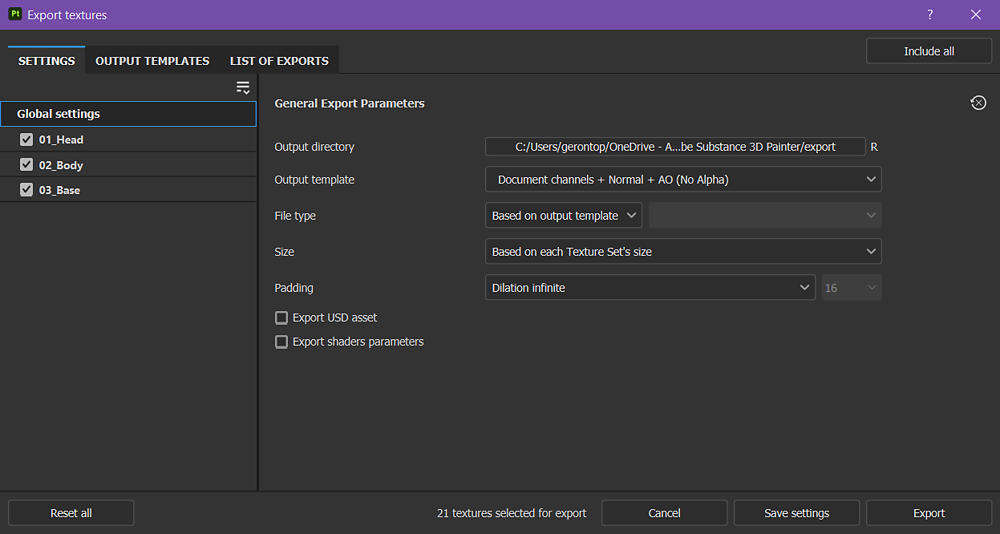

# 匯出設定

{width="500px"}

<b>匯出材質視窗</b>的<b>匯出設定標籤</b>允許你設定匯出材質的構圖、大小和位置。

## 一般與紋理集配置

視窗的第一個元素是左側的貼圖集列表。 全域設定區塊提供所有材質集共用參數的存取權限。 這讓你可以輕鬆調整一組設定，套用到專案中所有的貼圖集。 對個別材質集設定所做的更改會覆蓋該材質集的全域設定。 例如，在全域設定中將解析度設為 2048，並將特定材質集的覆蓋設為 1024，則除了設為 1024 的那組外，所有材質集都會匯出為 2048 解析度。

每個材質集名稱旁的勾選框表示相關材質是否會被匯出。

下拉選單對於擁有大量材質集的專案很有用，因為它讓你能快速修改選取範圍，使用 <b>「全部檢查</b>」、「 <b>全部取消勾選</b>」和<b>「反轉所有 </b>動作」。

## 一般輸出參數

本區包含將生成的每個材質的共享設定：

| 背景設定 | 說明 |
| --- | --- |
| <b>輸出目錄</b> | 儲存位置給匯出的材質。 |
| <b>輸出範本</b> | 選擇用來命名並將通道合成成貼圖檔的輸出範本。 欲了解更多範本資訊，請參閱 [輸出範本](../export-presets/export-presets.md)列表。 |
| <b>檔案類型  </b> | 檔案格式及其位元深度。 若 <b>選擇「基於輸出範本</b> 」選項，檔案格式會繼承自匯出預設（允許依材質決定格式與位元深度，而非全域）。 可用的位元深度取決於檔案類型;更多資訊請參見下表。 |
| <b>規模  </b> | 匯出的材質檔案解析度。 可能的數值：<ul data-preserve-html="true"> <li data-preserve-html="true"><b>根據每個材質集的大小</b></li> <li data-preserve-html="true"><b>128</b></li> <li data-preserve-html="true"><b>256</b></li> <li data-preserve-html="true"><b>512</b></li> <li data-preserve-html="true"><b>1024</b></li> <li data-preserve-html="true"><b>2048</b></li> <li data-preserve-html="true"><b>4096</b></li> <li data-preserve-html="true"><b>8192</b> （僅適用於顯示記憶體超過 1.5GB 的 GPU）</li> </ul> |
| <b>填充物  </b> | UV 島外區域在貼圖內部是怎麼填滿的。 可能的數值包括：<ul data-preserve-html="true"> <li data-preserve-html="true"><b>無填充（直通）：</b>直接使用目前材質的狀態。</li> <li data-preserve-html="true"><b>無限膨脹</b>：拉伸 UV 島嶼邊界直到相鄰邊界或貼圖末端。</li> <li data-preserve-html="true"><b>膨脹 + 透明</b>：將 UV 島嶼邊界拉伸到像素為單位的距離，其餘部分為透明。</li> <li data-preserve-html="true"><b>Dilation + 預設背景色</b>：將 UV 島嶼邊界拉伸到指定像素距離，其餘部分則填入 Texture Set 通道的預設顏色。</li> <li data-preserve-html="true"><b>Dilation + 預設背景色</b>：將 UV 島嶼邊界拉伸到指定像素距離，其餘部分則填入 Texture Set 通道的預設顏色。</li> <li data-preserve-html="true"><b>Dilam + Diffusion</b>：將 UV 島嶼邊界拉伸到指定像素距離，其餘部分則用模糊版的 UV 島（基於 mip-maps）填充。</li> </ul> |

>[!NOTE]
>
> **psd** 檔案格式是一個容器，這表示輸出映射會被集中在磁碟上的單一檔案中。

### 抖動

匯出 8 位元材質可能會導致漸層中出現條紋。 這在法線和高度貼圖時尤其明顯。 解決這個問題有兩種方法：使用更高精度或用抖動來補償。

理想中更高精度（16 或 32 位元）是理想的，但這可能不適用於所有應用。 最明顯的是，遊戲引擎經常壓縮成 8 位元。 抖動會引入雜訊，有助於減輕帶狀問題，同時仍能使用8位元的資訊。

### 材質檔案格式

以下是 Painter 支援的所有匯出檔案格式清單：

| 節目名稱 | 格式擴展 | 支援的位元深度 |
| --- | --- | --- |
| **位圖** | BMP | 8， 8 + 抖動 |
| **OpenEXR** | EXR | 16（浮動）、32（浮動） |
| **圖形交換格式** | 動圖 | 8， 8 + 抖動 |
| **Radiance HDR** | HDR | 32（浮動） |
| **聖像** | 伊科 | 8， 8 + 抖動 |
| **JPEG 2000** | J2K | 8， 8 + 抖動，16 |
| **Jpeg 網路圖形** | JNG | 8， 8 + 抖動，16 |
| **JPEG 2000** | JP2 | 8， 8 + 抖動，16 |
| **JPEG** | JPEG | 8， 8 + 抖動 |
| **JPEG 擴展範圍** | JPEG-XR | 8、8 + 抖動、16、32（浮動） |
| **可攜式位元圖** | PBM | 8， 8 + 抖動，16 |
| **可攜式浮動地圖** | PFM | 32（浮動） |
| **可攜式灰地圖** | PGM | 8， 8 + 抖動，16 |
| **可攜式網路圖形** | PNG | 8， 8 + 抖動，16 |
| **可攜式像素地圖** | PPM | 8， 8 + 抖動，16 |
| **Photoshop 文件** | PSD | 8， 8 + 抖動，16 |
| **真視 TGA** | 塔爾加 | 8， 8 + 抖動 |
| **標籤影像檔案格式** | TIFF | 8、8 + 抖動、16、32（浮動） |
| **無線應用協定點陣格式** | WBMP | 8， 8 + 抖動 |
| **WebP** | WEBP | 8， 8 + 抖動 |
| **X 像素地圖** | XPM | 8， 8 + 抖動 |

## 輸出映射

當選取特定材質集時，該材質集的輸出貼圖區塊會顯示。

本區列出所有將根據目前匯出預設產生的材質。 它會顯示材質名稱範本、檔案格式與位元深度，若啟用色彩管理[&#128279;](../../features/color-management/color-management.md)則會顯示色彩空間。

此區段允許您停用特定檔案的匯出，或覆蓋 <b>檔案格式</b> 與 <b>位元深度</b>。

## 出口美元資產

勾選此方框後，您將能以美元格式匯出。 與輸出範本</b>中<b>可用的 USDz（Apple AR）預設不同，這個匯出會考慮你為匯出設定的任何範本或參數。當你勾選美元資產欄位時，以下檔案會匯出出來 -

* 一個包含材質貼圖的資料夾
* 一個 *指向 texture maps 資料夾的 .usda* 。
* 一個可選的 .usd 檔，可以用原始網格檔案組裝材質。 它可以直接在 Omniverse 中顯示你的網格，並自動套用材質。
* 一個可選的 .usd 檔案，包含專案中使用的網格。 只有當原始網格檔案不是 USD 或使用 Painter 的自動展開來產生 UV 時，才會匯出。
