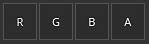
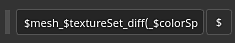

# 輸出範本

{width="500px"}

輸出範本標籤允許你管理並建立新的輸出範本。 你可以使用輸出範本修改匯出材質的名稱、格式和設定。

## 預設音色列表

預設清單顯示所有可用的輸出範本。 此清單包含預設輸出範本[&#128279;](../export-presets/default-presets.md)的集合，以及你所建立的任何自訂範本。

從此清單中，範本可以<b>被建立</b>、<b>重新命名</b>、<b>複製或</b><b>刪除</b>。

| 動作 | 視覺 | 說明 |
| --- | --- | --- |
| **重複** | 

 | 請在列表中建立目前選取的輸出範本副本。 |
| **移除** | 

 | 移除列表中目前選取的輸出範本。  **注意：**  刪除範本無法還原。 |
| **新增** | 

 | 新增一個空白輸出範本。 |
| **雙擊** | 

 | 重新命名所選輸出範本。 |
| **右鍵點擊** | 

 | 右鍵點擊 tempate 可以開啟情境選單，可以刪除、重命名或複製範本。 |

## 輸出地圖列表

本節列出所有由模板產生的材質及其組成。

### 地圖類型與關鍵字

頂線列出所有可製作的材質類型：

| 按鈕 | 視覺 | 說明 |
| --- | --- | --- |
| **格雷** | 

 | 新增一個灰階地圖。 |
| **RGB** | 

 | 新增一個 RGB 色彩映射。 |
| **共和+G+B。** | 

 | 新增一個帶有三個獨立灰階槽的 RGB 地圖。 |
| **RGB+A** | 

 | 新增一個 RGB 貼圖和一個 alpha（灰階）插槽。 |
| **R+G+B+A** | 

 | 新增一張帶有 4 個獨立灰階槽的 RGBA 地圖。 |

>[!NOTE]
>
> 某些類型在空時可合併/合併，或共用相同輸入映射：
> 
> 

### 地圖名稱

每個材質都可以用自訂命名規則來命名。 可透過 $**按鈕新增**&#x200B;幾個關鍵字，當生成最終檔案時，應用程式會自動替換：

| 關鍵詞 | 說明 |
| --- | --- |
| **$project** | 並以專案檔案名稱（.spp）取代。 |
| **$mesh** | 會被網格檔案名稱取代（輸入網格檔案，例如 .fbx） |
| **$textureset** | 並以產生材質的材質/材質集名稱取代。 |
| **$udim** | 並被 UDIM 編號取代，從中產生貼圖。 |
| **$colorSpace** | 並以所用色彩空間名稱取代給指定通道（RGB 或 G，忽略 Alpha）。 |

### 地圖檔案格式與位元深度

第一個下拉選單可用來指定當前輸出映射的檔案格式。

第二個下拉選單用來指定輸出映射的位元深度。 位元深度取決於所選檔案格式。 詳情請參見 [匯出設定](export-settings.md) 。

>[!NOTE]
>
> 匯出時要考慮格式和位元深度設定，請確保一般設定中的檔案類型設為基於 **輸出範本**。

## 原始地圖列表

### 輸入映射

輸入貼圖清單會重新組合所有可透過 [貼圖集設定](../../interface/texture-set/texture-set-settings.md)新增的通道。

>[!NOTE]
>
> **使用者**&#x200B;頻道是基於原始名稱（**user\_x**），自訂名稱則被忽略。

### 網格貼圖

網格貼圖是烘焙的貼圖：

| 名稱 | 說明 |
| --- | --- |
| **正常** | 烘焙法線貼圖。 |
| **世界空間法線** | 烘焙世界空間正常。 |
| **身分證** | 烘焙身份證。 |
| **環境遮蔽** | 烘焙環境遮蔽 |
| **曲率** | 烘焙曲率。 |
| **職位** | 烤姿勢。 |
| **厚度** | 烘烤厚度。 |
| **高度** | 烤高。 |
| **彎曲法線** | 烘烤彎曲的法線。 |

### 轉換地圖

轉換後的地圖是由應用程式從其他來源產生的地圖：

| 名稱 | 說明 |
| --- | --- |
| **一般 OpenGL** | 以 OpenGL 格式將烘焙的法線與材質集的法線通道合併。 |
| **一般 DirectX** | 將烘焙法線與材質集的法線通道合併成 DirectX 格式。 |
| **混合AO** | 結合了烘焙環境遮蔽的環境遮蔽與 Texture Set 的環境遮蔽通道。 |
| **彌漫** | 由基色&#x200B;**與**&#x200B;金屬&#x200B;**通道產生**&#x200B;的漫反射紋理（金屬區域被黑色取代）。 |
| **鏡面鏡面** | 由基色&#x200B;**與**&#x200B;金屬&#x200B;**通道產生**&#x200B;的鏡面紋理。 |
| **光澤** | 光澤質感則由粗糙通道的反向產生。 |
| **Unity4 擴散** | 已棄用。 從 **Base Color** 通道生成的漫反射材質，以匹配 Unity 4 著色器。 |
| **Unity4 光澤** | 已棄用。 光澤貼圖是從 **粗糙** 度和 **金屬** 通道產生，以匹配 Unity 4 的著色器。 |
| **反思** | 紋理中白色代表介電材料，其他顏色則代表金屬材質。 |
| **1/ior** | 包含 1 的紋理除以 **IOR** 值。 **IOR** 由金屬映射產生：介電層為 1.4，金屬為 100（黑色）。 |
| **光澤2** | 方形版 **光澤** 通道（**Glossiness** \* **Glossiness**） |
| **F0** | 材質中反射率值為菲涅爾0（dieletrics為0.04，金屬為1.0）。 |
