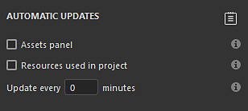
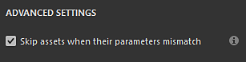

# 自動資源更新

自動資源更新，或稱<b>自動更新</b>，是資產視窗[&#128279;](../interface/assets/assets.md)中的一項功能，允許在有新版本可用時重新載入並更新資源。此過程可在介面中自動觸發、手動觸發，或透過 Python 腳本執行。

## 教學

你可以觀看一個簡短的教學影片，了解這個功能：

## 啟用自動更新

要啟用 <b>自動更新</b> ，只要到資產視窗底部點選雙箭頭圖示即可。 這會開啟自動更新選單，裡面有所有設定。 然後啟用自動更新</b>區段中<b>可用的選項之一。

### 自動更新

自動更新設定控制應用程式應該多久尋找一次更新，以及在哪裡尋找。

| 背景設定 | 說明 |
| --- | --- |
| <b>資產面板</b> | 如果啟用，自動更新會尋找所有目前已載入的函式庫的資產來更新。 這包括目前的專案。 但它不會更新圖層堆疊中使用的資源、顯示設定、著色器設定等。 |
| <b>專案中使用的資源</b> | 如果啟用，自動更新會尋找目前已匯入並被目前專案使用的資產來更新。 這適用於圖層堆疊中使用的資源、顯示設定、著色器設定等。 |
| <b>每x分鐘更新一次</b> | 控制應用程式尋找資源更新的頻率。 延遲0分鐘時，每隔幾秒就會觸發一次更新。 請注意，這麼低的延遲可能會造成效能問題。 |

>[!NOTE]
>
> 如果啟用自動更新，應用程式會在每次重新聚焦時自動尋找變更。

### 手動更新

手動更新操作是方便地在需要時觸發更新系統的方式。 它們可以啟用或不啟用自動更新設定。

| 背景設定 | 說明 |
| --- | --- |
| <b>更新資產面板</b> | 啟動自動更新流程。 行為方式與資產面板</b>設定相同<b>（見上文）。 |
| <b>更新專案中使用的資源</b> | 啟動自動更新流程。 行為與專案</b>中使用的資源相同<b>（見上文）。 |

## 進階設定

進階設定可控制更新過程的行為。

| 背景設定 | 說明 |
| --- | --- |
| <b>當資產參數不匹配時，跳過</b> | 若啟用自動更新，若新版本與舊版本不符，自動更新程序將避免更新資源。 例如，如果某個物質材質的參數在新版本中已經不存在（因為被移除或重新命名），更新過程會忽略該資源，保留舊版本。 |

>[!NOTE]
>
> 要強制更新有不匹配的資產，你可以在參數不匹配</b>設定時停用<b>跳過資產。

## 更新狀態與日誌

資源更新完成（自動或手動）後，流程結果會出現在<b>日誌</b>視窗的<b>資產</b>標籤中，報告成功更新與問題。若發生資源不匹配（見上文），我們會依資源提供問題細節。

可透過點擊自動更新選單右上角的專用圖示快速開啟該日誌：

>[!NOTE]
>
> 當更新後出現一個或多個問題時，日誌圖示會顯示一個小警告圖示。

根據更新過程的進行，可能會出現幾種類型的問題：

| 子嗣 | 說明 |
| --- | --- |
| <b>無法在資產面板更新</b> | 此訊息表示有問題導致更新系統無法繼續。 展開資源名稱以獲取更多資訊。 |
| <b>（檔名）。（格式）不存在。 無法重新載入（資源名稱）</b> | 此訊息表示資源的原始檔案無法再被找到（可能是移動或已被移除）。 一個簡單的解決方法是重新匯入資源或在資產視窗（透過右鍵選單）重新定位資源。 |

## 舊計畫訊息

開啟舊專案時，彈出訊息警告內會顯示自動更新流程的選項。 這是快速關閉自動更新流程的方便方法，如果自動更新程序在開啟舊專案前仍保持啟用。
