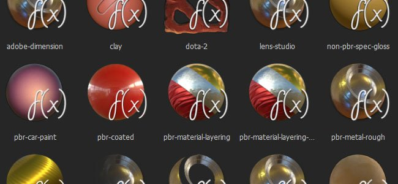

# 自訂著色器

Substance Painter 使用著色器在即時視口中渲染材質。

也可以寫自訂著色器來實作新行為，或讓視埠匹配其他渲染器。 Substance Painter 的其他著色器可以在 Substance Share[&#128279;](https://share.allegorithmic.com/libraries?by_category_type_id=6) 找到。

## 預設著色器

Substance Painter 預設包含以下著色器：

無法渲染 {children}。 頁面未找到：預設著色器。

## 建立新的著色器

只要建立新的 **.glsl** 檔案，就能建立新的自訂著色器。

提供詳細的 [著色器 API](https://helpx.adobe.com/substance-3d/unlisted/documentation/spdoc/custom-shader-api-89686018.html) ，並提供輔助功能以創造新效果並整合進現有工作流程。
