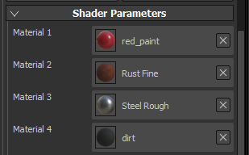

# 動態材質分層

{width="450px"}

**動態材質分層**  是一種特定的工作流程，將通用材質在著色器中混合在一起，而不是形成單一貼圖。 此工作流程的主要優點是混合是動態的，並允許透過在著色器內耕耘一般材質來控制並維持一定的品質。 雖然材質是通用的，但用來混合材質的遮罩是針對網格特有的，因此不會重複使用。

{width="400px"}

為了啟用材質分層工作流程，需要特定的著色器。\
Substance 3D Painter 預設附帶的著  **色器「pbr-material-layering**  」允許用 3 個遮罩混合 4 種材質。

## 子層堆疊

在此著色器中，可以定義子堆疊，並由著色器直接取樣。 Substance 3D Painter 附帶的著色器「pbr-material-layering」範例：

```
//: stacks [ 

//:   { 

//:     "id": "Mask", 

//:     "channels": [ 

//:   {"id": "opacity"} 

//:  ] 

//:   }, 

[...] 

//: ]
```


 在這個例子中，著色器會在給定的貼圖集上建立三個子堆疊，每個子堆疊都有一個「不透明度」通道。 子堆疊可在 TextureSet 清單視窗中存取：

由於&#x200B;**子層堆疊的通道**&#x200B;是在著色器&#x200B;**中定義**&#x200B;的，因此無法在貼圖集設定中新增通道。新增或移除通道需要更新著色器檔案。

最大支援的通道數量是由硬體總共支援的取樣器數量所定義。\
雖然 Substance 3D Painter 支援無綁定材質（因此材質數量無限），但引擎為圖層堆疊提供的通道限制為 32 條（在 Windows 下）。 這個限制還包括其他貼圖，例如在專案網格上烘焙的法線和環境遮蔽。

## 材料投入

雖然可以設置子堆疊來定義材質，除了遮罩之外，但通常更實際的做法是直接在著色器中定義材質輸入，並直接使用架子上的材質。 大多數時候，這些素材也存在於最終應用程式中，例如 Unity 或 Unreal Engine 4。 在著色器「pbr-material-layering」中，宣告材質的命名慣例如下：

```
//: materials [ 

//:   { 

//:      "id": "Material1", 

//:      "label": "Material 1", 

//:      "default": "", 

//:      "size": 1024, 

//:      "default_color": [0.5, 0.5, 0.5] 

//:   }, 

[...] 

//: ]
```


 以下是載入某些材料（物質材料或材料預設）後的結果：

材料解析度可以用「尺寸」參數來定義。 當著色器建立時，預設也可以載入材質（使用需要載入的資源名稱或標籤）。

要存取著色器本身的材質和遮罩，只要用「param auto」關鍵字連接它們：

```
//: param auto Material1.channel_basecolor 

uniform sampler2D color1; 

 

//: param auto Mask.channel_opacity 

uniform sampler2D mask;
```


在這個工作流程中，最重要的部分是遮罩和著色器參數。 因此，建議在 Substance 3D Painter 的匯出視窗啟用「  **匯出著色器參數**  」設定。 這會在貼圖旁邊的磁碟建立一個  **JSON**  檔案，裡面會包含子堆疊的設定、材質、著色器和其參數的資訊。 參數匯出與匯入

目前匯出時不支援將遮罩打包成單一材質。 不過，一個簡單的解決方法是使用腳本功能，然後呼叫 Substance Batch Tools 來用 Substance 來進行包裝。


這個 JSON 檔案可以用來設定專案的圖層堆疊和著色器。\
這讓多個應用程式之間能輕鬆往返，因為共享共同參數。


