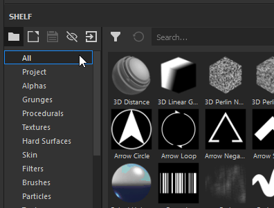

# 濾鏡

濾鏡效果是改變層或遮罩內容的物質。

## 如何使用過濾器？

根據濾鏡類型，必須在圖層的內容或遮罩上建立濾鏡效果。\
濾網有兩種使用方式，選擇哪一種取決於你希望濾網如何運作。

## 手動套用過濾器。

以下範例中，模糊濾鏡是套用在圖層內容上，但更常用來套用濾鏡到遮罩：

### 1 - 加入濾波效果

先選擇圖層內容（左縮圖），然後點擊效果按鈕（或右鍵開啟右鍵選單）。\
在清單中選擇「  **新增過濾器**  」選項。

### 2 - 在屬性視窗中選擇篩選器

在屬性視窗中，參數或過濾器目前是空的。 目前只有選擇按鈕可用。\
點擊按鈕打開迷你書架並選擇想要的濾鏡，這裡我們選擇模糊濾鏡。

## 從架子上拖放濾鏡

此方法僅適用於應適用於整個 Layerstack 的濾波器。 它會自動設定所有通道 [混合模式](../../interface/layer-stack/blending-modes.md) 。 它無法用來在遮罩上加濾鏡。

### 1 - 打開架子的過濾器區

在書架中，點選左側的「篩選」區塊。

## 2 - 拖放濾波器

選擇你想在架子上使用的濾鏡。 把它拖放到你的圖層堆疊中，確保放在正確的位置（例如避免丟到不需要的群組裡）。

請注意，在上述範例中，droped filter 已經有一個 Passthrough Blending 模式。 這對文件的所有通道都適用。

## 新增新型過濾器

所有濾鏡都是物質，可以用 Substance 3D Designer 建立。\
作為快速啟動，Substance 3D Designer 提供可供 Substance 3D Painter 使用的範本。

更多資訊請參閱此頁面： [建立自訂效果](../../content/creating-custom-effects/creating-custom-effects.md)
