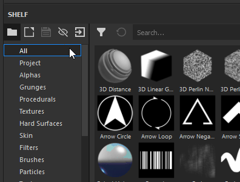

# 濾鏡

濾鏡效果是能改變層或遮罩內容物的物質。 透過直通混合模式，圖層可以修改圖層堆疊的結果;在具有直通混合模式的圖層上使用濾波器，則能用濾波器來修改整個圖層堆疊。

## 我該如何套用過濾器？

根據濾鏡類型，必須在圖層的內容或遮罩上建立濾鏡效果。 有兩種方式可以套用濾鏡：

* 手動方式需要多個步驟來設定過濾器，但能直接控制每個步驟。
* 拖放方式讓你能快速新增濾波器，並自動將混合模式設為所有聲道的直通模式。

### 手動套用篩選器

以下範例中，模糊濾鏡是套用在圖層內容上，但通常用於對遮罩套用濾鏡：

**1. 新增濾鏡效果**

先選擇圖層內容或圖層遮罩，然後點擊 **效果按鈕** （或右鍵開啟右鍵選單）。 在列表中選擇「 **新增篩選器** 」選項。

**2. 在屬性視窗中選擇篩選器**

在 **屬性面板**&#x200B;中，尚未選擇任何篩選條件。 點擊濾鏡選擇按鈕打開迷你書架並選擇想要的濾鏡，這裡我們選擇 **模糊濾鏡**。

>[!NOTE]
>
> 手動套用濾鏡時，記得如果你想讓濾鏡影響底層的內容，可能需要使用通透混合模式。

## 從架子上拖放濾鏡

此方法僅適用於應適用於整個 Layerstack 的濾波器。 它會自動設定所有通道 [混合模式](../../interface/layer-stack/blending-modes.md) 。 它無法用來在遮罩上加濾鏡。

**1. 打開書架的篩選區**

在書架中，點選左側的「篩選」區塊。

**2. 拖放濾波器**

選擇你想在架子上使用的濾鏡。 把它拖放到你的圖層堆疊中，確保放在正確的位置（例如避免丟到不需要的群組裡）。

請注意，在上述範例中，droped filter 已經有 Passthrough Blending 模式。 這對文件的所有通道都適用。

## 新增篩選器

所有濾鏡都是物質，可以用 Substance 3D Designer 建立。 作為快速啟動，Substance 3D Designer 提供可供 Substance 3D Painter 使用的範本。

更多資訊請參閱此頁面： [建立自訂效果](../../content/creating-custom-effects/creating-custom-effects.md)

## 可用過濾器

### 標準

* [模糊](filters/standard/blur.md)
* [模糊定向](filters/standard/blur-directional.md)
* [模糊斜坡](filters/standard/blur-slope.md)
* [夾子](filters/standard/clamp.md)
* [色彩平衡](filters/standard/color-balance.md)
* [色彩校正](filters/standard/color-correct.md)
* [對比亮度](filters/standard/contrast-luminosity.md)
* [陰影](filters/standard/drop-shadow.md)
* [填充區域顏色](filters/standard/fill-area-color.md)
* [填充區域遮罩](filters/standard/fill-area-mask.md)
* [FXAA（抗鋸齒）](filters/standard/fxaa-anti-aliasing.md)
* [發光](filters/standard/glow.md)
* [梯度](filters/standard/gradient.md)
* [梯度動態](filters/standard/gradient-dynamic.md)
* [灰階轉換](filters/standard/grayscale-conversion.md)
* [高通](filters/standard/highpass.md)
* [直方圖掃描](filters/standard/histogram-scan.md)
* [直方圖移位](filters/standard/histogram-shift.md)
* [HSL Perceptive](filters/standard/hsl-perceptive.md)
* [倒轉](filters/standard/invert.md)
* [鏡子](filters/standard/mirror.md)
* [像素化](filters/standard/pixelate.md)
* [海報化](filters/standard/posterize.md)
* [磨利](filters/standard/sharpen.md)
* [滑步](filters/standard/smoothstep.md)
* [臨界值](filters/standard/threshold.md)
* [變形](filters/standard/transform.md)
* [曲速](filters/standard/warp.md)

### 飾面

* [MatFinish 拉絲線性](filters/finishes/matfinish-brushed-linear.md)
* [MatFinish鍍鋅處理](filters/finishes/matfinish-galvanized.md)
* [MatFinish 顆粒感](filters/finishes/matfinish-grainy.md)
* [MatFinish 研磨](filters/finishes/matfinish-grinded.md)
* [MatFinish 被狠狠砸了](filters/finishes/matfinish-hammered.md)
* [MatFinish 穿孔圓圈](filters/finishes/matfinish-perforated-circles.md)
* [MatFinish 粉末塗層](filters/finishes/matfinish-powder-coated.md)
* [MatFinish 原始版](filters/finishes/matfinish-raw.md)
* [MatFinish 粗糙](filters/finishes/matfinish-rough.md)

### MatFX

* [MatFX 漫畫書](filters/matfx/matfx-comic-book.md)
* [MatFX 細節邊緣磨損](filters/matfx/matfx-detail-edge-wear.md)
* [MatFX Edge 損壞](filters/matfx/matfx-edge-damages.md)
* [MatFX HBAO](filters/matfx/matfx-hbao.md)
* [MatFX 油畫顏料](filters/matfx/matfx-oil-paint.md)
* [MatFX 剝落的油漆](filters/matfx/matfx-peeling-paint.md)
* [MatFX 生鏽老化](filters/matfx/matfx-rust-weathering.md)
* [MatFX 關閉線路](filters/matfx/matfx-shut-line.md)
* [MatFX 水彩](filters/matfx/matfx-watercolor.md)
* [MatFX 水滴](filters/matfx/matfx-water-drops.md)

### 光源

* [烘焙燈光環境](filters/lighting/baked-lighting-environment.md)
* [風格化的烘焙燈光](filters/lighting/baked-lighting-stylized.md)

### 進階

* [各向異性桑原](filters/advanced/anisotropic-kuwahara.md)
* [斜面](filters/advanced/bevel.md)
* [斜面光滑](filters/advanced/bevel-smooth.md)
* [顏色配對](filters/advanced/color-match.md)
* [方向距離](filters/advanced/directional-distance.md)
* [梯度曲線](filters/advanced/gradient-curve.md)
* [高度調整](filters/advanced/height-adjustments.md)
* [身高至正常](filters/advanced/height-to-normal.md)
* [面具大綱](filters/advanced/mask-outline.md)
* [PBR 驗證](filters/advanced/pbr-validate.md)
* [量子化](filters/advanced/quantize.md)
* [風格化](filters/advanced/stylization.md)
* [三位面進階](filters/advanced/tri-planar-advanced-filter.md)
