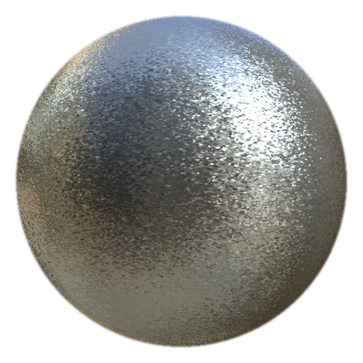

# MatFinish 粉末塗層

<table>
<tr style="border: 0;">
<td width="33.33%" style="border: 0;" valign="top">

<b>在：</b> 效果/表面處理、表面處理

</td>
<td width="100.00%" style="border: 0;" valign="top">

## 說明

MatFinish 粉末塗層濾網是金屬塗裝系列的一部分，用於創造粉末塗層金屬效果。

它用於填充層。 調整底層填充層的顏色、粗糙度、金屬質感及其他特性，然後加入濾網進行最終表面處理。

</td>
</tr>
</table>

## 輸入

| 輸入名稱 | 說明 |
| --- | --- |
| <b>自訂片狀：</b> 灰階 | 使用自訂的剝片材質或錨點。 |
| <b>位置：</b> 顏色 | 使用烘焙的位置貼圖。 |
| <b>世界空間法線：</b> 顏色 | 使用烘焙的世界空間法線貼圖。 |

## 參數

| 參數名稱 | 說明 |
| --- | --- |
| <b>種子：</b> | 隨機分配一個數值，創造出不同的變化，且不改變整體設定。 |
| <b>規模：</b> | 調整整體塗層的比例。 |
| <b>雪片強度：</b> | 調整雪片的強度。 |
| <b>使用自訂片狀物：</b> | 切換使用自訂片狀紋理。 |
| <b>三平面映射：</b> | 切換三平面映射。 |

