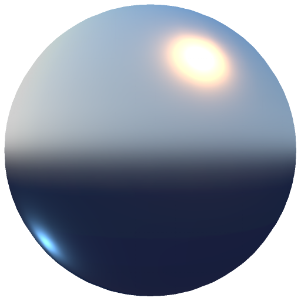

# 風格化的烘焙燈光

<table>
<tr style="border: 0;">
<td width="33.33%" style="border: 0;" valign="top">

<b>在：</b> 特效/風格化、光線、色彩

</td>
<td width="100.00%" style="border: 0;" valign="top">

## 說明

烘焙燈光風格化濾鏡會將材質和光照資訊烘焙到色彩通道中。

它用於設定為直通模式的繪圖層，並套用到所有聲道。 它適用於不需要精確模擬光照，或資源有限的程式化工作流程，例如行動專案或僅依賴色彩貼圖的資產。

</td>
</tr>
</table>

## 輸入

| 輸入名稱 | 說明 |
| --- | --- |
| <b>環境遮蔽：</b> 灰階 | 使用烘焙好的環境遮蔽地圖。 |
| <b>曲率：</b> 灰階 | 使用烘焙好的曲率地圖。 |
| <b>普通：</b> 顏色 | 使用烘焙好的法線貼圖。 |
| <b>世界空間法線：</b> 顏色 | 使用烘焙的世界空間法線貼圖。 |

## 參數

| 參數名稱 | 說明 |
| --- | --- |
| <b>輸入：</b> | 選擇輸入材料的工作流程。 |
| <b>輸出：</b> | 選擇輸出模式。 |
| <b>介電反射率：</b> | 調整介電反射率。 |
| <b>彌漫性AO：</b> | 調整環境遮蔽對漫射光的貢獻。 |
| <b>彌漫性腔：</b> | 調整腔體對漫射光的貢獻。 |
| <b>鏡面光源：</b> | 調整環境遮蔽對鏡面光的貢獻。 |
| <b>鏡面腔：</b> | 調整腔體對鏡面光的貢獻。 |
| <b>腔體光滑度：</b> | 調整空腔效果的平滑度。 |
| <b>邊緣強度：</b> | 調整邊緣效應的強度。 |
| <b>邊緣平滑度：</b> | 調整邊緣效果的平滑度。 |
| <b>一般細節類型：</b> | 選擇使用哪些正常細節。 |
| <b>身高到正常強度：</b> | 調整高度與正常值轉換的強度。 |
| <b>太陽強度：</b> | 調整陽光的強度。 |
| <b>太陽水平角：</b> | 調整太陽光的水平角度。 |
| <b>太陽垂直角度：</b> | 調整陽光的垂直角度。 |
| <b>太陽顏色：</b> | 調整陽光的顏色。 |
| <b>天空強度：</b> | 調整天空光線的強度。 |
| <b>天空顏色：</b> | 調整天光的顏色。 |
| <b>地平線色彩：</b> | 調整地平線燈的顏色。 |
| <b>底色：</b> | 調整地面燈的顏色。 |
| <b>水平角度：</b> | 調整額外光線的水平角度。 |
| <b>垂直角度：</b> | 調整額外光線的垂直角度。 |
| <b>強度：</b> | 調整額外光線的強度。 |
| <b>顏色：</b> | 調整額外燈光的顏色。 |
| <b>水平角度：</b> | 調整第二盞額外燈的水平角度。 |
| <b>垂直角度：</b> | 調整第二盞額外燈的垂直角度。 |
| <b>強度：</b> | 調整第二盞額外光的強度。 |
| <b>顏色：</b> | 調整第二盞額外燈的顏色。 |

### 材質

<table>
<tr>
<td><b>介電反射率：</b></td>
<td>設定介電反射率。</td>
</tr>
<tr>
<td><b>彌漫性AO：</b></td>
<td>控制環境遮蔽對擴散細節的影響程度。</td>
</tr>
<tr>
<td><b>彌漫性腔：</b></td>
<td>控制空腔區域對擴散細節的影響程度。</td>
</tr>
<tr>
<td><b>鏡面光源：</b></td>
<td>控制環境遮蔽對鏡面細節的影響程度。</td>
</tr>
<tr>
<td><b>鏡面腔：</b></td>
<td>調整空腔區域對鏡面細節的影響程度。</td>
</tr>
<tr>
<td><b>腔體光滑度：</b></td>
<td>調整空洞區域的平滑程度。</td>
</tr>
<tr>
<td><b>邊緣強度：</b></td>
<td>設定邊緣細節的強度。</td>
</tr>
<tr>
<td><b>邊緣平滑度：</b></td>
<td>調整邊緣區域的平滑度。</td>
</tr>
<tr>
<td><b>一般細節類型：</b></td>
<td>選擇用於法線的細節：僅網格，或網格 + 高度 + 法線。</td>
</tr>
<tr>
<td><b>身高到正常強度：</b></td>
<td>調整產生的法線細節強度。</td>
</tr>
</table>

### 太陽與天空

<table>
<tr>
<td><b>太陽強度：</b></td>
<td>控制太陽的強度。</td>
</tr>
<tr>
<td><b>太陽水平角：</b></td>
<td>調整太陽的水平角度。</td>
</tr>
<tr>
<td><b>太陽垂直角度：</b></td>
<td>調整太陽的垂直角度。</td>
</tr>
<tr>
<td><b>太陽顏色：</b></td>
<td>控制太陽的顏色。</td>
</tr>
<tr>
<td><b>天空強度：</b></td>
<td>調整天空強度。</td>
</tr>
<tr>
<td><b>天空顏色：</b></td>
<td>設定天空的顏色。</td>
</tr>
<tr>
<td><b>地平線色彩：</b></td>
<td>調整地平線的顏色。</td>
</tr>
<tr>
<td><b>底色：</b></td>
<td>設定地面的顏色。</td>
</tr>
</table>

### 光 1

<table>
<tr>
<td><b>水平角度：</b></td>
<td>調整額外光線的水平角度。</td>
</tr>
<tr>
<td><b>垂直角度：</b></td>
<td>調整額外光線的垂直角度。</td>
</tr>
<tr>
<td><b>強度：</b></td>
<td>調整額外光線的強度。</td>
</tr>
<tr>
<td><b>顏色：</b></td>
<td>設定額外燈的顏色。</td>
</tr>
</table>

### 光2

<table>
<tr>
<td><b>水平角度：</b></td>
<td>調整第二盞額外燈的水平角度。</td>
</tr>
<tr>
<td><b>垂直角度：</b></td>
<td>調整第二盞額外燈的垂直角度。</td>
</tr>
<tr>
<td><b>強度：</b></td>
<td>調整第二盞額外燈的亮度。</td>
</tr>
<tr>
<td><b>顏色：</b></td>
<td>設定第二個額外燈的顏色。</td>
</tr>
</table>
