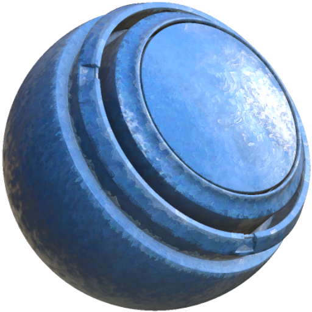

# MatFX 油畫顏料

<table>
<tr style="border: 0;">
<td width="33.33%" style="border: 0;" valign="top">

<b>收錄於：</b> 特效/模糊、灰階

</td>
<td width="100.00%" style="border: 0;" valign="top">

## 說明

MatFX 油畫濾鏡以油畫風格化出源頭。

它用於材質層，創造出繪畫般的筆觸、色彩變化及受油畫啟發的表面細節。

</td>
</tr>
</table>

## 輸入

| 輸入名稱 | 說明 |
| --- | --- |
| <b>影像輸入：</b> 彩色 | 使用影像輸入。 |

## 參數

****&#x200B;預設可用，且能快速更新濾波器中的多個參數作為起點。

>[!NOTE]
>
> 當選擇預設時，會把所有參數設成預設值——如果你對濾波器做了不想失去的改動，建議先複製濾波器並切換可見性再嘗試預設。

| 參數名稱 | 說明 |
| --- | --- |
| <b>輸入類型：</b> | 選擇效果所使用的輸入類型。 |
| <b>效果強度：</b> | 調整整體效果的強度。 |
| <b>細節：</b> | 調整結果中保留的細節量。 |
| <b>銳利度：</b> | 調整結果的銳利度。 |
| <b>粗糙度：</b> | 調整粗糙度值。 |
| <b>粗糙度變化：</b> | 調整成品的粗糙度變化。 |
| <b>粗糙度細節：</b> | 調整細節對粗糙度的影響程度。 |
| <b>正常強度：</b> | 調整正常效應的強度。 |
| <b>正常筆劃方向影響：</b> | 調整筆劃方向對正常結果的影響程度。 |

### 輸入色彩校正

| 參數名稱 | 說明 |
| --- | --- |
| <b>輸入影像對比度：</b> | 調整輸入影像的對比度。 |
| <b>輸入影像色調：</b> | 調整輸入影像的色調。 |
| <b>輸入影像飽和度：</b> | 調整輸入影像的飽和度。 |
| <b>輸入影像亮度：</b> | 調整輸入影像的亮度。 |

### 中風

| 參數名稱 | 說明 |
| --- | --- |
| <b>全球尺度乘數：</b> | 調整筆劃的全域刻度倍率。 |
| <b>隨機量表：</b> | 調整隨機比例變化的程度。 |
| <b>尺寸：</b> | 調整筆劃大小。 |
| <b>尺寸隨機：</b> | 調整隨機大小變化的程度。 |
| <b>隨機顏色：</b> | 調整顏色隨機變化的程度。 |
| <b>筆觸硬度：</b> | 調整筆觸的硬度。 |
| <b>自動方向乘數：</b> | 調整自動方向對筆劃的影響程度。 |
| <b>方向平滑度：</b> | 調整筆觸方向的平滑度。 |

### 亮部

| 參數名稱 | 說明 |
| --- | --- |
| <b>啟用：</b> | 切換高光圖層開關。 |
| <b>格網細分：</b> | 調整高光圖層所用的格子細分。 |
| <b>筆劃大小：</b> | 調整高光圖層使用的筆劃大小。 |
| <b>筆劃大小從細節中：</b> | 調整高光圖層中細節對筆劃大小的影響。 |
| <b>曲速強度：</b> | 調整高光層的變形強度。 |

### 中間調

| 參數名稱 | 說明 |
| --- | --- |
| <b>啟用：</b> | 切換中間調的層次開關。 |
| <b>格網細分：</b> | 調整用於中間調層的格子細分。 |
| <b>筆劃大小：</b> | 調整中間調層使用的筆劃大小。 |
| <b>筆劃大小從細節中：</b> | 調整細節對中間調層筆劃大小的影響程度。 |
| <b>曲速強度：</b> | 調整中間調層的經線強度。 |

### 陰影

| 參數名稱 | 說明 |
| --- | --- |
| <b>啟用：</b> | 切換陰影層次開關。 |
| <b>格網細分：</b> | 調整陰影圖層使用的格子細分。 |
| <b>筆劃大小：</b> | 調整陰影圖層使用的筆劃大小。 |
| <b>筆劃大小從細節中：</b> | 調整陰影層中細節對筆劃大小的影響程度。 |
| <b>曲速強度：</b> | 調整陰影層的扭曲強度。 |

### 背景

| 參數名稱 | 說明 |
| --- | --- |
| <b>啟用：</b> | 切換背景圖層的開關。 |
| <b>格網細分：</b> | 調整背景圖層所用的網格細分。 |
| <b>筆劃大小：</b> | 調整背景圖層使用的筆劃大小。 |
| <b>曲速強度：</b> | 調整背景圖層的扭曲強度。 |

### 輪廓

| 參數名稱 | 說明 |
| --- | --- |
| <b>金額：</b> | 調整輪廓長度。 |
| <b>厚度：</b> | 調整輪廓厚度。 |

### 版面

| 參數名稱 | 說明 |
| --- | --- |
| <b>紋理強度：</b> | 調整畫布材質的強度。 |
| <b>纖維數量：</b> | 調整帆布纖維的數量。 |
