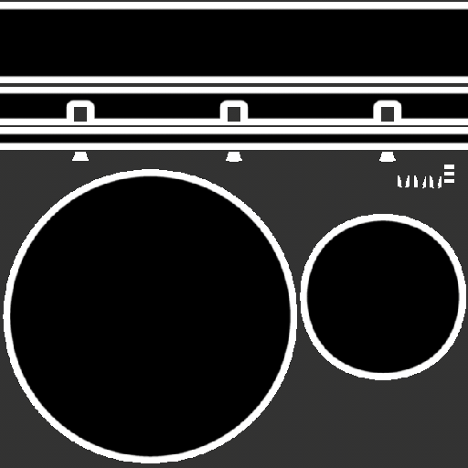

# 紫外線邊界距離

<table>
  <tr style="border: 0;">
    <td style="border: 0;" valign="top"> <strong>在：</strong> 網狀、紫外線、距離</td>
    <td style="border: 0;" valign="top"><strong>說明</strong> UV邊界距離產生器會在UV島嶼邊界建立灰階遮罩，讓你輕鬆加入各種沿著UV邊界的效果。  UV邊界距離產生器輸出單色（黑白）材質。 因此，它對於產生一個遮罩，能高亮靠近 UV 邊界的區域非常有用。</td>
  </tr>
</table>

## 參數

| 參數名稱 | 說明 |
| --- | --- |
| **倒轉** | 將發電機輸出反轉。 |
| **平衡** | 調整效果的平衡，將中點像亮度控制一樣往黑或白移動。 |
| **對比** | 調整效果的對比度/衰減。 |
| **平滑度** | 調整效果的圓滑度。 當使用低 **平滑度** 值時，這點最為明顯。 |
| **距離** | 調整效果從 UV 邊界延伸的距離。 |
