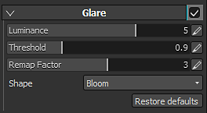

# 刺眼

參數說明：

| 背景設定 | 說明 |
| --- | --- |
| **亮度** | 這就是眩光效果的整體亮度。 將此設定設為 0.0 會完全關閉這個效果。  實際數值範圍約為0.5到4.0，最高可達約16.0。 |
| **門檻** | 只有比閾值亮的像素會被提取來產生眩光。  為了呈現自然效果，建議數值介於 0.0 到 1.0 之間。 |
| **重映射**&#x200B;**因子** | 指定非 1.0 的值會使提取的高亮度成分進一步非線性展開（或壓縮）。 如果你通過超過1.0的數值，刺眼的亮度會變得更強。  在調整眩光亮度映射時，單獨使用時使用，不影響其他效果。 明亮通過後的亮度呈平滑曲線增加，亮度值為 1.0 趨近&#x200B;**於重映射因子**，大於 1.0 則趨近（**重映射**&#x200B;**因子** ^2）。 |
| **形狀** | 形狀決定了眩光的外觀，有不同型號可供選擇：<ul data-preserve-html="true"><li data-preserve-html="true"><strong>綻放</strong> ：只有綻放效果。</li><li data-preserve-html="true"><strong>鏡頭光暈：</strong> 暈光/幽靈（鏡頭光暈）/殘像。</li><li data-preserve-html="true"><strong>標準：</strong> 字體，包含所有基本元素的良好平衡。</li><li data-preserve-html="true"><strong>廉價鏡頭：</strong>  銳利的重影及其他廉價鏡頭的表現。 </li><li data-preserve-html="true"><strong>殘像：</strong>  帶有非常強烈的殘像。 </li><li data-preserve-html="true"><strong>濾鏡交叉屏：</strong>  附有十字形星形濾鏡產生器的鏡頭。</li><li data-preserve-html="true"><strong>濾鏡交叉遮蔽光譜</strong>：搭載十字形星形濾鏡產生器，附有強光譜。</li><li data-preserve-html="true"><strong>濾鏡雪十字</strong> ：附有六個方向星形濾鏡產生器的透鏡。</li><li data-preserve-html="true"><strong>雪交叉光譜</strong> 濾鏡：附有六個方向強光譜星形濾鏡產生器的透鏡。</li><li data-preserve-html="true"><strong>Sunny Cross</strong> 濾鏡：附有八個方向星形濾鏡產生器的鏡頭。</li><li data-preserve-html="true"><strong>陽光十字光譜</strong> 濾鏡：搭載八方向強光譜星光片產生器的鏡頭。</li><li data-preserve-html="true"><strong>水平條紋</strong> ：這種透鏡光暈類型會產生強烈的水平星條紋。</li><li data-preserve-html="true"><strong>垂直條紋</strong> ：具有強烈的垂直條紋特徵。 CCD數位相機的抹片等等。</li></ul> |

## 形狀範例

