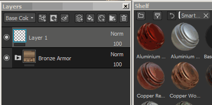
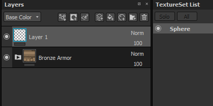

# 智慧材料與口罩

Substance 3D Painter 支援使用進階  **圖層預設**  。 這些預設可用來快速&#x200B;**在貼圖集或專案**&#x200B;間分享&#x200B;**類似的貼圖流程**，同時保持結果不同，並&#x200B;**適應網格拓撲**。

>[!NOTE]
>
> 請注意，一旦加入到圖層堆疊中，就無法取得使用了哪個智慧材料。 若智慧材料需要更新，則必須手動完成。\
> 不過，個別資源可以透過資源更新器](plugins/resources-updater.md)進行更新[。

## 如何使用智慧材料/口罩？

智慧材質可以在圖層堆疊的任何地方使用，而智慧遮罩只能在效果堆疊中使用。\
欲了解更多差異，請參閱： [圖層堆疊](../interface/layer-stack/layer-stack.md) 與 [效果](effects/effects.md)

### 新增智慧材質

智慧材料可透過兩種不同方式添加：

* 將 smart materials 從書架拖放到圖層堆疊中：\
  
* 點擊智慧材質按鈕開啟迷你書架：\
  

### 加裝智慧口罩

因為智慧面罩是效果的預設，所以只能加入效果堆疊（特別是針對面罩）。

* 要新增智慧口罩，只需  **從架子拖放**  一個到  **目標**  圖層：\
  
* 拖放  **多個**  智慧口罩會累積：\
  
* 不過&#x200B;**，在拖放時按下** CTRL **鍵，可以替換**&#x200B;整個效果堆疊：\
  

### 如何製作智慧材質/遮罩？

要建立智慧材料，需要一個  **資料夾**  。\
智慧材料的內容將包含在資料夾中。 然後只要右鍵點擊資料夾，選擇「  **建立智慧素材**  」。 智慧資料將被加入目前的書架，並依據所選資料夾命名。

要建立智慧口罩，只需在圖層上右鍵點擊，選擇「  **建立智慧口罩**  」。

## 如何分享或取回智慧材質/口罩？

預設會儲存  **在磁碟**  中，並可從專用資料夾取出。\
要找到  **書架位置**  ，請參見： [在硬碟](../content/importing-assets/adding-content-on-the-hard-drive.md) 上新增內容。

接著任何人都可以直接  **把檔案匯入**  Substance 3D Painter 架子，使用預設。
