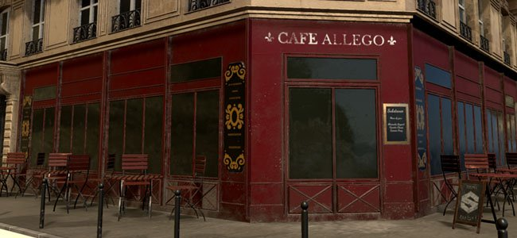

# 稀疏虛擬貼圖

從 2018.3 **版本**&#x200B;開始，Substance 3D Painter 在即時視口中使用&#x200B;**稀疏虛擬貼圖**（**SVT**）來管理大量貼圖。這項技術允許串流進出僅從特定角度看來維持特定 GPU 記憶體佔用空間的貼圖。 它能提升擁有大量貼圖集（或稱 UDIM）的專案效能。

## 支援平台

稀疏紋理依賴特定的硬體配置才能達到完整效能。 如果目前的設定無法妥善支援，Substance 3D Painter 會  **退回**  軟體實作（但那會更不精確且效能較差）。

你可以強制 Substance 3D Painter 使用軟體備援而非硬體加速，方法是進入 [設定](../interface/settings/settings.md) 。

以下是支援硬體加速的稀疏虛擬貼圖的配置：

| 平台 | 支援（硬體加速） | 不支援（軟體備援） |
| --- | --- | --- |
| **窗戶** | <ul data-preserve-html="true"><li data-preserve-html="true">Nvidia GeS（驅動程式 411.63 或更高）</li><li data-preserve-html="true">Nvidia Quadro（驅動程式 411.63 或以上）</li><li data-preserve-html="true">AMD FirePro 與 Radeon Pro（驅動程式 18.9.3 或以上） <strong> &#42; </strong></li><li data-preserve-html="true">AMD Radeon（驅動程式 18.9.3 或更高版本）&#42;</li></ul> | <ul data-preserve-html="true"><li data-preserve-html="true"> Nvidia Quadro M2000 </li><li data-preserve-html="true">  Nvidia Geforce GTX 970 </li><li data-preserve-html="true"> Intel GPU </li></ul> |
| **Mac OS** | <ul data-preserve-html="true"><li data-preserve-html="true"> 作業系統不支援的硬體功能 </li></ul> | <ul data-preserve-html="true"><li data-preserve-html="true">任何 GPU 型號</li></ul> |
| **Linux** | <ul data-preserve-html="true"><li data-preserve-html="true">Nvidia GeForce（驅動程式 410.73 或更高）</li><li data-preserve-html="true">Nvidia Quadro（驅動程式 410.73 或以上）</li><li data-preserve-html="true">AMD FirePro 與 Radeon Pro（驅動程式 18.9.3 或以上） <strong> &#42; </strong></li><li data-preserve-html="true">AMD Radeon（驅動程式 18.9.3 或更高版本）&#42;</li></ul> | <ul data-preserve-html="true"><li data-preserve-html="true">Intel GPU</li></ul> |

* **\*** ：硬體加速預設已關閉，可在設定](../interface/settings/settings.md)中[手動啟用。

## 為什麼 Substance 3D Painter 使用稀疏的虛擬貼圖？

Substance 3D Painter 使用其主引擎來計算材質，然後在視窗中顯示。 這表示引擎與視窗必須共用 GPU 記憶體（VRam）來計算和顯示這些貼圖。 專案包含越多  **紋理集**  （或 UV 磚塊），視口所需的記憶體就越多。 如果視窗佔用太多 GPU 記憶體，主引擎就無法計算材質，必須將材質逐出系統記憶體（記憶體）。 這會導致效能不佳和計算緩慢。

SVT 的目標是預算視窗能佔用 GPU 記憶體，讓主引擎有更多空間進行運算。 這套系統的優點是能在 Substance 3D Painter 中載入更大的專案，同時仍能正常運作。

## 稀疏材質是如何運作的？

稀疏虛擬貼圖是一種不完整的貼圖。 這表示應用程式只會在記憶體中載入部分貼圖。 只有需要的部分會被載入，其餘則放入系統記憶體或磁碟（快取）。 當需要時，材質會從快取中取出並放回視窗。 為了讓傳輸速度足夠快，系統依賴  **mipmaps**  ，並快速切換不同解析度的材質。 這也是為什麼快速進入視窗時，起初可能會顯示模糊的材質，幾秒後品質會提升。

欲了解更多技術知識，請參見：  [稀疏虛擬貼圖](https://silverspaceship.com/src/svt/)  。

## 快取位置

當系統記憶體（RAM）不足以儲存 SVT 快取時，Substance 3D Painter 會切換到電腦硬碟來儲存快取。\
此快取的位置預設位於作業系統暫存檔案資料夾中。 此位置可透過應用程式的主要設定更改，詳見 [一般偏好設定](https://helpx.adobe.com/substance-3d/unlisted/documentation/spdoc/general-71008262.html) 。

## 著色器相容性

為了充分發揮 SVT 的優勢，著色器必須向稀疏系統請求並讀取貼圖。 因此，基於  **vec2 紋理座標**  與  **取樣器的**  先前函式已被棄用。 現在則提供輔助功能以使用稀疏材質。

要更新你的著色器：

* 針對&#x200B;**預設 Substance 3D Painter 著色器**：請依照「更新著色器](../interface/shader-settings/updating-a-shader.md)」頁面的[步驟操作。
* 關於  **自訂著色器**  ：請查看日誌中的錯誤訊息以及 [著色器 API](https://helpx.adobe.com/substance-3d/unlisted/documentation/spdoc/custom-shader-api-89686018.html) 頁面。

>[!WARNING]
>
> 舊專案如果著色器不是最新的，可能會顯示白色閃爍。 更多資訊請參見此頁面： [移動攝影機](../technical-support/technical-issues/rendering-issues/mesh-flash-to-white-when-moving-camera.md)時網狀閃光燈轉為白色。
