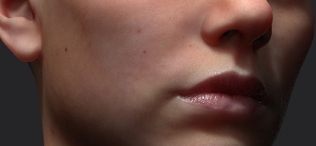

# 地下材料類型

本頁列出了可透過 Subsurface 散射功能創造的各種材質類型，以及如何配置 Substance 3D Painter 來製作這些材質。 每種材料都有一個刻度和顏色，可以在地下參數](subsurface-parameters.md)中[設定。

>[!NOTE]
>
> 本頁列出的數值，旨在概述各類材料。 這些數值並非精確，必須依專案解讀和/或調整。

## 人類皮膚

要做好皮膚材料，需要：

* 良好的基底材質：對於寫實角色來說，這代表要有足夠的細節和多樣的色彩。
* 強烈的高度/法線貼圖：次表面效果會柔化表面細節，原本有強烈細節會彌補。

| *背景設定* | *描述* |
| --- | --- |
| **規模** | <ol data-preserve-html="true"><li data-preserve-html="true">05 到 0.2</li></ol> |
| **顏色** | **右**  ： 0.575   **重克**  ： 0.894   **B**  ： 0.376 

 **注意：**  此顏色適合白人膚質。 |

透過真實人物的3D掃描，可以找到真實人物的例子：

* 數位艾蜜莉： <http://gl.ict.usc.edu/Research/DigitalEmily2/>
* 無限現實 LPS 頭像 ： <http://www.ir-ltd.net/> | <http://casual-effects.com/data/>

## 翡翠

**翡翠**  是一種觀賞礦物，主要以其綠色品種聞名，在古代亞洲藝術中佔有重要地位。

| *背景設定* | *描述* |
| --- | --- |
| **規模** | <ol data-preserve-html="true"><li data-preserve-html="true">25</li></ol> |
| **顏色** | **右**  ： 0.575   **重克**  ： 0.894   **B**  ： 0.376 

 |

## 大理石

| *背景設定* | *描述* |
| --- | --- |
| **規模** | <ol data-preserve-html="true"><li data-preserve-html="true">25</li></ol> |
| **顏色** | **R**  ：0.845   **G**  ：0.777   **B**  ：0.525 

 |

## 蠟

蠟會重新聚集各種有機化合物。 它存在於自然環境中，但也可以在實驗室中製造。 蠟可以存在於蠟燭中。

| *背景設定* | *描述* |
| --- | --- |
| **規模** | <ol data-preserve-html="true"><li data-preserve-html="true">6個以上。</li></ol> |
| **顏色** | **重度**  ：0.820   **重心**  ：0.470   **比重：**  0.205 

 |

## 牛奶

| *背景設定* | *描述* |
| --- | --- |
| **規模** | <ol data-preserve-html="true"><li data-preserve-html="true">7</li></ol> |
| **顏色** | **R**  ：0.895   **G**  ：0.833   **B**  ：0.750 

 |
