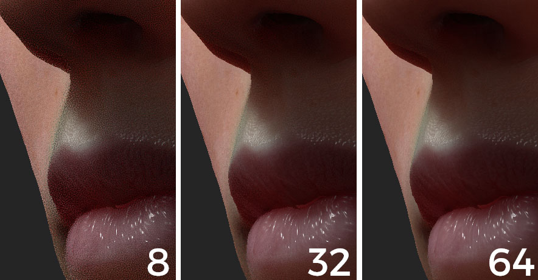

# 地下參數

Substance 3D Painter 的即時地下實作是一種螢幕空間下的地下散射效果。 控制它的參數詳見本頁。\
目前的實作基於PIXAR[&#128279;](http://graphics.pixar.com/library/ApproxBSSRDF/)發表的「高效次表面散射的近似反射率剖面」方法。

基於這些參數的材料範例，請參見： [次表面材料類型](subsurface-material-type.md)。

## 著色器/MDL 參數

在著色器設定[&#128279;](../../interface/shader-settings/shader-settings.md)視窗中可取得。

| *背景設定* | *描述* |
| --- | --- |
| **啟用** | 在這個著色器/mdl 實例上啟用或停用 Subsurface Scattering 效果。  可以用來禁用不需要的材料的 SSS 效果。 |
| **散射類型** | 定義材料中光吸收的行為：<ul data-preserve-html="true"><li data-preserve-html="true"><strong> 半透明</strong>：適合用於翡翠或大理石等光線能深入物體的通用材料。</li><li data-preserve-html="true"><strong> 皮膚</strong>：適合有機皮膚，光線吸收迅速且僅在表面附近散射。</li><li data-preserve-html="true"><strong>紅移/雷利</strong>：比皮膚設定更準確，能模擬人類或生物表面皮膚。</li></ul> |
| **規模** | 控制材料中光線吸收的半徑/深度。 這個參數的行為會根據場景中網格的大小而改變。0.0、0.2 和 1.0 分級在人類頭像上的比較：   

 |
| **顏色** | 光被材料吸收時的顏色。三種顏色的比較：   

 |

### 顯示設定參數

可在顯示設定[&#128279;](../../interface/display-settings/display-settings.md)視窗中取得。

>[!NOTE]
>
> 此參數&#x200B;**僅影響**&#x200B;**地下散射效應的即時**&#x200B;版本。

| *背景設定* | *描述* |
| --- | --- |
| **樣本數量** | 控制將執行的取樣數量以產生螢幕空間中的次表面模糊。 取樣越多，噪音越少，但會影響表現。在接近表面時，8、32 和 64 個樣本的比較：   

  **注意：**  也可以透過開啟 [相機設定](../../interface/display-settings/camera-settings.md) 來減少雜訊，但不增加取樣數。 |
