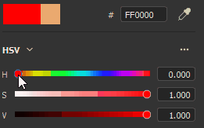

# 色彩選擇器

色彩選擇器允許設定顏色要繪製或投影到網格上。 它可以用來從外部影像中選取顏色，或調整應用程式內現有的顏色。

當點擊 Painter 中任何色彩欄位時，會顯示該色彩選擇視窗，該欄位可在屬性中或其他設定或選單中找到，例如顯示參數或著色器參數。

## 色彩選擇器概述

一旦開啟，顏色選擇器是半持久的，也就是說它會一直開啟，直到上下文改變——例如從繪畫圖層切換到填充圖層時。 你可以移動視窗，並將它放置在任何可用的螢幕上。 但與其他視窗不同的是，色彩選擇器無法插入底座。

窗戶採用垂直布局，由三個部分組成：

* 漸變選擇器（或頻譜）
* 滑桿（RGB/HSV）
* 色票

{width="200px"}

### 梯度選擇器（頻譜）

| 名稱與外觀 | 說明 |
| --- | --- |
| **顯示選擇器** 

 | 允許選擇使用哪個顯示器來編輯顏色（光譜與滑桿）。 預設值與主視窗使用的顯示值相符。  **注意：**&#x200B;此設定僅在啟用色彩管理[&#128279;](../features/color-management/color-management.md)時使用。 |
| **光譜** 

 | 垂直滑桿是整體色調。 它允許選擇在漸層場中顯示的色調。選擇好一般陰影後，可以按住並拖曳斜面區域中的準星游標，選擇想要的顏色。  **注意：**&#x200B;啟用色彩管理[&#128279;](../features/color-management/color-management.md)時，目前顯示器的 HDR 色彩會被夾住（在工作色彩空間中）。這是為了避免色彩管理通道輸出 HDR 值。 |
| **現今與過去的顏色** 

 | 左側矩形表示顏色選擇器將輸出的最終顏色。右邊的矩形顯示前一個顏色（當顏色選擇器被打開時）。 你可以點擊它來還原之前的顏色，並讓它變成目前的顏色。 |
| **十六進位域** 

 | 十六進位欄位以十六進位值表示當前顏色。 RGB 元件以一對字母表示。例如 #FF0000 代表紅色。  **注意：**&#x200B;啟用色彩管理[&#128279;](../features/color-management/color-management.md)時，十六進位欄位始終在標準 sRGB 色彩空間中運作，方便跨軟體複製/貼上數值，無論專案目前使用何種顯示或工作空間。 |
| **滴管** 

 | 吸管可以用來從外部來源中挑選顏色。 要使用它&#x200B;**&#x200B;**，點擊圖示再移動滑鼠，再複製想要的顏色。**注意：**  在視窗內選擇顏色時，可以使用 **Shift** 修改器直接選取目前已編輯的頻道。 這樣可以避免在原始材質與螢幕上顯示的顏色之間進行有損色彩轉換。 這也方便選擇顏色，而不必切換材質&#x200B;**&#x200B;**&#x200B;顯示模式。

  **注意：**  色彩欄位旁邊還設有吸管，可以快速選擇顏色，無需打開色彩選擇器。 

  **注意：**  在 Mac OS 上，吸管可能無法在應用程式介面外選取顏色，原因是隱私設定的關係。 要解決此問題，請在以下區域為應用程式指派適當的權限： `System Preferences > Security & Privacy > Privacy > Screen Recording` |

### 色彩設定

| 背景設定 | 說明 |
| --- | --- |
| **吸管色彩空間** | 指定視窗外選取色彩的色彩空間。**自動**&#x200B;設定使用專案設定中的標準 sRGB 色彩空間。

 **注意：**  此設定同樣適用於吸管與彩色按鈕旁的。  **注意：**  在視窗內選取的顏色，在未使用 Shift 修改器時也會使用此設定檔。 |

### 滑桿

色彩滑桿允許手動調整個別數值。

滑桿可設定兩種模式，HSV **&#x200B;**&#x200B;或 **RGB**。要更改模式，請使用專用的下拉選單。

#### HSV

**HSV** 代表 **H** ue、 **S** aturation 和 **V** alue。

**色相** 可以像垂直漸變滑桿一樣，在全域色彩家族間循環切換。

**飽和度** 控制所選色彩的豐富度，從灰階到完全飽和。

**明暗** 決定了顏色的深淺，範圍從全黑到全白不等。

#### RGB

**RGB** 代表 **R** ed、 **G** reen 和 **B** lue。

這些是電腦圖形中用來數位儲存顏色的主要元件。每個滑桿代表最終顏色中成分的比例。

舉例來說：下圖的顏色包含100%的紅色，但有50%的藍色和綠色。

RGB 滑桿通常以 0-255 的數值來測量。 這可以透過關閉 **浮點數值** 選項來達成。

### 滑桿設定

設定選單允許設定幾項額外行為：

| 背景設定 | 說明 |
| --- | --- |
| **動態滑桿** | 啟用後，滑桿的背景顏色會根據當前顏色調整。 |
| **浮點數值** | 啟用時，滑桿值會從 0.0 到 1.0 不等。若停用：<ul data-preserve-html="true"> <li data-preserve-html="true"><strong>HSV</strong>：色相滑桿是以度數來衡量（像色輪一樣）。 飽和度與價值使用百分比。 </li> <li data-preserve-html="true"><strong>RGB</strong>：元件以 0 到 255 的數值表示。</li> </ul> |

## 工作色彩空間

此區段顯示在當前工作色彩空間下，最終色彩值。

用 **滑鼠將「工作色彩空間** 」標題滑鼠移至，可以顯示目前色彩空間的名稱。

>[!NOTE]
>
> 此區塊僅在啟用色彩管理[&#128279;](../features/color-management/color-management.md)時使用。

## 色票

色片提供了一種保存顏色的方法，方便日後再使用。 試色可於投影與拍攝階段取得。

### 新增試色

點擊這個按鈕會在目前的色片組中產生新的色片顏色。

只有當最後一個顏色（按鈕旁邊的顏色）與目前編輯的顏色不同時，才會產生色片顏色。

>[!NOTE]
>
> 色片色彩會被管理並儲存為 sRGB 顏色，無論目前 [色彩管理](../features/color-management/color-management.md) 設定為何。

### 色片色

點擊試色顏色來載入。

滑鼠移至試色表會顯示其十六進位數值。

>[!NOTE]
>
> 啟用色彩管理[&#128279;](../features/color-management/color-management.md)時，顏色的顯示會根據目前選擇的顯示器進行調整。

### 試色設定

右鍵點擊色片顏色，打開選單並刪除它。

### 設定選單

使用設定選單刪除所有色片。

>[!NOTE]
>
> 色片會儲存在使用者文件資料夾中的設定檔中。 欲了解更多資訊，請參閱 [「架子與資產位置](../pipeline-and-integration/resource-management/shelf-and-assets-location.md) 」頁面。
