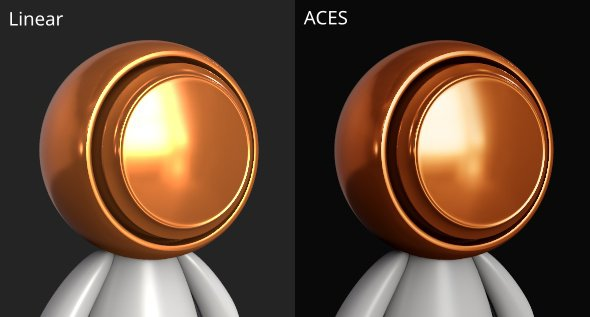

# 相機設定

此區&#x200B;**&#x200B;**&#x200B;塊控制相機的行為以及視窗的最終外觀。

## 相機

| *背景設定* | *描述* |
| --- | --- |
| **視野範圍** | 允許控制相機的視角（以度數為單位） |
| **對焦距離** | 定義焦點所在的距離。  這個點被景深效果所利用。 

 **注意：**  對焦距離可以透過快捷鍵 **CTRL + 中鍵點擊網格的某一點來自動設定** |
| **光圈** | 定義景深的寬度。 

 **注意：**  如果 Iray 控制此參數，改變它會重新觸發計算。 |

## 後續影響

更多資訊請參閱 [後期效果頁面](../../features/post-processing/post-processing.md) 。

## 時間抗鋸齒

啟用後， **時間抗鋸齒** （**TAA**）會移除視窗中的鋸齒邊緣。\
**TAA** 透過在多個渲染幀中累積資訊來運作，這表示在攝影機停止移動或執行其他操作之前，該效果會被停用。

| *背景設定* | *描述* |
| --- | --- |
| **累積** | 定義將累積多少幀以減少鋸齒。<ul data-preserve-html="true"> <li data-preserve-html="true">16：大多數情況下的建議價值</li> <li data-preserve-html="true">64：用於清理高對比度值（如 Alpha 測試著色器與抖動結合）</li> </ul>  **注意：**  此設定不影響效能;不過，較高的數值可能會花較長時間才能產生良好結果。 |

{width="500px"}

抗鋸齒也可用於過濾 **Alpha-Test** 著色器，前提是啟用了「**Alpha 抖動**」設定：

{width="500px"}

## 次表面散射

更多資訊請參閱 [次層散射](../../features/subsurface-scattering/subsurface-scattering.md) 頁面。

## 色彩特徵

更多資訊請參閱 [色彩專頁](../../features/post-processing/color-profile.md) 。

## 色調對應

| 背景設定 | 說明 |
| --- | --- |
| **功能** | 指定用於設定超出顯示器顯示能力的色彩值函數（將 HDR 值重新映射至 LDR 範圍）。可能的值有：<ul data-preserve-html="true"><li data-preserve-html="true"><strong>線性</strong> （預設）：無轉換，1.0 以上的數值會被鎖定。</li><li data-preserve-html="true"><strong>ACES：</strong>使用 ACES 的電影色調映射曲線。</li></ul> 

 **注意：**  部分遊戲引擎與渲染軟體使用 ACES 色調映射器。 啟用此功能有助於應用程式間匹配顏色，避免差異。 |
