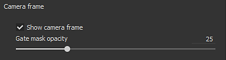
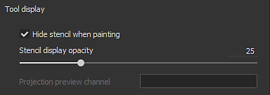
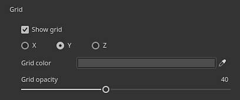

# 視框設定

顯示設定&#x200B;**的**&#x200B;此區控制與視窗顯示相關的各種設定，如材質過濾與網格線框。

## 紋理過濾

各向異性濾波與 MipMap 偏壓允許控制視口中紋理的顯示。 這些設定不會直接影響材質，匯出時也不會套用，只是優化視窗的渲染過程。 MipMap 偏壓設定允許對遠處或斜角像素強制使用非常銳利的紋理，但在某些情況下可能會產生莫爾紋理或抖動。

預設設定是品質與效能的妥協，只有在真正需要時才應該更改。

| *背景設定* | *描述* |
| --- | --- |
| **各向異性濾波** | 各向異性濾波能提升斜角觀看時的貼圖品質。 高品質值能提供更好的過濾，但可能導致效能損失。 此設定控制用於濾波的每像素取樣數（spp）：<ul data-preserve-html="true"><li data-preserve-html="true"><strong>停用</strong> ：無過濾</li><li data-preserve-html="true"><strong>低劑量</strong> （2spp）</li><li data-preserve-html="true"><strong>中等</strong> （4spp）：預設值</li><li data-preserve-html="true"><strong>高（</strong> 8spp）</li><li data-preserve-html="true"><strong>非常高（</strong> 16spp）</li></ul> 

 |
| **MipMap 偏誤** | 調整 MipMap 細節層級以提升材質品質。 銳利的數值可能導致效能損失和貼圖鋸齒狀。<ul data-preserve-html="true"><li data-preserve-html="true"><strong>0 - 軟</strong> （輕量級性能）：預設值</li><li data-preserve-html="true"><strong>1 - 中軟</strong></li><li data-preserve-html="true"><strong>2 - 準時</strong></li><li data-preserve-html="true"><strong>3 - 非常銳利</strong> （密集表演）</li></ul>（從0到-3） |

## 攝影機框架

欲了解更多攝影機管理資訊，請參見： [攝影機管理](../viewport/camera-management.md)

## 工具顯示

| *背景設定* | *描述* |
| --- | --- |
| **繪畫時隱藏模板** | 使用模板（參見繪製工具屬性）時，這個設定允許在繪製網格上時暫時隱藏它。 |
| **模板顯示不透明度** | 控制模板在不上色時對視窗渲染的可見性。 |
| **投影預覽頻道** | 控制使用投影工具時要顯示材質的哪個通道。 |

## 網格線框

| *背景設定* | *描述* |
| --- | --- |
| **顯示網格線框** | 在視窗中啟用或停用網格線框的顯示。 |
| **線框色彩** | 控制繪製網格線框的顏色。 |
| **線框不透明度** | 控制在網格上繪製線框時，能看到多少。 |

## 頻道顯示

>[!NOTE]
>
> 頻道顯示設定僅在使用 **單頻道** 視圖模式時可用。

| *背景設定* | *描述* |
| --- | --- |
| **顯示無燈光的單人視圖（未亮）** | 在單頻道模式下觀看時，啟用此設定會移除燈光，頻道呈現平淡的顏色。 如果停用，網格邊界會被套用陰影。 |
| **縮放HDR值** | 在單聲道模式下 **觀看 HDR** 材質（例如高度）時，此設定會將總數值縮放。 這對於觀看超過 1 或低於 -1 的數值非常有用。 結果等於 **按比例**&#x200B;劃分的 Channel diving。以下範例中，高度通道的值最高為 3。 然而，預設情況下，除非刻度值改變，否則無法查看： 

 |
| **HDR 值使用 +/- 顏色** | 此設定可透過將正值替換為第一色、負值替換為第二色，更輕鬆地瀏覽 HDR 材質。 中性值（0）為黑色。範例： 

 |
| **彩色通道** | 修改視窗視角模式，使其僅單獨顯示當前通道的 R、G、B 或 Alpha 部分。 此設定在物質顯示模式下無法使用。 啟用時，選取的色彩通道名稱會顯示在視窗中：  

  可能的數值：<ul data-preserve-html="true"><li data-preserve-html="true"><strong>RGBA</strong> （預設）：在彩色通道中，顯示所有帶有透明度的元件。</li><li data-preserve-html="true"><strong>灰階+Alpha</strong> （預設值）：在灰階通道中，顯示灰階值與透明度。</li><li data-preserve-html="true"><strong>R</strong>：在彩色通道上，只顯示紅色成分。</li><li data-preserve-html="true"><strong>G</strong>：在彩色通道中，只顯示綠色成分。</li><li data-preserve-html="true"><strong>B</strong>：在彩色通道上，只顯示藍色成分。</li><li data-preserve-html="true"><strong>Alpha</strong>：在任何頻道上，只顯示材質的透明度。</li></ul> |

## 格線

格線設定允許在 3D 視窗內顯示並控制繪製 3D 格子。

格子劃分是根據當前相機的縮放和角度自動產生的。 目前的格網單元顯示在視窗左下角。

| 背景設定 | 說明 |
| --- | --- |
| **展覽格子** | 如果啟用，請在 3D 視窗中顯示格子。 |
| **軸心國** | 定義格子在視窗中可見的軸向。 預設值為 Y，因為這是應用程式的上軸。 |
| **格子顏色** | 在視窗中繪製格子的顏色。 |
| **網格不透明度** | 視窗格網的不透明度。 |
