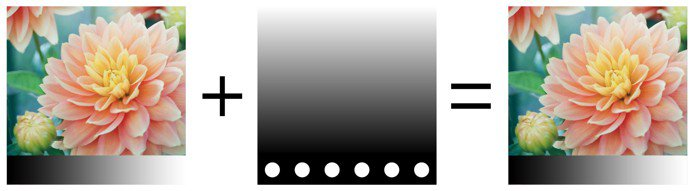
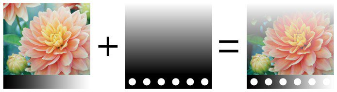
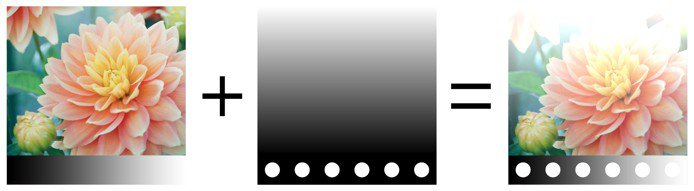
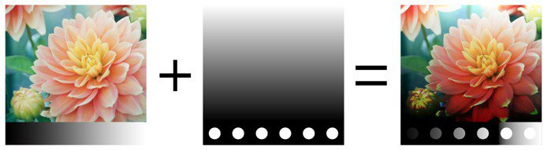
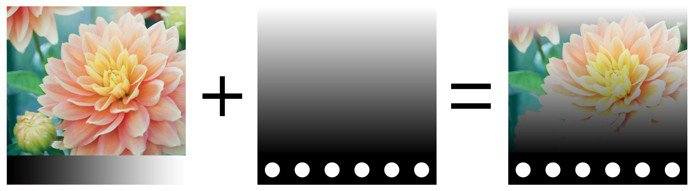

# 混合模式

圖層和效果器可以使用多種 **混合模式**。 它們允許將一層的結果與下方其他層以不同方式混合。

並非所有混合模式都適合所有使用情境。 例如 **，法線貼圖** 混合模式只適用於 **貼圖集的法線通道** 。

## 混合模式順序

要了解混合模式的應用方式與時間，了解圖層堆疊&#x200B;**中操作的**&#x200B;執行順序非常重要：

1. 計算出底層。
1. 頂層的圖層會根據混合模式計算並與下方的圖層混合（例如：乘法）。
1. 遮罩是為了呈現頂層的最終效果。

## 改變混合模式

混合模式可以針對  **圖層中的每個通道**  進行調整。 要在頻道間切換，請使用圖層堆疊視窗中左上角的下拉選單。

要更改混合模式，只需點擊特定圖層的混合模式下拉選單：

>[!NOTE]
>
> 如果下拉選單有焦點，可以透過以下快捷鍵快速切換混合模式：
> 
> * 向上或向下箭頭鍵盤快捷鍵
> * 滑鼠滾輪上下

## 混合模式列表

以下是 Substance 3D Painter 圖層與效果中所有可用的混合模式清單。 大多數混合模式透過RGB（或灰階）操作來運作，但有些操作也透過另一種模式執行，即[HSV（色相、飽和度、明暗）。](https://en.wikipedia.org/wiki/HSL_and_HSV)所有混合模式皆在 **線性伽瑪空間** 內部執行。

| *名稱* | *描述* |
| --- | --- |
| 正常 | 在不做轉換的情況下，將頂層顯示在底層之上（複製模式）。 如果頂層有透明（alpha），它會透過透明像素顯示底層。 

 |
| 直通式 | 將底層壓平成最上層。 主要適用於以下情況：<ul data-preserve-html="true"> <li data-preserve-html="true">要對頂層以下的所有圖層套用效果</li> <li data-preserve-html="true">要把頂層下方的層壓扁或複製</li> </ul> 

 **注意：******&#x200B;效果可以&#x200B;**直接拖放**&#x200B;到圖層堆疊中，這樣會產生一個所有通道都設定為 PassThrough 的圖層。   |
| 停用 | 捨棄該圖層的混合，只顯示前幾層。 它可用於優化通道的計算，方法是忽略頂層的通道。 

 |
| 替換 | 覆蓋底層。 這有助於避免資訊與下方圖層混合。 替換和法線混合的運作方式不同，因為它也會忽略頂層的 alpha，這可能導致透明像素。 

 |
|  |  |
| 乘法 | 將頂層乘以底層。 結果總是較暗。 

 |
| 分界 | 將下方圖層除以當前圖層的顏色資訊。 結果照片大多時候會比較淺，有時看起來有點燒焦。 

 |
| 逆除法 | 與分割混合模式相同，但混合操作中會交換頂部與底部層。 

 |
| 暗色（Min） | 保持最上層和底層之間的最小色彩值。 

 |
| Lighten（Max） | 保持頂層與底層之間的最大色彩值。 

 |
|  |  |
| 線性閃避（Add） | 將頂層的顏色值加到底層。 結果可能呈現低於 0 或高於 1 的顏色，若通道非 HDR，結果會被壓縮或裁剪。 此混合模式有助於累積高度資訊。 

 |
| 減法 | 從底層減去最上層的顏色。 結果可能會產生低於 0 的顏色，若通道不是 HDR，結果會被壓縮或裁剪。 

 |
| 反減法 | 與減法混合模式相同，但混合操作中會交換頂部與底部層。 

 |
| 差異 | 從底層減去頂層顏色，但取結果的絕對值（負值會變成正值）。 

 |
| 排除 | 類似差異混合模式，但會產生較低對比度的結果。 

 |
| 帶名加法（AddSub） | 兩者都會根據頂層的顏色，從底層增加或減去顏色資訊。 灰階值不影響，深色會減少資訊，淺色則會增加資訊。 

 |
|  |  |
| 疊加層 | 結合螢幕和乘法混合模式。 頂層的灰階值不會有影響，但深色會讓顏色倍增，而亮色則會讓顏色變亮。 

 |
| 螢幕 | 頂部與底部的色彩資訊會先反轉，然後相互相乘，接著再反轉。 這會產生與乘法混合模式相反的視覺效果，並呈現更明亮的影像。 

 |
| 線性燃燒 | 將頂層和底層的顏色資訊加總，然後從結果中減去 1。 

 |
| 色彩燃燒 | 將底層除以頂層。 操作執行前，底層會被反轉。 此混合操作會使頂層變暗並增加對比度，以顯示底層的顏色。 底層越深，顏色使用的越多。 

 |
| 彩色道奇 | 將底層除以倒置的頂層。 此操作會根據頂層的數值來減輕底層的重量。 頂層越亮，其顏色對底層的影響就越大。 

 |
|  |  |
| 柔和的光 | 類似於疊加混合模式，但採用不同的曲線來混合色彩資訊，使影像對比度降低。 

 |
| 硬光 | 類似於疊加混合模式（結合乘法與螢幕操作）。 差別在於操作順序相反，導致影像顏色較暗或較亮，但對比度較低。 

 |
| 鮮明之光 | 結合了色彩閃避和色彩燃燒混合模式。 閃避作用適用於比灰色淺的顏色，燃燒則用於比灰色深的顏色。 灰色值則不受影響。 結果是影像對比更強烈。 

 |
| 線性光 | 結合線性閃避和線性燒傷。 閃避作用適用於比灰色淺的顏色，燃燒則用於比灰色深的顏色。 灰色值則不受影響。 結果與 Vivid Light 相似，但對比度較低。 

 |
| 針燈 | 根據頂層顏色來調亮或調暗顏色資訊。 如果頂層的深色比底層深，它們會被看見;如果不暗，則會消失。 鮮豔的顏色也是同樣的原理。 此混合模式可能導致斑點或斑點（大雜訊），且完全去除所有中間調。 

 |
|  |  |
| 色調 | 以HSV模型執行操作。 只保留最上層的色調，並使用底層的飽和度和明度。 黑色和非常深的顏色沒有色相，因此底層的顏色會保持不變。 

 |
| 飽和度 | 以HSV模型執行操作。 只保留最上層的飽和度，並使用底層的色調和明暗。 黑色和非常深的顏色會被去飽和，因此底層的顏色會變成灰階值。 

 |
| 顏色 | 以HSV模型執行操作。 只保留最上層的色調和飽和度，並使用底層的明暗值。 黑色和非常深的顏色沒有色相，且會去飽和，因此底層的顏色會變成灰階值。 

 |
| 價值 | 以HSV模型執行操作。 只會保留最上層的明暗，並使用底層的色調和飽和度。 

 |
|  |  |
| 法線貼圖結合 | 白色處理混合作業。 保留細節，同時確保平坦法線仍能正常運作。 更多資訊請參見 [法線貼圖繪製](../../painting/advanced-channel-painting/normal-map-painting.md) 。 

 |
| 法線貼圖細節 | 細節導向混合操作（Reoriented Normal Mapping），比法線貼圖組合更精確。 保留平坦的法線貼圖及兩個來源的強度。 為了確保結果，頂層法線會重新定向，使其沿最底層的表面。 更多資訊請參見 [法線貼圖繪製](../../painting/advanced-channel-painting/normal-map-painting.md) 。 

 |
| 法線貼圖反細節 | 與法線貼圖細節混合操作的行為相同，但底部圖層會被轉換以符合頂層的表面。 更多資訊請參見 [法線貼圖繪製](../../painting/advanced-channel-painting/normal-map-painting.md) 。 

 |

>>
