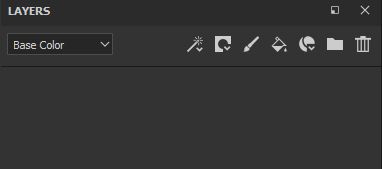

# 建立圖層

在圖層堆疊中新增/建立圖層有多種方式：

| *行動* | *示範* |
| --- | --- |
| **點擊專用按鈕建立繪畫圖層**

 | 

 |
| 點擊專用按鈕建立&#x200B;**填充圖層**

 | 

 |
| **點擊專用按鈕建立資料夾**

 | 

 |
| **可使用以下方法之一複製** 圖層：<ul data-preserve-html="true"><li data-preserve-html="true">右鍵點擊>複製</li><li data-preserve-html="true">快捷鍵 CTRL+D 或 COMMAND+D</li><li data-preserve-html="true">按住並維持 CTRL 或 COMMAND 鍵，然後拖放圖層</li></ul> | 

 |
| 點擊專用按鈕刪除圖層 

 | 

 |

>[!NOTE]
>
> 部分操作配有相應的快捷鍵，可在專屬頁面](../settings/shortcuts.md)查詢[。

從書架拖放資源也可以是一種建立圖層的方法：

| *行動* | *示範* |
| --- | --- |
| 將材質&#x200B;**[從資產](../assets/assets.md)拖放**&#x200B;到圖層堆疊中 | 

 |
| 將智慧材質&#x200B;**從[資產](../assets/assets.md)拖放**&#x200B;到圖層堆疊中 | 

 |
| 將特效&#x200B;**[從資產](../assets/assets.md)拖放**&#x200B;到圖層堆疊中 | 

 |
