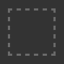
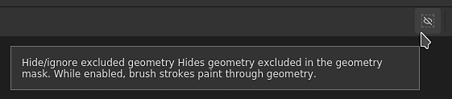

# 幾何遮罩

\
幾何遮罩是層上的次要遮罩，允許根據相關紋理集的 3D 模型幾何來遮罩圖層。 它可以用網格名稱或 UV 圖塊來遮罩。

## 概觀

幾何遮罩的運作方式是透過包含/排除清單指定該圖層應套用在 3D 模型的哪一部分。

幾何遮罩是一個有用的工具，可以快速捨棄 3D 模型幾何的大部分。 它為油漆遮罩帶來多項優點：

* 通常搭配視窗選擇模式設定和使用會比較快。
* 它提供更好的效能，因為在產生貼圖時可以完全捨棄幾何體。
* 它是非破壞性的，當 3D 模型在重新匯入後改變時會更新。
* 它允許繪製遮罩幾何體下方的幾何體，從而繪製隱藏的部分。
* 就像塗裝遮罩一樣，幾何遮罩可以套用在群組上，同時影響多個圖層。

### 聖像國

幾何遮罩圖示可指示其狀態：

| 聖像 | 說明 |
| --- | --- |
| 

 | 沒有排除任何幾何體，該圖層會套用在相關 Texture Set 的整個網格上。這是任何新圖層或資料夾的預設狀態。 |
| 

 | 一個或多個網格名稱已被排除。 麻木表示該層仍受影響的剩餘元素數量。 |
| 

 | 一個或多個 UV 磚塊已被排除。 麻木表示該層仍受影響的剩餘元素數量。 |
| 

 | 沒有包含網格名稱，這個圖層不會有任何實際影響。 |

## 編輯幾何遮罩

要修改特定圖層的幾何遮罩，只需點擊專用圖示即可。 要退出編輯模式，只需點擊圖層的其他部分，例如內容或繪圖遮罩：

### 遮蔽類型

幾何遮罩支援兩種遮罩方式：

| 類型 | 說明 |
| --- | --- |
| **UV瓷磚** | 遮罩是透過指定應包含哪個 UV 圖塊（UDIM）編號來完成的。 這是效能最高的方法，因為它允許完全捨棄一個紋理，避免被計算。 |
| **網格名稱** | 遮罩是透過指定應包含在 3D 模型中的子網格來完成的。 幾何體依網格名稱分組。 |

### 層堆疊動作

幾何遮罩狀態可直接從圖層堆疊中快速修改，方法是右鍵點擊圖示。

它提供以下行動：

| 動作 | 說明 |
| --- | --- |
| **複製幾何遮罩** | 複製給定圖層的幾何遮罩類型與選擇。 |
| **貼到幾何遮罩裡。** | 貼上先前複製的幾何遮罩屬性。 |
| **包含所有** | 標記給定遮罩的所有元素為已選取。 |
| **全部排除** | 將給定遮罩的所有元素標記為取消選取。 |

## 透過遮罩幾何進行繪畫

當部分幾何體被排除後，就可以在視窗中隱藏。 這讓原本無法觸及的幾何結構可以上色。

要隱藏被排除的幾何體，請使用視窗頂端的按鈕，在上下文工具列中：

在下方的範例中，3D 模型被拆分為兩個物件：上半部和下半部。 預設筆觸會與所有物件碰撞。 排除上半部後，現在可以只在下半部上色。

>[!NOTE]
>
> 幾何遮罩的包含/排除清單是動態的，改變其狀態會觸發該圖層筆觸的新計算。 這讓在重新匯入帶有新 UV 圖塊的網格或網格名稱改變時，可以調整遮罩而不損失筆觸。 但這也代表筆觸不會被烘焙，因此幾何遮罩的任何變動都可能導致畫筆投影錯誤。

| 視覺 | 說明 |
| --- | --- |
| 

 | 幾何遮罩中沒有排除任何幾何體，白色筆觸所覆蓋的顏料層會與所有幾何體碰撞。**隱藏排除幾何**&#x200B;體按鈕是被禁用的。 |
| 

 | 幾何遮罩中已排除上半部，白色筆觸僅與幾何體底部碰撞。**「隱藏排除幾何**&#x200B;體」按鈕已啟用。 |
| 

 | 幾何遮罩中已排除上半部，白色筆觸僅與幾何體底部碰撞。**隱藏排除幾何**&#x200B;體按鈕是被禁用的。 |
