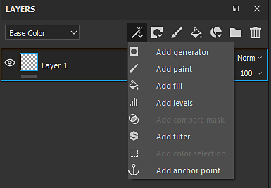

# 層堆疊

**圖層堆疊**&#x200B;讓你可以操作貼圖集的圖層。圖層包含繪畫和效果，這些會為場景中的 3D 物件創造貼圖。 你可以隱藏和解除隱藏圖層，將它們放入資料夾，並調整不透明度和混合模式。

更多資訊請參閱以下頁面：

* [建立圖層](creating-layers.md)
* [管理層級](managing-layers.md)
* [遮蔽與效果](masking-and-effects.md)
* [混合模式](blending-modes.md)
* [層實例化](layer-instancing.md)
* [幾何遮罩](geometry-mask.md)

## 概觀

圖層堆疊顯示具有特定階層的圖層：底層的圖層會先在網格上繪製，接著是上方的圖層。 因此，堆疊頂端的層是最後一項，而最底層的層是第一層。 同樣的原理也適用於資料夾，但資料夾的內容會優先。 這表示資料夾的內容會先處理，先於同層級的圖層。

**共同特徵：**

* 每一層都是 **多通道**。
* 繪畫工具會根據材質設定在所有相應的通道&#x200B;**上繪色**（你目前在圖層堆疊中觀看的哪個通道不會影響）。
* 每個圖層都有 **混合模式** 和每個通道的 **不透明度** （你可以透過左上角下拉選單切換通道）。

**層次類型：**

* **顏料層** ：這種層可以用畫筆和顆粒在上面繪製
* **填充圖層** ：此圖層無法直接塗裝，而是可以載入材質，填滿通道。 （例如你也可以操作轉換來重複材質。）
* **資料夾** ：此類圖層僅用於包含其他圖層，主要用於組織圖層堆疊

在每個圖層上，你可以 **新增一個遮罩** ，讓內容只套用到目前材質集的特定通道部分。\
你可以手動（用畫筆用灰階）在遮罩上繪畫，或是用濾鏡和材質來達到更動態/程序化的效果。

## 視圖模式

圖層堆疊的左上角下拉選單控制圖層堆疊的檢視模式。 由於一層可以涵蓋多個通道，因此無法同時顯示所有這些屬性。 因此，檢視模式可以用來定義目前的顯示上下文。 使用此下拉選單時，可以指定圖層縮圖中顯示哪些通道，並控制該通道的混合模式與透明度。

這個下拉選單中的列表是根據貼圖集設定](../texture-set/texture-set-settings.md)中可用的[頻道列表。

## 動作

右上角的圖示列表是圖層堆疊中常見的動作：

| 動作 | 說明 |
| --- | --- |
| 加益效果 

 | 建立一個新效果，然後加入目前選取的圖層。 欲了解更多效果相關資訊，請參閱[專屬頁面](../../features/effects/effects.md)。 |
| 建立遮罩 

 | 打開面具動作選單，裡面包含以下項目：<ul data-preserve-html="true"><li data-preserve-html="true">加白色遮罩</li><li data-preserve-html="true">加上黑色遮罩</li><li data-preserve-html="true">新增點陣遮罩</li><li data-preserve-html="true">加入遮罩並選擇顏色</li><li data-preserve-html="true">加上遮罩與高度組合</li></ul> |
| 建立新的繪畫圖層 

 | 在目前選取的圖層上方建立一個新的 Paint 圖層。 |
| 建立新的填充圖層 

 | 在目前選取的圖層上方建立一個新的 [填充圖層](../../painting/fill-projections/fill-projections.md) 。 |
| 新增智慧材料 

 | 在目前選取的圖層上方插入一個新的智慧材質。點擊此按鈕會開啟一個迷你書架，瀏覽目前資產中可用的智慧材料清單。 |
| 新增資料夾 

 | 在目前選取的圖層上方建立一個新的空資料夾。 |
| 刪除圖層 

 | 刪除目前選取的項目（圖層、資料夾或效果）。 |
