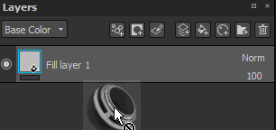

# 遮蔽與效果

## 遮蔽

圖層可以被遮罩，只在材質的特定部分顯示或套用其內容。 遮罩作為層內容的強度參數。 圖層上的遮罩永遠是灰階的，不管你用什麼內容來覆蓋（因此任何顏色在上色前都會被轉換成灰階值）。

你可以透過右鍵選單或專用按鈕新增遮罩：

對面具的可能操作：

* 你可以想像遮罩本身在縮圖上用 **ALT + 左鍵點擊** 。 它會將視窗切換到遮罩的隔離視圖。 此操作也可透過檢視器設定使用。
* 你可以用 SHIFT + 左鍵點擊&#x200B;**遮罩**&#x200B;的縮圖暫時停用。重新執行同樣的操作來重新啟用。 此操作也可透過右鍵選單（「切換遮罩」）使用。
* 你可以透過&#x200B;**右鍵點擊 > 複製遮罩內容**&#x200B;**到另一個遮罩，然後右鍵點擊 > 貼到**&#x200B;第二個遮罩的縮圖上。
* 你可以透過右 **鍵點擊 > 反轉遮罩背景來反轉遮罩的背景**。 如果你想避免破壞面具附帶的效果，這很有用。

>[!WARNING]
>
> 重新加裝或移除遮罩會破壞遮罩及其所有效果。

在建立填充圖層時（透過拖放 **）按下 CTRL** 鍵即可立即建立遮罩：

## 影響

特效是可隨時編輯的特殊操作。 這些效果可以放在遮罩上，也可以放在圖層內容上。\
不過，效果對另一方來說更合適。 例如，「產生器」是適合用在遮罩上的。

圖層上每個縮圖下方的線條會顯示是否有效果。 灰色代表沒有效果，紅色代表至少一個效果。 效果疊疊是每個面具和每個內容的。

欲了解更多資訊，請參閱 [專屬頁面](../../features/effects/effects.md)。

## 智慧口罩

智慧遮罩是一種儲存遮罩及其效果的方法，方便它們在其他圖層或其他專案中重複使用。 要建立智慧口罩，只需右鍵點擊遮罩並選擇「**建立智慧口罩**」。\
當將智慧遮罩拖放到圖層時，如果黑色遮罩還不存在，就會建立，否則效果清單會與現有的合併。 只要按下「**CTRL」**，在放下智慧遮罩時，可以完全覆蓋效果清單。

<table>
<tr style="border: 0;">
<td style="border: 0;" valign="top">

</td>
<td style="border: 0;" valign="top">

</td>
</tr>
</table>
