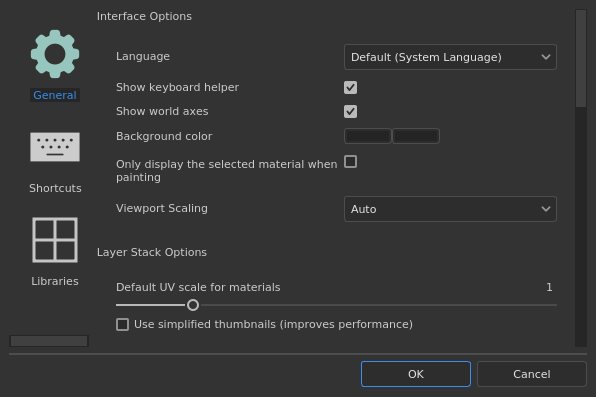
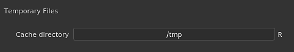

# 一般偏好

本頁說明應用程式的主要設定。

## 介面選項

| 背景設定 | 說明 |
| --- | --- |
| **語言** | 定義應用程式介面所使用的語言。 此設定需重新啟動應用程式才能生效。可能的數值：<ul data-preserve-html="true"><li data-preserve-html="true"><strong>預設（系統語言）：</strong>從作業系統中取得相容語言</li><li data-preserve-html="true"><strong>英文</strong></li><li data-preserve-html="true"><strong>德語</strong></li><li data-preserve-html="true"><strong>法語</strong></li><li data-preserve-html="true"><strong>日本</strong></li><li data-preserve-html="true"><strong>中文</strong> （簡體）</li></ul> |
| **Show 鍵盤輔助工具** | 若啟用此功能，按下按鍵（如 CTRL 或 SHIFT）時，鍵盤捷徑會在視窗左下角顯示。 |
| **展場斧頭** | 啟用時，3D 視圖右下角會顯示世界軸。 |
| **背景色** | 選擇作為視窗背景的顏色。 有兩種顏色可用來產生漸層。 |
| **上色時只顯示選定的材質** | 啟用後，繪製時只有目前選取的貼圖集會顯示在 3D 視圖中（暫時隱藏其他貼圖集）。  **注意：**&#x200B;建議關閉此設定，因為快速更改視窗中的可見度會影響稀疏虛擬貼圖](../../features/sparse-virtual-textures.md)的[效能。 |
| **視窗縮放** | 允許降低HDPI/Retina螢幕的視窗解析度，以提升效能。可能的價值：<ul data-preserve-html="true"><li data-preserve-html="true"><strong>沒有</strong>：沒有縮放，視窗是以原生螢幕解析度呈現。</li><li data-preserve-html="true"><strong>自動</strong>：將螢幕解析度除以二（僅限 HDPI 螢幕）。</li></ul> |

## 圖層堆疊選項

| 背景設定 | 說明 |
| --- | --- |
| **材質的預設 UV 縮放** | 定義了填充圖層的預設平鋪/重複值，並在層疊中應用材質時的填充效果。 |
| **請使用簡化縮圖** | 啟用後，圖層堆疊只會顯示圖示，而不會計算縮圖。 使用圖示可以提升效能。 這個設定不適用於使用 UV Tile 工作流程的專案，因為它們總是會顯示圖示。 |

## 相機選項

| 背景設定 | 說明 |
| --- | --- |
| **旋轉速度** | 在視窗中，攝影機預設旋轉速度的乘數。 |
| **變焦速度** | 在視窗中，相機預設變焦速度的倍增器。反向可根據滑鼠移動反轉縮放方向。 |
| **車輪速度** | 滑鼠滾輪的放大速度乘數。反向方向則可根據輪子的移動反轉變焦方向。 |

## 烘焙選項

| 背景設定 | 說明 |
| --- | --- |
| **儲存預處理場景檔案** | 啟用後，烘焙者使用的預先處理高多邊形網格會儲存在磁碟中，供未來再利用。 這個設定可以讓重新烘焙更快。 |
| **啟用即時預覽烘焙流程** | 啟用後，3D 與 2D 視埠會顯示目前正在計算的 Baker 材質。 |
| **啟用 GPU 光線追蹤** | 啟用後，Baker 會嘗試使用 GPU 來執行光線追蹤，而非 CPU。 這個功能讓烘焙者整體上能更快完成工作。此功能只能在相容硬體上啟用。 詳情請參閱 [系統需求](../../getting-started/system-requirements.md) 。 |

## 預覽選項

| 背景設定 | 說明 |
| --- | --- |
| **本地快取目錄** | 定義資源縮圖生成時的次要位置。此設定對於當資源路徑為唯讀（例如只有讀取權限的網路路徑）時，計算和儲存資源縮圖非常有用。 這樣可以避免每次啟動時重新計算縮圖，否則縮圖不會儲存在磁碟上。 |
| **本地快取預算（以 MB 計）** | 定義本地快取的最大快取大小。 |
| **材質預覽著色器** | 定義一個著色器，用來在書架上產生材質縮圖。 如果資源使用與預設著色器不同的工作流程，這很有用。 此設定需要重新啟動應用程式才能生效。 |

## 暫存檔案

| 背景設定 | 說明 |
| --- | --- |
| **快取目錄** | 定義暫存檔案的寫入位置。 這包括 [稀疏虛擬材質](../../features/sparse-virtual-textures.md) 快取。 此設定可被 [環境變數](../../pipeline-and-integration/configuration/environment-variables.md)覆蓋。 |

## 稀疏虛擬貼圖

| 背景設定 | 說明 |
| --- | --- |
| **硬體支援加速** | 啟用後，應用程式會嘗試使用 GPU 上的稀疏材質。 更多細節請參閱 [稀疏虛擬貼圖](../../features/sparse-virtual-textures.md) 頁面。 此設定可被 [環境變數](../../pipeline-and-integration/configuration/environment-variables.md)覆蓋。 |

## Iray 硬體

本節列出所有可用 Iray 渲染時可用的相容硬體。

CPU 設定在所有電腦上皆可使用。 如果電腦搭載  **的是 CUDA 相容版本的 Nvidia GPU**  ，也會在這裡列出。

>[!NOTE]
>
> 建議關閉 CPU，只啟用 GPU 硬體，以確保最佳的渲染效能。 CPU 和 GPU 同時啟用可以增加渲染時間。

## 隱私

| 背景設定 | 說明 |
| --- | --- |
| **自動傳送使用統計資料** | 若啟用，請匿名傳送電腦硬體配置資訊及其他使用資料。 這些數據幫助我們開發與改進軟體。 |
