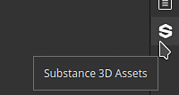

# Substance 3D Assets

<b>Substance 3D Assets</b> 底座允許直接在應用程式內瀏覽同名的線上資料庫。原始圖書館可於以下地址查閱： <https://substance3d.adobe.com/assets>

>[!NOTE]
>
> Substance 3D 資產視窗在 Steam 版本應用程式中無法使用。

## 位置

預設情況下，視窗會作為一個分頁，緊鄰一般資產視窗。 如果視窗關閉，可以從介面最右側的 dock 工具列再次開啟。

### 瀏覽資產

瀏覽素材時，您可以使用視窗內的介面。 頂部顯示搜尋欄位，方便你精細搜尋，並且還提供篩選功能。

### 下載資產

當你點擊資產的下載按鈕後，它們會開始下載，並會出現在視窗的 donwload 管理器中。 要查看，只需點擊視窗左下角的按鈕即可。

此清單僅顯示應用程式當前會話中下載的資產。

一旦資產成功下載，它會出現在一般 <b>的資產</b> 視窗中。

>[!NOTE]
>
> 資源下載的位置取決於預設的函式庫。 此位置可在偏好設定中更改，詳見專用 [文件頁面](assets/adding-a-new-library.md)。

### 控制選單

視窗右下角的按鈕提供幾個操作：

* <b>開啟資料夾位置</b>：打開檔案總管到目前函式庫的位置。 這讓玩家可以在磁碟上瀏覽已下載的資產（包含過去的會話）。
* <b>重新載入頁面</b>：重新載入視窗內的介面。
* <b>上一頁</b>：在視窗中導覽到上一頁的介面。
* <b>下一頁</b>：在視窗中導覽到下一個介面。

