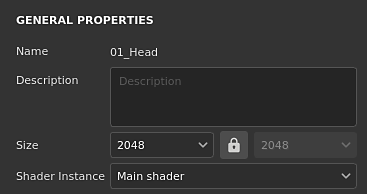
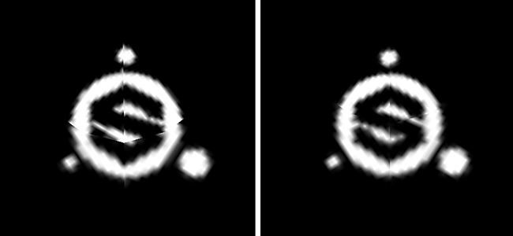

# 材質集設定

{width="300px"}

**貼圖集設定**&#x200B;控制目前選中的貼圖集參數。這裡可以管理解析度、通道和相關的網格貼圖。

## 一般性質

| 背景設定 | 說明 |
| --- | --- |
| **名稱** | 材質集名稱。 是繼承給 3D 模型上材質名稱的。 |
| **描述** | 文字欄位允許新增關於貼圖集的資訊。 此文字顯示於 [材質集清單](texture-set-list.md) 與 [烘焙](../../baking/baking.md) 視窗中。 |
| **規模** | 控制 Texture Set 內通道的解析度（像素數）。 要使用  **非平方**  解析度（例如 2048x1024），請在兩個下拉選單間關閉  **鎖定按鈕**  。貼圖集解析度是  **動態**  的，因為是  **非破壞性的工作流程**。 這表示你可以先用低解析度工作以獲得良好效能，之後再用更高解析度來獲得更好的畫質。 在應用程式內部，通道的最大解析度為 4096x4096 像素，而匯出時最大解析度則為 8192x8192（若 GPU 支援）。 改變解析度可能會觸發引擎的長時間計算。 |
| **著色器實例** | 定義用哪個[著色器](../shader-settings/shader-settings.md)來渲染給定的貼圖集。[&#128279;](../viewport/viewport.md) |

## 管道

### 頻道列表

清單可隨時修改，透過新增或移除通道（除非被 [材質分層](../../features/dynamic-material-layering.md)工作流程覆蓋）。

| 按鈕 / 圖示 | 說明 |
| --- | --- |
| <b>新增通道</b>  

 | 點擊此按鈕將新頻道加入列表中。彈出選單會被分為三個類別：<ul data-preserve-html="true"><li data-preserve-html="true"><strong>支援通道</strong>：這些通道可由目前視窗中的著色器使用。</li><li data-preserve-html="true"><strong>不支援通道</strong>：這些通道會被視窗中目前的著色器忽略。</li><li data-preserve-html="true"><strong>使用者通道</strong>：用於繪製更多資訊的額外通道，通常不由著色器支援。</li></ul>  **注意：**  新增通道數量沒有限制，但通道過多會嚴重影響效能，且會需要更多記憶體。 |
| <b>移除通道</b>  

 | 從列表中移除一個頻道。  **注意：**  專案內的繪畫資訊不會隨通道刪除，因此通道可在需要時重新加入以恢復貼圖（重新計算後）。 |
| <b>頻道名稱</b>  

 | 某個頻道的名稱。使用者頻道可透過雙擊當前名稱重新命名： 

 |
| <b>頻道設定</b>  

 | 這個按鈕會開啟頻道的設定選單，並有多個操作。第一個動作列表控制通道的儲存類型與精確度：<ul data-preserve-html="true"><li data-preserve-html="true"><strong>sRGB8</strong>：RGB 色彩、伽瑪校正值，儲存在 8 位元。</li><li data-preserve-html="true"><strong>L8</strong>：灰階值，儲存在 8 位元。</li><li data-preserve-html="true"><strong>RGB8</strong>：RGB 色彩，儲存在 8 位元。</li><li data-preserve-html="true"><strong>L16</strong>：灰階值，儲存在 16 位元。</li><li data-preserve-html="true"><strong>RGB16</strong>：儲存在16位元的RGB色彩。</li><li data-preserve-html="true"><strong>L16F</strong>：灰階值-正負值，儲存在浮點 16 位元上。</li><li data-preserve-html="true"><strong>RGB16F</strong>：RGB 顏色——正負，儲存在浮空的 16 位元。</li><li data-preserve-html="true"><strong>L32F</strong>：灰階值——正負值，儲存在浮空的 32 位元。</li><li data-preserve-html="true"><strong>RGB32F</strong>：RGB 顏色——正負，儲存在浮動的 32 位元。</li></ul>  **注意：**  儲存類型  **不是**  色彩空間/伽瑪控制。 用於儲存通道資訊的資料（例如 sRGB8 或 L32F）不會影響應用程式的讀取方式。 例如，粗糙度通道仍會被視為資料/原始素材，而基底色彩仍被視為經過伽瑪校正。  選單的最後一個動作可用來啟用或關閉 [頻道的色彩管理](../../features/color-management/color-management.md) ：<ul data-preserve-html="true"><li data-preserve-html="true"><strong>彩色通道</strong>：啟用時，該通道會被色彩管理。 此選項只能手動修改以針對使用者頻道。</li></ul> |
| <b>色彩管理</b>  

 | 若有，表示該通道已進行色彩管理。 只有使用者頻道可以標記為色彩管理或非，其他頻道的行為則是固定的。關於哪些通道有色彩管理或沒有的詳細清單，請參見： [色彩管理](../../features/color-management/color-management.md)。 |

### 混音設定

這些設定控制通道生成的各種行為，特別是通道與烘焙材質（網格貼圖）的組合方式。

| 背景設定 | 說明 |
| --- | --- |
| **正常混合** | 控制「烘焙的法線貼圖」如何與「法線」通道結合。 可能的數值包括：<ul data-preserve-html="true"><li data-preserve-html="true"><strong> 替換 </strong> ：忽略「烘焙的法線貼圖」，只使用「法線」通道來處理這個貼圖集。 可以用來在烘焙好的法線貼圖上繪製。 更多資訊請參閱 [進階水道繪畫](../../painting/advanced-channel-painting/normal-map-painting.md)文件。 若 Normal 通道不存在或 Normal 通道輸出為空，仍會使用烘焙的 normal map。</li><li data-preserve-html="true"><strong> 合併 </strong> （預設）：使用細節導向函式將「法線」通道與「烘焙法線貼圖」合併。</li></ul>  **注意：**  若頻道列表中缺少該頻道，此設定可能會被停用。 若缺少該通道，則使用預設混音值。 |
| **高度到正規化方法** | 控制將高度通道轉換為法線貼圖的方法。 可能的數值包括：<ul data-preserve-html="true"><li data-preserve-html="true"><strong>銳利</strong>：製作更明確的法線貼圖，冒著引入雜訊和鋸齒的風險。 改裝成重複圖案如布料。</li><li data-preserve-html="true"><strong>平滑（Sobel）（</strong> 預設）：使用Sobel濾波器製作更平滑的法線貼圖，冒著細節損失的風險。 大多數情況下都有調整。</li></ul> |
| **環境遮蔽混合** | 控制「烘焙環境遮蔽」如何與「環境遮蔽」通道合併。 可能的數值包括：<ul data-preserve-html="true"><li data-preserve-html="true"><strong> 替換 </strong> ：忽略「烘焙環境遮蔽」，只使用「環境遮蔽」通道來設定這個貼圖集。 可以用來覆蓋烘焙的環境遮蔽。 更多資訊請參閱  [進階水道繪畫](../../painting/advanced-channel-painting/ambient-occlusion-painting.md)  文件。  </li><li data-preserve-html="true"><strong> 乘法 </strong> （預設）：使用乘法操作將「環境遮蔽」通道與「烘焙環境遮蔽」合併。  </li></ul>  **注意：**  若頻道列表中缺少該頻道，此設定可能會被停用。 若缺少該通道，則使用預設混音值。 |
| **紫外線填充** | 控制紫外線島外填充的產生方式。 可能的數值包括：  <ul class="steps" data-preserve-html="true"> <li class="step" data-preserve-html="true">    <strong>3D 空間鄰居</strong> （預設）：看 UV 接縫的另一側，找到鄰居像素顏色，並用它在 UV 邊界使用。 建議在連續圖案的UV接縫上作畫時，建議使用此設定。 範例中，左邊是規則填充，右邊是三維鄰居：           </li> <li class="step" data-preserve-html="true">    <strong>2D 空間鄰居</strong>：在產生填充前，先將 UV 島內的像素複製到島外邊界。 當 UV 島資訊非常相反且不重疊時，建議使用此設定。 舉例來說，球體中每個 UV 島嶼的帶狀物都有獨特的顏色，左邊是 2D 鄰居設定，右邊是 3D 鄰居（注意那個出血現象）：           </li> </ul>  **注意：**  此填充設定會依照貼圖集儲存，並在貼圖匯出及視覺化到視窗時予以考慮。由於 3D 空間鄰居的運作方式，無法與正常通道一起使用，會改用 2D 版本。 |

## 網格貼圖

網格貼圖是針對網格和貼圖集烘焙的貼圖，透過濾鏡、智慧材質和智慧遮罩來提升貼圖品質。 更多細節請參考 [烘焙](../../baking/baking.md)說明。
