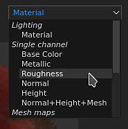
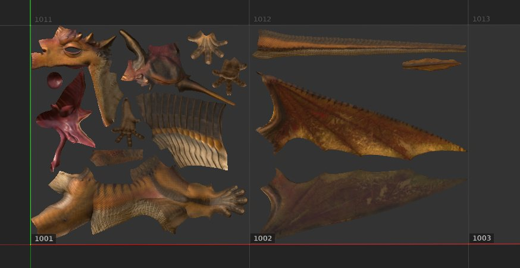

# 2D 視角

{width="450px"}

2D 視圖顯示目前選取 [的貼圖集](../texture-set/texture-set.md)的網格 UV 島嶼。 它不僅能看到圖層堆疊的材質，也能在網格的 UV 島上繪製。

## 顯示模式

視窗右上角有顯示模式下拉選單。 此控制允許改變視窗中應顯示的資訊內容。 它允許顯示單一通道、網格貼圖或最終材質結果，並搭配光影。

## 軸心資訊

視窗右下角是 **軸資訊**，指示二維軸的方向。 以二維視角為例，軸是你和V。

## UV 圖塊資訊

顯示模式&#x200B;**旁邊**&#x200B;有 **UV 圖塊資訊**&#x200B;按鈕，可顯示或隱藏與 UV 圖塊相關的資訊。這個按鈕在一般專案中看不到。

## 專案工作流程

根據建立專案時定義的工作流程，2D 視圖的外觀與行為可能會有所不同：

| *專案工作流程* | *行為* |
| --- | --- |
| **常規專案** | 一般專案中，只能在 UV 範圍 [0-1] 內的 UV 上色。 超出這個範圍的聲音會被看見，但不會互動。在這個例子中，只有左側的 UV 島嶼可以被繪製（淺灰色背景則在後方）。 

 |
| **UV 圖塊專案** | 用 UV Tile 專案，每個 UV 範圍都是一組新的貼圖，可以直接塗上去。 2D 視圖還會顯示格子，讓你更清楚看到每個圖塊的組織方式。 每個格子都會分配一個 UDIM 編號。 

 |
