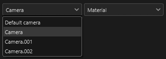

# 攝影機管理

用 Maya、Max、Blender、Modo 和 DAE 製作的攝影機可以匯入 Substance 3D Painter。

>[!NOTE]
>
> 正交相機與顯示比例在 ABC（Alembic）格式中未被正確支援。

## 在 Substance 3D Painter 中匯入攝影機

攝影機應包含在網格檔案中，格式為 FBX 或 ABC（Alembic）。

名稱、變換參數、視野角（FOV）以及長寬比（如果存在）都會被匯入。

在新專案視窗中，選擇包含攝影機的網格檔案，並確認 **是否勾選了匯入攝影機** 的勾選框。 如果你在編輯>專案設定視窗&#x200B;**切換**&#x200B;重新匯入網格&#x200B;**&#x200B;**，也可以切換「**匯入攝影機**」，如果在初始專案建立時錯過了。

然後點擊 **確定**：

<table>
  <tr style="border: 0;">
    <td style="border: 0;" valign="top"></td>
    <td style="border: 0;" valign="top"></td>
  </tr>
</table>

## 精選攝影機

當你目前專案匯入攝影機後，你可以從 **3D 視埠**&#x200B;的下拉選單&#x200B;**&#x200B;**&#x200B;中選擇哪台攝影機是啟用的。

預設情況下，Painter 相機的「預設相機」會被選取，並處於透視模式。

在上述範例中，匯入了 3 台攝影機，當包含預設攝影機後，下拉選單中總共有 4 台攝影機。

## 控制攝影機

當選取匯入相機時，透過平移、縮放或旋轉視角移動攝影機，會切換到預設相機。 這樣可以防止你匯入的攝影機在場景中被移動。

>[!NOTE]
>
> 如果你需要更改匯入的攝影機位置，可以在你選擇的場景編輯應用程式中更新，並用 **Edit > Project 設定**&#x200B;重新匯入場景。

你可以在 **顯示設定視窗**&#x200B;中控制匯入相機的參數。

使用 **預設** 下拉選單選擇要修改的相機。

若任何屬性被修改，可透過 **還原按鈕**&#x200B;回復其原始值。

若參數已修改為匯入相機，相機名稱會以斜體標示，並在相機名稱後加上「\*」。

### 攝影機屬性

視野（FOV）是以度數表示。

焦距以毫米表示。

在視窗模式（OpenGL）中，對焦距離與光圈會被關閉。 要啟動它們，必須啟動後效和景深。

### 顯示比率

如果顯示比例存在於網格檔案中，則會顯示在攝影機區塊。 如果相機沒有定義的顯示比例，它會被標示為 **未指定** （就像預設相機一樣）。

### 鎖定

點擊鎖定圖示即可鎖定攝影機。 鎖定攝影機可防止相機參數的變更。

## 攝影機框架

相機畫面可在顯示設定>視窗設定&#x200B;**中切換**：

你也可以用 **Gate 遮罩的不透明度**&#x200B;調整畫面外區域的不透明度。

<table>
  <tr style="border: 0;">
    <td style="border: 0;" valign="top"></td>
    <td style="border: 0;" valign="top"></td>
  </tr>
</table>
