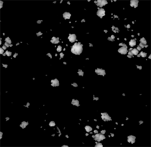

# 高度圖繪製

## 整體概念

在高度圖上工作而非直接在法線上有多項優點，例如品質更好、控制更佳、彈性更高，以及資產間的一致性。

流程如下：

* 從高多邊形網格烘焙的法線貼圖會載入到低多邊形網格上。
* 你會在高度圖頻道上繪製更多細節。
* 你繪製的高度會經過所有圖層合成，並即時轉換成法線貼圖，最後與高多邊形網格的法線融合。

你只需要注意把那個高度的油漆，其他的都是自動完成的。

### 高度 HDR 格式

高度通道採用 **HDR** 色彩格式，能在亮度不超過上限的情況下繪製正負值，與傳統高度圖在 0 到 255 之間飽和度不同。

* 當用點陣圖或物質在高度上繪畫時，該來源會從原本的 [0,255] 範圍重新映射到 [-1,1] 範圍。

中間灰色會被重新映射為 0。 因此，當使用預設的高度圖混合模式「**線性閃避（增加）**」時，低於 127 的數值會&#x200B;**從高度圖中扣除**，而高於 127 的數值則會&#x200B;**加**&#x200B;總。

* 用純色上色時，你可以直接選擇介於 -1 到 1 之間的數值。

### 高度視覺化

在單人模式下視覺化高度圖時，預設預覽只會顯示正數值，負數值則呈現強烈的黑色飽和度。

**+/-色彩**&#x200B;設定允許使用不同顏色來呈現正負值的完整範圍。

**縮放**&#x200B;設定允許你調整該 HDR 地圖的可見範圍，以防你加減超過預設的 [-1,1] 範圍。

<table>
<tr style="border: 0;">
<td style="border: 0;" valign="top">

</td>
<td style="border: 0;" valign="top">

</td>
</tr>
</table>
