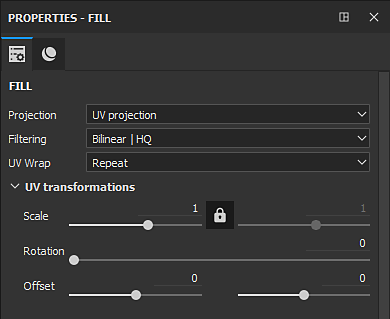

# 填充投影

填充層和填充效果會根據特定模式直接將貼圖投射到網格上。 這種圖層/效果避免了手動在 3D 模型上繪製貼圖。 投影的設定可以透過屬性視窗編輯。

這些屬性分為兩類： **填料性質** 與 **材料**&#x200B;型。

## 填充性質

填充屬性控制材質如何套用和/或投影到網格上。 投影模式可以透過屬性[&#128279;](../../interface/properties.md)視窗中的投影&#x200B;**下拉選單來更改**。

目前可用的投影模式包括：

* [填充（以 UV 磚塊匹配）](fill-match-per-uv-tile.md)
* [紫外線投影](uv-projection.md)
* [三平面投影](tri-planar-projection.md)
* [平面投影](planar-projection.md)
* [球面投影](spherical-projection.md)
* [圓柱投影](cylindrical-projection.md)
* [曲速投影](warp-projection.md)

## 材質（及灰階）

材質/灰階控制與其他工具相同。 更多細節請參閱 [Paint 工具文件](../tool-list/paint-brush.md) 。
