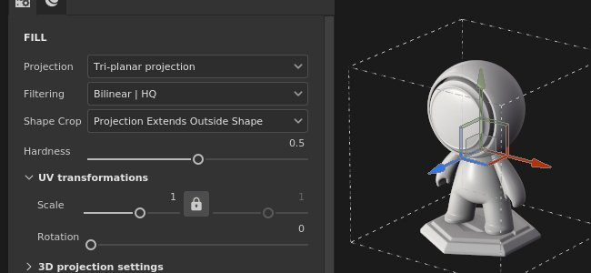

# 三平面投影

填充的三平面投影是一種三維投影，將多個平面投影合併並混合，覆蓋整個 3D 網格。 它能在不產生明顯接縫的情況下投射聲音和圖案，非常有用。

## 屬性

| *背景設定* | *描述* |
| --- | --- |
| **過濾** | 控制材質或材質的過濾方式。 這個設定會影響重複使用時的材質外觀。 在高縮放值下，使用不同於預設的過濾方式，可能會產生更漂亮的效果。 目前可用的設定：<ul data-preserve-html="true"> <li data-preserve-html="true"><b>雙線性 - HQ</b> （預設）：進階雙線性濾波，嘗試在平鋪值較高時提升貼圖品質。</li> <li data-preserve-html="true"><b>雙線性 - 銳利</b>：簡單的雙線性濾波，稍微平滑紋理，但盡量保留細節。</li> <li data-preserve-html="true"><b>最近</b>：無濾波，若雙線性濾波結果模糊且破壞細節，則有用。 可能會在貼圖中引入鋸齒。</li> </ul> |
| **形狀裁剪** | 定義投影材質是否應該在投影區域外可見。 可能的數值包括：<ul data-preserve-html="true"><li data-preserve-html="true"><strong>裁切成形</strong>的投影：投影被限制在投影區域內。</li><li data-preserve-html="true"><strong>投影延伸至外部形狀</strong> （預設：投影範圍會延伸至投影區域之外。</li></ul>   <table> <tr style="border: 0;"> <td style="border: 0;" valign="top">  

  </td> <td style="border: 0;" valign="top">  

  </td> </tr> </table> |
| **硬度** | 控制投影平面間過渡的強度或柔和程度。 數值或1.0代表每個平面之間會有明確的界線。 

 **注意：**  每個平面的轉換由網格頂點法線定義（不考慮法線網格貼圖）。 這表示頂點法線突然或破碎，在混合平面時可能導致意想不到的結果。 |

### UV 轉換

UV 轉換設定控制投影內的材質/材質。

<table data-preserve-html="true" style="width: 100.0%;"><colgroup> <col style="width: 40.0%;"/> <col style="width: 20.0%;"/> <col style="width: 40.0%;"/> </colgroup><tbody><tr><th>音階模式</th><th>背景設定</th><th>說明</th></tr><tr><td>
<strong>平鋪</strong> （預設）<strong>  </strong>

允許手動設定當前材質的重複數量。
</td><td><strong>鋪磚</strong></td><td>控制材質重複次數。</td></tr><tr><td rowspan="2">  </td><td colspan="1"><strong>旋轉</strong></td><td colspan="1">控制貼圖投影到網格上的角度。</td></tr><tr><td colspan="1"><strong>偏移</strong></td><td colspan="1">控制點從材質投影的位置。 預設值代表貼圖中心位於網格 UV 的中心。</td></tr><tr><th colspan="1"> </th><th colspan="1"> </th><th colspan="1"> </th></tr><tr><td rowspan="4">
<strong>實際大小</strong>

根據網格大小和嵌入的物理尺寸自動調整貼圖。 它使用寬度與長度（X 和 Y 的測量）來計算正確的物理尺寸。 Z 測量未被考慮。

（更多資訊請參閱專門的[文件頁面]（https://experienceleague.adobe.com/en/docs/substance-3d-painter/using/features/physical-size））
</td><td><strong>自訂尺寸</strong></td><td>
啟用後，允許手動輸入實體大小並覆蓋資產提供的尺寸。

若未偵測到物理大小，或同一層/效果中使用多個不同物理尺寸的資產，則會自動選擇。
</td></tr><tr><td colspan="1"><strong>尺寸（公分）</strong></td><td colspan="1">嵌入的物理尺寸以公分表示。 你可以使用使用不同計量單位建立的網格檔案——它會保留正確的比例。 不過資產尺寸目前僅以公分顯示。</td></tr><tr><td colspan="1"><strong>旋轉</strong></td><td colspan="1">控制貼圖投影到網格上的角度。</td></tr><tr><td colspan="1"><strong>偏移</strong></td><td colspan="1">
控制點從材質投影的位置。 預設值代表貼圖中心位於網格 UV 的中心。
</td></tr></tbody></table>

>[!NOTE]
>
> 三平面投影無法使用 **偏移** 設定。

### 3D 投影設定

3D 投影設定控制投影在 3D 空間中的轉換。

| 背景設定 | 說明 |
| --- | --- |
| **偏移** | 投影在三維空間中原點的位置。 這些單位是根據整個場景的邊界框設計的。 0 是這個方框的中心。 |
| **旋轉** | 以度度為單位的角度，使整個投影在每個軸上旋轉。 |
| **規模** | 每個軸上的投影大小。 |

## 情境工具列

從位於視窗頂端的情境工具列[&#128279;](../../interface/toolbars.md)可使用多項設定與工具，這些工具提供對操作手與投影的控制：

| 聖像 | 名稱 | 說明 |
| --- | --- | --- |
| 

 | 展示/隱藏操控者 | 啟用後，操作器會在視窗中可見且可控制。 |
| 

 | 操作手設定 | 此選單包含三個設定：<ul data-preserve-html="true"><li data-preserve-html="true"><strong>操作手的大小</strong>：控制操作手在視窗中的大小。</li><li data-preserve-html="true"><strong>格點步</strong>：在用約束平移時定義步長。</li><li data-preserve-html="true"><strong>角度步進</strong>：定義在有約束條件下旋轉時步進的角度。</li></ul> |
| 

 | 平移操作器 | 允許在場景中沿著主軸（X、Y、Z）移動投影。 |
| 

 | 旋轉操作手 | 允許在場景中沿著主軸（X、Y、Z）旋轉投影。 |
| 

 | 比例操控器 | 允許在場景中沿著主軸（X、Y、Z）進行投影縮放。 |
| 

 | 表面操作手 | 允許透過將投影吸附在 3D 模型表面來移動投影。  **注意：**  此操作器僅適用於平面投影與扭曲投影類型。 |
| 

 | 操作手空間 | 定義轉換在哪個空間進行。 可能的數值包括：<ul data-preserve-html="true"><li data-preserve-html="true"><strong>局部空間</strong>：軸與電流變換對齊。</li><li data-preserve-html="true"><strong>世界空間</strong>：軸線會與場景對齊。</li></ul> |
| 

 | X上的鏡子 | 將轉換在 X 軸上反轉。 |
| 

 | Y字鏡 | 將轉換反轉到Y軸。 |
| 

 | Z 上的鏡子 | 將轉換方向在 Z 軸上反轉。 |
| 

 | 重置轉換 | 將投影轉換恢復到預設狀態。 |

## 操作手

此投影操作器僅在 [3D視窗](../../interface/viewport/3d-view.md)中提供。

| 動作 | 捷徑 | 說明 |
| --- | --- | --- |
| **翻譯** | 滑鼠點擊 | 使用平移操作器，點擊軸線可移動投影：<ul data-preserve-html="true"><li data-preserve-html="true"><strong>一個軸</strong>：投影只向一個方向移動。</li><li data-preserve-html="true"><strong>兩個軸</strong>：將投影移動與軸對齊的平面圖。</li><li data-preserve-html="true"><strong>三個軸</strong>：在相機空間中移動投影（平面面向它）。</li></ul>   <table> <tr style="border: 0;"> <td style="border: 0;" valign="top">  

  </td> <td style="border: 0;" valign="top">  

  </td> <td style="border: 0;" valign="top">  

  </td> </tr> </table> |
| **翻譯受限** | SHIFT+滑鼠點擊 | 使用平移操作器，沿選定軸線移動投影，但僅在特定間隔（步進式）。 音程大小由操作手設定決定。 

 |
| **旋轉** | 滑鼠點擊 | 使用旋轉操作器，點擊其中一個軸即可旋轉投影。 點擊軸之間的位置可以同時旋轉所有軸。   <table> <tr style="border: 0;"> <td style="border: 0;" valign="top">  

  </td> <td style="border: 0;" valign="top">  

  </td> </tr> </table> |
| **旋轉受限** | SHIFT+滑鼠點擊 | 使用旋轉操作器時，點擊一個軸來旋轉投影只會在特定間隔發生。 這個階梯是由操作手設定的角度所定義。 

 |
| **規模** | 滑鼠點擊 | 使用比例操作器，點擊一個軸柄，即可將投影沿著指定軸調整大小。   <table> <tr style="border: 0;"> <td style="border: 0;" valign="top">  

  </td> <td style="border: 0;" valign="top">  

  </td> <td style="border: 0;" valign="top">  

  </td> </tr> </table> |
| **規模受限** | SHIFT+滑鼠點擊 | 使用比例操作器時，點擊一個軸柄並維持快捷鍵，會分階段調整投影大小。 步長與平移操作器相同。 

 |
| **表面** | 滑鼠點擊 | 用 Surface Manipulator，點擊並拖曳它在 3D 模型上，就能把它吸附到表面上。 

 **注意：**  此操作器僅 **適用於平面** 投影與 **扭曲** 投影類型。 |
