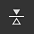
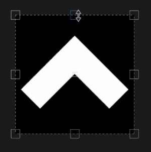
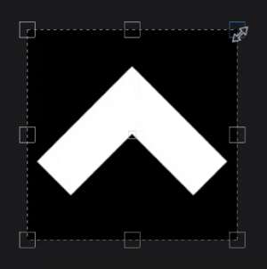

# 紫外線投影

填充的 UV 投影是 2D 投影，只在 2D 貼圖空間中運作。 它提供移動、旋轉和縮放影像的控制。

## 屬性

| *背景設定* | *描述* |
| --- | --- |
| **過濾** | 控制材質或材質的過濾方式。 這些設定會影響重複使用時的材質外觀。 在高縮放值下，使用與預設不同的過濾方法可能會產生更佳的效果。 目前可用的設定：<ul data-preserve-html="true"><li data-preserve-html="true"><strong>雙線性 `\|` HQ </strong>：（預設）進階雙線性過濾，嘗試在平鋪值較高時提升紋理品質。</li><li data-preserve-html="true"><strong>雙線 `\|` 性銳利 </strong>：簡單的雙線性濾波，稍微平滑紋理，但嘗試保留細節。</li><li data-preserve-html="true"><strong>最近 </strong>值：無濾波，當雙線性濾波產生模糊結果且破壞細節時，這很有用。 可能會在貼圖中引入鋸齒。</li></ul> |
| **UV 包裹** | 控制投影的材質/影像在投影形狀內應該如何重複。 可能的數值包括：<ul data-preserve-html="true"><li data-preserve-html="true"><strong>無</strong> ：投影沒有重複。</li><li data-preserve-html="true"><strong>水平</strong> 重複：只水平重複。</li><li data-preserve-html="true"><strong>垂直重複</strong> ：只垂直重複。</li><li data-preserve-html="true"><strong>重複</strong> （預設）：橫向和垂直重複。</li></ul> 

 |

### UV 轉換

UV 轉換設定控制投影內的材質/材質。

<table data-preserve-html="true" style="width: 100.0%;"><colgroup> <col style="width: 40.0%;"/> <col style="width: 20.0%;"/> <col style="width: 40.0%;"/> </colgroup><tbody><tr><th>音階模式</th><th>背景設定</th><th>說明</th></tr><tr><td>
<strong>平鋪</strong> （預設）<strong>  </strong>

允許手動設定當前材質的重複數量。
</td><td><strong>鋪磚</strong></td><td>控制材質重複次數。</td></tr><tr><td rowspan="2">  </td><td colspan="1"><strong>旋轉</strong></td><td colspan="1">控制貼圖投影到網格上的角度。</td></tr><tr><td colspan="1"><strong>偏移</strong></td><td colspan="1">控制點從材質投影的位置。 預設值代表貼圖中心位於網格 UV 的中心。</td></tr><tr><th colspan="1"> </th><th colspan="1"> </th><th colspan="1"> </th></tr><tr><td rowspan="4">
<strong>實際大小</strong>

根據網格大小和嵌入的物理尺寸自動調整貼圖。 它使用寬度與長度（X 和 Y 的測量）來計算正確的物理尺寸。 Z 測量未被考慮。

（更多資訊請參閱專門的[文件頁面]（https://experienceleague.adobe.com/en/docs/substance-3d-painter/using/features/physical-size））
</td><td><strong>自訂尺寸</strong></td><td>
啟用後，允許手動輸入實體大小並覆蓋資產提供的尺寸。

若未偵測到物理大小，或同一層/效果中使用多個不同物理尺寸的資產，則會自動選擇。
</td></tr><tr><td colspan="1"><strong>尺寸（公分）</strong></td><td colspan="1">嵌入的物理尺寸以公分表示。 你可以使用使用不同計量單位建立的網格檔案——它會保留正確的比例。 不過資產尺寸目前僅以公分顯示。</td></tr><tr><td colspan="1"><strong>旋轉</strong></td><td colspan="1">控制貼圖投影到網格上的角度。</td></tr><tr><td colspan="1"><strong>偏移</strong></td><td colspan="1">
控制點從材質投影的位置。 預設值代表貼圖中心位於網格 UV 的中心。
</td></tr></tbody></table>

## 情境工具列

視窗頂端的情境工具列[&#128279;](../../interface/toolbars.md)提供多種設定與工具，以控制操作手與投影：

| 聖像 | 名稱 | 說明 |
| --- | --- | --- |
| 

 | 展示/隱藏操控者 | 啟用後，操作器會在視窗中可見且可控制。 |
| 

 | 操作手處理尺寸 | 此選單包含三個設定，定義變換柄在視口中的大小：<ul data-preserve-html="true"><li data-preserve-html="true"><strong>小</strong></li><li data-preserve-html="true"><strong>媒介</strong></li><li data-preserve-html="true"><strong>大型</strong></li></ul> |
| 

 | X上的鏡子 | 將轉換在 X 軸上反轉。 |
| 

 | Y字鏡 | 將轉換反轉到Y軸。 |
| 

 | 重置樞軸點 | 將樞軸點恢復到轉換的中間位置。 |
| 

 | 重置轉換 | 將投影轉換恢復到預設狀態。 |

## 操作手

UV 投影使用一個只在 [2D 視圖](../../interface/viewport/2d-view.md)中可用的操作器。

| 動作 | 捷徑 | 說明 |
| --- | --- | --- |
| **翻譯** | 滑鼠點擊 | 點擊並拖曳變形內的任何區域即可移動。 

 |
| **翻譯受限** | SHIFT+滑鼠點擊 | 點擊並拖曳變形內的任何區域，同時按下並維持快捷鍵，只沿一個軸移動。 軸可以是水平或垂直，並與相機對齊，它是根據滑鼠方向來調整的。 

 |
| **旋轉** | 滑鼠點擊 | 從變形外點擊和拖曳可以旋轉它。 移動樞軸也能改變旋轉的原點。   <table> <tr style="border: 0;"> <td style="border: 0;" valign="top">  

  </td> <td style="border: 0;" valign="top">  

  </td> </tr> </table> |
| **旋轉受限** | SHIFT+滑鼠點擊 | 從變形外點擊拖曳，同時按住並維持快捷鍵，只能每旋轉一次 45 度。 

 |
| **規模** | 滑鼠點擊 | 點擊並拖曳操作手的任意手柄可以使變形變形。   <table> <tr style="border: 0;"> <td style="border: 0;" valign="top">  

  </td> <td style="border: 0;" valign="top">  

  </td> </tr> </table> |
| **規模受限** | SHIFT+滑鼠點擊 | 透過按下並維持快捷鍵並拖動把柄，變形必須維持其比例。   <table> <tr style="border: 0;"> <td style="border: 0;" valign="top">  

  </td> <td style="border: 0;" valign="top">  

  </td> </tr> </table> |
| **比例鏡像** | CTRL+滑鼠點擊 | 當移動任意一個握把並按下快捷鍵時，其他握把也會做出類似的動作。 它允許在樞軸點周圍對稱地變形變換。   <table> <tr style="border: 0;"> <td style="border: 0;" valign="top">  

  </td> <td style="border: 0;" valign="top">  

  </td> </tr> </table> |
| **尺度鏡像與約束** | SHIFT+CTRL+滑鼠點擊 | 結合這兩個捷徑可以讓變換在對稱性上變形，同時保持長寬比。 

 |
