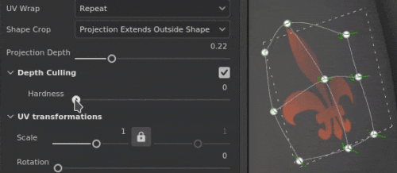
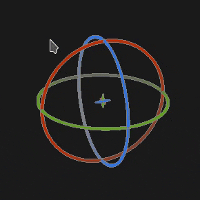

# 曲速投影

填充的 Warp 投影是一種 3D 投影，允許透過編輯格子上的點來變形貼圖。 它可用於在非平面表面上貼合圖案和標誌。

## 快速設定

你可以透過將資源 [從資產視窗](../../interface/assets/assets.md) 拖放到網格上，快速設定帶有扭曲投影的圖層。 放開滑鼠時會開啟選單，讓你選擇資源應該分配到哪個頻道。

相容的資源類型包括：

* **阿爾法**
* **程序性**
* **材質**
* **材質** （需按 ALT 鍵）

## 屬性

| 背景設定 | 說明 |
| --- | --- |
| **過濾** | 控制材質或材質的過濾方式。 這個設定會影響重複使用時的材質外觀。 在高縮放值下，使用不同於預設的過濾方式，可能會產生更漂亮的效果。 目前可用的設定：<ul data-preserve-html="true"><li data-preserve-html="true"><strong>雙線性 `\|` HQ</strong> （預設）：進階雙線性過濾，嘗試在鋪磚值較高時提升貼圖品質。</li><li data-preserve-html="true"><strong>雙線 `\|` 性銳利</strong>：簡單的雙線性濾波，稍微平滑紋理，但盡量保留細節。</li><li data-preserve-html="true"><strong>最近</strong>：無濾波，若雙線性濾波結果模糊且破壞細節，則有用。 可能會在貼圖中引入鋸齒。</li></ul> |
| **UV 包裹** | 控制貼圖在投影中的重複。 可能的數值包括：<ul data-preserve-html="true"><li data-preserve-html="true"><strong>沒有</strong>：質地不會重複。 材質外的部分是黑色或透明的。</li><li data-preserve-html="true"><strong>橫向重複</strong>：質地只會橫向重複。</li><li data-preserve-html="true"><strong>垂直重複</strong>：紋理只會垂直重複。</li><li data-preserve-html="true"><strong>重複</strong> （預設）：材質在兩個軸上重複。</li></ul> |
| **形狀裁剪** | 定義投影材質是否應該在投影區域外可見。 可能的數值包括：<ul data-preserve-html="true"><li data-preserve-html="true"><strong>裁切成形</strong>的投影：投影被限制在投影區域內。</li><li data-preserve-html="true"><strong>投影延伸至外部形狀</strong> （預設：投影範圍會延伸至投影區域之外。</li></ul> 

 |
| **投影深度** | 控制投影沿 Z 軸延伸的距離。 這個設定有助於在網格點或投影平面太遠時抵達網格表面。綠色箭頭表示投影在格子上各點的方向與距離。 

 **警示：** 高價值會嚴重影響效能。 建議盡量保持這個參數的低點。 |
| **深度剔除** | 根據距離淡化投影。 有一個參數可用：<ul data-preserve-html="true"><li data-preserve-html="true"><strong>硬度</strong>：控制漸變過渡的硬度或軟度。</li></ul> 

 |

### UV 轉換

UV 轉換設定控制投影內的材質/材質。

<table data-preserve-html="true" style="width: 100.0%;"><colgroup> <col style="width: 40.0%;"/> <col style="width: 20.0%;"/> <col style="width: 40.0%;"/> </colgroup><tbody><tr><th>音階模式</th><th>背景設定</th><th>說明</th></tr><tr><td>
<strong>平鋪</strong> （預設）<strong>  </strong>

允許手動設定當前材質的重複數量。
</td><td><strong>鋪磚</strong></td><td>控制材質重複次數。</td></tr><tr><td rowspan="2">  </td><td colspan="1"><strong>旋轉</strong></td><td colspan="1">控制貼圖投影到網格上的角度。</td></tr><tr><td colspan="1"><strong>偏移</strong></td><td colspan="1">控制點從材質投影的位置。 預設值代表貼圖中心位於網格 UV 的中心。</td></tr><tr><th colspan="1"> </th><th colspan="1"> </th><th colspan="1"> </th></tr><tr><td rowspan="4">
<strong>實際大小</strong>

根據網格大小和嵌入的物理尺寸自動調整貼圖。 它使用寬度與長度（X 和 Y 的測量）來計算正確的物理尺寸。 Z 測量未被考慮。

（更多資訊請參閱專門的[文件頁面]（https://experienceleague.adobe.com/en/docs/substance-3d-painter/using/features/physical-size））
</td><td><strong>自訂尺寸</strong></td><td>
啟用後，允許手動輸入實體大小並覆蓋資產提供的尺寸。

若未偵測到物理大小，或同一層/效果中使用多個不同物理尺寸的資產，則會自動選擇。
</td></tr><tr><td colspan="1"><strong>尺寸（公分）</strong></td><td colspan="1">嵌入的物理尺寸以公分表示。 你可以使用使用不同計量單位建立的網格檔案——它會保留正確的比例。 不過資產尺寸目前僅以公分顯示。</td></tr><tr><td colspan="1"><strong>旋轉</strong></td><td colspan="1">控制貼圖投影到網格上的角度。</td></tr><tr><td colspan="1"><strong>偏移</strong></td><td colspan="1">
控制點從材質投影的位置。 預設值代表貼圖中心位於網格 UV 的中心。
</td></tr></tbody></table>

### 3D 投影設定

3D 投影設定控制投影在 3D 空間中的轉換。

| 背景設定 | 說明 |
| --- | --- |
| **偏移** | 投影在三維空間中原點的位置。 這些單位是根據整個場景的邊界框設計的。 0 是這個方框的中心。 |
| **旋轉** | 以度度為單位的角度，使整個投影在每個軸上旋轉。 |
| **規模** | 每個軸上的投影大小。 |

## 情境工具列

從位於視窗頂端的情境工具列[&#128279;](../../interface/toolbars.md)可使用多項設定與工具，這些工具提供對操作手與投影的控制：

| 聖像 | 名稱 | 說明 |
| --- | --- | --- |
| 

 | 展示/隱藏操控者 | 啟用後，操作手會在視窗中可見且可控制，以便編輯投影變換或格點。 若停用，操作器與網格皆隱藏。 |
| 

 | 操作手設定 | 此選單包含三個設定：<ul data-preserve-html="true"><li data-preserve-html="true"><strong>操作手的大小</strong>：控制操作手在視窗中的大小。</li><li data-preserve-html="true"><strong>格點步</strong>：在用約束平移時定義步長。</li><li data-preserve-html="true"><strong>角度步進</strong>：定義在有約束條件下旋轉時步進的角度。</li></ul> |
| 

 | 曲速版選單 | 此選單包含五個動作：<ul data-preserve-html="true"><li data-preserve-html="true"><strong>變形扭曲：</strong>編輯扭曲變換。 允許操作全域網格的位置、旋轉與縮放。</li><li data-preserve-html="true"><strong>編輯頂點</strong>：單獨（或群組）編輯曲速網格點。</li><li data-preserve-html="true"><strong>橫向</strong>分割變形：啟動分割變形工具，在水平和垂直方向都插入新的格子分割。</li><li data-preserve-html="true"><strong>水平分割扭曲</strong>：啟動分割扭曲工具，將新的格子分割插入水平方向。</li><li data-preserve-html="true"><strong>垂直分割曲速</strong>：啟動分割曲速工具，垂直插入新的格點分割。</li></ul> |
| 

 | 曲速投影設定 | 此選單會重新組合只影響當前曲速投影的設定：<ul data-preserve-html="true"><li data-preserve-html="true"><strong>列與列</strong>：指定曲速網格的分割數。 此設定僅在格子未被修改時可編輯。</li><li data-preserve-html="true"><strong>Handle 大小</strong>：在編輯頂點</strong>模式中定義網格點<strong>的大小。</li><li data-preserve-html="true"><strong>格子顏色</strong>：定義曲速格線的顏色。</li></ul> |
| 

 | 自動切線 | 若啟用，移動點時會自動將其切線對齊至鄰近點。 |
| 

 | 平移操作器 | 允許沿著主軸（X、Y、Z）移動投影或格點。 |
| 

 | 旋轉操作手 | 允許將投影或格網點沿主軸（X、Y、Z）旋轉。 |
| 

 | 比例操控器 | 允許在場景中沿著主軸（X、Y、Z）進行投影縮放。 |
| 

 | 表面操作手 | 允許透過將投影點或格點吸附在 3D 模型表面上來移動它們。 |
| 

 | 操作手空間 | 定義轉換在哪個空間進行。 可能的數值：<ul data-preserve-html="true"><li data-preserve-html="true"><strong>局部空間</strong>：軸與電流變換對齊。</li><li data-preserve-html="true"><strong>世界空間</strong>：軸線會與場景對齊。</li></ul> |
| 

 | X上的鏡子 | 將轉換在 X 軸上反轉。 |
| 

 | Y字鏡 | 將轉換反轉到Y軸。 |
| 

 | Z 上的鏡子 | 將轉換方向在 Z 軸上反轉。 |
| 

 | 重置轉換 | 此選單包含三個動作：<ul data-preserve-html="true"><li data-preserve-html="true"><strong>恢復全域轉換</strong>：將投影的位置、旋轉與縮放重設回初始值。 這個動作不會影響格子點本身。</li><li data-preserve-html="true"><strong>重置所有頂點</strong>：重置曲速網格中所有格點的位置與切線。</li><li data-preserve-html="true"><strong>重置選取頂點</strong>：僅重置曲速網格中選取點的位置與切線。</li></ul> |

## 操作手

此投影操作器僅在 [3D視窗](../../interface/viewport/3d-view.md)中提供。

| 動作 | 捷徑 | 說明 |
| --- | --- | --- |
| **翻譯** | 滑鼠點擊 | 使用平移操作器，點擊軸線可移動投影：<ul data-preserve-html="true"><li data-preserve-html="true"><strong>一個軸</strong>：投影只向一個方向移動。</li><li data-preserve-html="true"><strong>兩個軸</strong>：將投影移動與軸對齊的平面圖。</li><li data-preserve-html="true"><strong>三個軸</strong>：在相機空間中移動投影（平面面向它）。</li></ul>   <table> <tr style="border: 0;"> <td style="border: 0;" valign="top">  

  </td> <td style="border: 0;" valign="top">  

  </td> <td style="border: 0;" valign="top">  

  </td> </tr> </table> |
| **翻譯受限** | SHIFT+滑鼠點擊 | 使用平移操作器，沿選定軸線移動投影，但僅在特定間隔（步進式）。 音程大小由操作手設定決定。 

 |
| **旋轉** | 滑鼠點擊 | 使用旋轉操作器，點擊其中一個軸即可旋轉投影。 點擊軸之間的位置可以同時旋轉所有軸。   <table> <tr style="border: 0;"> <td style="border: 0;" valign="top">  

  </td> <td style="border: 0;" valign="top">  

  </td> </tr> </table> |
| **旋轉受限** | SHIFT+滑鼠點擊 | 使用旋轉操作器時，點擊一個軸來旋轉投影只會在特定間隔發生。 這個階梯是由操作手設定的角度所定義。 

 |
| **規模** | 滑鼠點擊 | 使用比例操作器，點擊一個軸柄，即可將投影沿著指定軸調整大小。   <table> <tr style="border: 0;"> <td style="border: 0;" valign="top">  

  </td> <td style="border: 0;" valign="top">  

  </td> <td style="border: 0;" valign="top">  

  </td> </tr> </table> |
| **規模受限** | SHIFT+滑鼠點擊 | 使用比例操作器時，點擊一個軸柄並維持快捷鍵，會分階段調整投影大小。 步長與平移操作器相同。 

 |
| **表面** | 滑鼠點擊 | 用 Surface Manipulator，點擊並拖曳它在 3D 模型上，就能把它吸附到表面上。 

 **注意：**  此操作器僅 **適用於平面** 投影與 **扭曲** 投影類型。 |

## 編輯格點

曲速投影以平面和點網格表示。 每個點都可以修改，使投影更符合 3D 模型，同時也能扭曲紋理。

要編輯格點，請從情境工具列將編輯模式切換為 **編輯頂點** ：

>[!NOTE]
>
> 提供鍵盤快捷鍵，可快速切換 **變換（Transform warp** ）與 **編輯（Edit）頂點**。 請參考捷徑頁面的&#x200B;**切換轉速版模式**&#x200B;[。](../../interface/settings/shortcuts.md)

### 點選

| 動作 | 說明 |
| --- | --- |
| 

 | <ul data-preserve-html="true"><li data-preserve-html="true">點擊一個點即可選擇該點。</li><li data-preserve-html="true">點擊遠離某個點或操作器會取消選取點。</li><li data-preserve-html="true">按下 Shift</strong> 鍵點擊<strong>點可以選擇多個點。</li><li data-preserve-html="true">點擊某個點並 <strong>按住 CTRL</strong> ，允許只取消這個點，不能取消另一個。</li></ul> |
| 

 | <ul data-preserve-html="true"><li data-preserve-html="true">點擊和拖曳可以做矩形選取。 放開滑鼠時，矩形內的任何點都會被選取。</li><li data-preserve-html="true">點擊拖曳並按 <strong>住 SHIFT</strong> 可以為當前選擇增加更多點數。</li><li data-preserve-html="true">點擊並拖曳並按住 <strong>Ctrl</strong> 可以移除當前選取中的點。</li></ul> |

### 移動點

| 動作 | 說明 |
| --- | --- |
| 

 | <ul data-preserve-html="true"><li data-preserve-html="true">使用平移操作器移動一個點。</li><li data-preserve-html="true">使用 Surface Manpulator 在 3D 模型表面上點移動。</li></ul> |
| 

 | <ul data-preserve-html="true"><li data-preserve-html="true">點擊並拖曳一個點，可以快速移動，不用先選取該點。</li><li data-preserve-html="true">點擊並拖曳一個點會像 Surface Manipulator 一樣移動它。</li><li data-preserve-html="true">按下 Ctrl</strong> 鍵時<strong>點擊並拖曳一點，會像平移操作器一樣移動它（在鏡頭空間中三軸移動）。</li></ul> |

### 調整切線

Warp 投影網格是貝 [塞爾區塊](https://en.wikipedia.org/wiki/B%C3%A9zier_surface)，這表示每個點都有自己的切線集合，用來控制連接點的線條曲線。 調整切線能讓你更精確地控制紋理的變形方式。

| 動作 | 說明 |
| --- | --- |
| 

 | <ul data-preserve-html="true"><li data-preserve-html="true">要修改某個點（以紅色顯示）的切線，只要選擇指定點，然後使用旋轉或縮放操作器即可。</li></ul> |

>[!NOTE]
>
> 如果在上下文工具列啟用「自動切線&#x200B;**」設定**，移動點時切線會自動重置並調整。
> 
> 

### 增加或減少點數

扭曲格子可以細分，增加點數並讓紋理變形有更多控制。

| 動作 | 說明 |
| --- | --- |
| 

 | <ul data-preserve-html="true"><li data-preserve-html="true">從 Warp 設定選單中將格子依列和欄分成。 （這僅在未移動點數的情況下可行）</li><li data-preserve-html="true">用三種分割工具之一來細分網格。</li><li data-preserve-html="true">任何分割工具都可以按 <strong>Esc</strong> 鍵來取消。</li></ul> |
