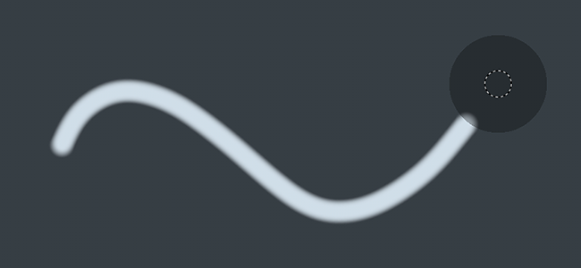

# 懶惰的老鼠

懶惰滑鼠是滑鼠游標與實際繪畫之間的距離偏移，讓筆觸更精準或流暢。

可透過 [上下文工具列](../interface/toolbars.md)啟用此功能。 這讓畫線條乾淨且連貫變得更容易。

## 啟用懶惰滑鼠

要啟用或停用懶人滑鼠，只需點擊情境工具列中的按鈕：

啟用後，視窗刷子游標周圍應該會顯示一個灰色圓圈：

## 懶鼠半徑

在情境工具列中，可以更改懶人滑鼠的距離。 距離定義了從原始塗裝位置起，筆印將被繪製的半徑。 距離越小，郵票越早上色，這能讓轉圈快速，但會減少塗線的平滑度。

* 遠距離：

  {width="400px"}
* 距離很短：

  {width="400px"}
