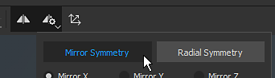

# 鏡像對稱

鏡像對稱是一種基於軸向的對稱性，可在上下文工具列中啟用：

## 使用操作手來定位對稱軸

你可以從 <b>3D 視圖頂部的情境工具列中的對稱設定按鈕</b>進入對稱顯示設定。 在顯示設定中，你可以啟用並自訂操作手。 在三維視角中拖動操作手把以改變對稱軸的位置。

## 鏡像對稱參數

{width="300px"}

| *參數* | *描述* |
| --- | --- |
| <b>軸心國</b> | 定義場景的哪個軸線用於實現對稱性。 |
| <b>軸心位置</b> | 定義專案中軸的偏移量。 此數值可用滑桿或操作手（見上文）編輯。 |
| <b>表演飛機</b> | 若啟用，視窗中會顯示透明平面，用以界定鏡像對稱的兩側。 |
| <b>展示交叉路口</b> | 啟用後，會在視口的網格上畫一條線，以界定鏡像對稱的兩側。 |
| <b>顯示游標</b> | 啟用後，對稱另一側會顯示第二個游標，指示繪畫何時進行。 |
| <b>繪畫時隱藏</b> | 啟用後，第二個游標會在繪畫過程中隱藏（直到滑鼠點擊釋放）。 |
| <b>操作手尺寸</b> | 控制操作手在視窗中的大小。 |
