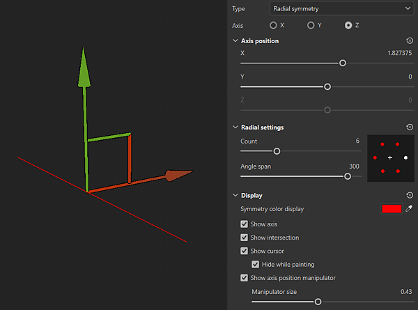

# 放射對稱

徑向對稱性沿軸向呈徑向複製筆劃或填充圖層內容：

## 使用操作手來定位對稱軸

你可以從 <b>3D 視圖頂部的情境工具列中的對稱設定按鈕</b>進入對稱顯示設定。 在顯示設定中，你可以啟用並自訂操作手。 在三維視角中拖動操作手把以改變對稱軸的位置。

{width="600px"}

## 徑向對稱參數

{width="300px"}

| *參數* | *描述* |
| --- | --- |
| <b>軸心國</b> | 定義場景的哪個軸線用於實現對稱性。 |
| <b>翻轉副本</b> | 在U軸或V軸上交替翻轉副本。 這對於像文字這類有方向性的內容使用對稱性很有幫助。 |
| <b>軸位置：X、Y、Z</b> | 定義專案中軸的偏移量。 此數值可用滑桿或操作手（見上文）編輯。 |
| <b>Show 軸心</b> | 啟用後，視窗中會出現一條透明線，代表對稱軸。 |
| <b>展示交叉路口</b> | 啟用後，視窗中會在網格上繪製一個點，顯示對稱軸與網格的交點。 |
| <b>顯示游標（筆刷工具）</b> | 啟用後，對稱另一側會顯示第二個游標，指示繪畫何時進行。 |
| <b>繪畫時隱藏（畫筆工具）</b> | 啟用後，第二個游標會在繪畫過程中隱藏（直到滑鼠點擊釋放）。 |
| <b>顯示軸位置操作器</b> | 切換操作手在視窗中的可見度。 |
| <b>操作手尺寸</b> | 控制操作手在視窗中的大小。 |
