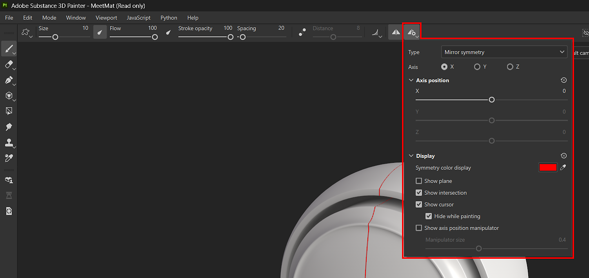

# 對稱性

對稱是一個很有用的設定，你可以在刷圖層和填充圖層上使用，根據幾何限制輕鬆且精確地複製內容：

* 使用筆刷圖層時，利用對稱性根據對稱軸在網格其他位置複製你的筆觸。
* 在填充圖層中，利用對稱性來複製整個填充層，繞著對稱軸。

了解更多關於 Painter 中可以使用的對稱類型：

* [鏡像對稱](mirror-symmetry.md)
* [放射對稱](radial-symmetry.md)

## 用 Paint 工具搭配對稱

你可以在情境工具列裡用<b> 對稱按鈕</b> 啟用對稱。

用<b>上下文工具列中的對稱設定按鈕</b>調整對稱選項。

>[!NOTE]
>
> 2D 視圖中的塗裝投影和模板投影不支援對稱性。 如果需要，我們建議改用 3D 視角。

## 使用對稱性填充圖層

當選取填充圖層時，你可以在情境工具列中使用 <b>對稱按鈕</b> ，就像筆刷工具對稱一樣。 透過填充圖層，你也可以從 <b>屬性面板</b>啟用並存取對稱選項。 對稱性僅適用於以下投影方法：

<table>
<tr style="border: 0;">
<td style="border: 0;" valign="top">

* 三平面投影
* 平面投影
* 球面投影
* 圓柱投影
* 曲速投影

當選擇合格投影方法時，請在屬性面板的對稱區啟用對稱，以存取對稱選項。

若選擇不支援的投影方法， <b>啟用對稱</b>選項將無法使用，且 <b>情境工具列中的對稱按鈕</b>會變成灰色。

</td>
<td style="border: 0;" valign="top">

{width="400px"}

</td>
</tr>
</table>

>[!NOTE]
>
> 對稱顯示選項僅能從 <b>情境工具列的對稱設定按鈕</b>中取得。 你無法從 <b>屬性面板</b>修改對稱顯示設定。
