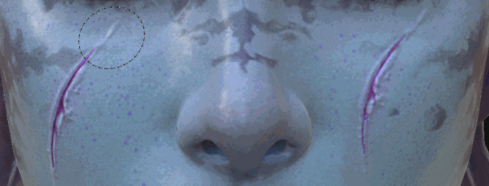

# 複製工具

Clone 工具在 Substance 3D Painter 2 中引入，與繪畫工具[&#128279;](https://support.allegorithmic.com/documentation/display/SPDOC/Paint+brush)共享相同類型的參數。顧名思義，複製工具允許你從一個點複製特定圖層或整個圖層堆疊的內容。

## 使用情況

使用複製工具最簡單的方法是對繪圖層的內容使用。

這可分為兩個步驟：

* 將滑鼠放在模型上並按「  **V**  」鍵來選擇來源位置。
* 然後把滑鼠放在重複區域會出現的位置，開始上色。

隨時可再次按下「  **V**  」鍵更新來源。

預設情況下，使用複製工具繪製時，來源位置會跟隨並更新，當畫筆釋放後。 關閉用於  **「克隆來源行為**  」的按鈕後，按下「  **V**  」時，來源會回到定義的位置。 這在多次繪製同一來源區域時非常有用。

使用複製工具的更聰明方法是建立繪畫圖層，並將所有通道的混合模式設為「通過」。 這樣可以以非破壞性的方式複製位於「複製層」下方所有圖層的資訊。 下方的層保持完整，後續施加的任何修改將由複製層考慮：

