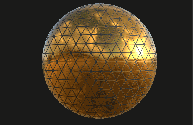
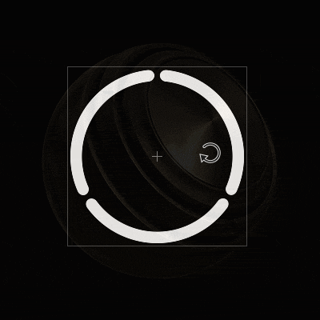

# 畫筆

Paint 工具是 Substance 3D Painter 預設的工具，用來在 3D 網格上套用顏色和材質屬性。 它有特定的參數，可以透過屬性](../../interface/properties.md)來編輯[。

繪畫工具透過各種行為和設定模擬筆觸，營造在 3D 網格上繪畫的感覺。

## 工具列

[工具列](../../interface/toolbars.md)將顯示以下捷徑（詳見後續說明）：

* 大小
* 流量
* 筆劃不透明度
* 間距

還有其他工具常見的捷徑：

* [懶惰的老鼠](../lazy-mouse.md)
* [對稱性](../symmetry/symmetry.md)

## 預覽

屬性的頂端是筆刷和材質預覽。它們可以用來快速瀏覽目前工具的設定狀況。

| *名稱* | *描述* |
| --- | --- |
| **筆刷預覽** | 筆刷預覽會顯示筆刷根據筆刷參數的行為。 你可以點擊預覽畫面來繪製自訂筆劃。   <table> <tr style="border: 0;"> <td style="border: 0;" valign="top">  

  </td> <td style="border: 0;" valign="top">  

  </td> </tr> </table>   **注意：**  筆刷預覽不支援筆壓功能。 |
| **資料預覽** | 材質預覽顯示目前用於繪畫的材質特性。 你可以在預覽中點擊旋轉光線，並更清楚看到材質的表現，然後再上色。   <table> <tr style="border: 0;"> <td style="border: 0;" valign="top">  

  </td> <td style="border: 0;" valign="top">  

  </td> </tr> </table> |

## 筆刷

筆刷參數定義了在 3D 網格上執行筆觸的外觀與感覺。

>[!NOTE]
>
> 使用繪圖板時，部分參數可透過筆壓控制。 這些資訊也可以儲存在 [預設](../presets/presets.md) 中。\
> 點擊專用按鈕以啟用或關閉壓力：
> 
> 

| 名稱 | 說明 |
| --- | --- |
| **規模** | 控制筆觸內印章的大小。 筆刷大小是相對的，會根據中定義的相對空間而改變（見下方對齊大小空間參數）。 *此參數可透過筆壓控制。* |
| **流** | 筆觸內各印章的強度或不透明度。 *此參數可透過筆壓控制。* |
| **筆劃不透明度** | 筆觸的最大全域不透明度。 與流序參數相反，筆劃不透明度無法透過筆壓控制，因為它是在筆劃繪製過程的最後階段施加的。流量與筆劃不透明度的差異：<ul data-preserve-html="true"><li data-preserve-html="true"><strong> 左邊 </strong> ：流量50%，行程不透明度100%</li><li data-preserve-html="true"><strong> 右： </strong> 流量100%，筆觸不透明度50%</li></ul> 

 **注意：**  按下快捷鍵「A」可以繼續前一筆，就像上面動畫一樣。 |
| **間距** | 筆觸的印記與個人之間的距離。 小數值可創造連續線條，但計算範圍較大，因為總計印章數量更多。 高面值則能在印章間創造空隙，這可能更適合特定圖案（如木釘）。 |
| **角度** | 印章在筆觸內的方向。 如果 Alpha 沒有正確對齊，旋轉它很有用。 可以與跟隨路徑結合使用。 |
| **跟隨道路** | 將印章在筆觸內側朝向，以配合繪畫方向。 

 **注意：**  計算筆劃方向時，Substance 3D Painter 會比較前一個印章與當前印章，這也是為什麼啟用 Follow Path 時，單擊繪製不會產生任何結果。 啟用此功能時，至少需兩枚郵票才能繪製筆觸。 |
| **尺寸抖動** | 在筆觸內套用每個印章隨機大小值。 值為 0 表示無隨機性，值為 1 則表示完全隨機性。 

 |
| **流動抖動** | 在筆觸內套用每個印章的隨機流動值。 值為 0 表示無隨機性，值為 1 則表示完全隨機性。 

 |
| **角度抖動** | 在筆觸內，每個印章都隨機加一個額外的旋轉角度。 值為 0 表示無隨機性，值為 1 則表示完全隨機性。 

 |
| **位置抖動** | 在筆觸內對每個印章施加隨機位置偏移。 值為 0 表示無隨機性，值為 1 則表示完全隨機性。 

 |
| **路線** | 決定筆觸內的印章如何投影/定向於 3D 網格表面。 可用數值如下：<ul data-preserve-html="true"><li data-preserve-html="true"><strong> 相機 </strong> ：將郵票朝向觀景窗視角</li><li data-preserve-html="true"><strong> 切線 `\|` 繞線（預設）： </strong> 將印章朝向與 3D 網格表面對齊。 郵票也會被變形以符合表面。</li><li data-preserve-html="true"><strong> 切線 `\|` 平面 </strong> ：將印章方向調整至與 3D 網格表面對齊。 印章會因為邊框離 3D 網格表面太遠而逐漸淡出。 </li><li data-preserve-html="true"><strong> UV </strong> ：根據 3D 網格 UV 來定位印章。</li></ul> |
| **背面剔除** | 允許忽略 3D 網格中與印章不對齊的表面。 為了計算應忽略 3D 網格的哪些部分，繪畫引擎會查看 3D 網格表面的法線，並將其角度與定義值進行比較。 |
| **尺寸空間** | 計算筆刷大小的相對空間控制。 可能的值有：<ul data-preserve-html="true"><li data-preserve-html="true"><strong> 物件（預設）： </strong> 畫筆大小會與 3D 網格大小同步。 移動視窗中的攝影機會影響大小，以維持相對於 3D 網格的大小。</li><li data-preserve-html="true"><strong> 視窗 </strong> ：筆刷大小與視窗連結。 調整介面大小會影響筆刷大小。 移動鏡頭不會有任何影響。</li><li data-preserve-html="true"><strong> 材質 </strong> ：筆刷大小與 2D 視窗縮放層級相關聯。</li></ul> |

## Alpha

Alpha 是灰階遮罩，覆蓋在筆觸內的每個印章上。 它可以是 Substance 檔案或點陣圖。

>[!NOTE]
>
> 如果 Substance 圖中暴露了一個參數「硬度」（識別碼），則可用硬度 [捷徑](../../interface/settings/shortcuts.md)來控制。

## 物理學

物理屬性允許控制繪畫時投射的粒子。

預設情況下，物理屬性不可用，但可透過兩種方式啟用：

* 只要在工具列](../../interface/toolbars.md)裡把工具切換到「實體[」（或透過鍵盤快捷鍵）。
* 在資產](../../interface/assets/assets.md)視窗點擊粒子筆刷預設[。

## 模板

模板是筆觸的額外灰階遮罩。 與每個獨立印章所施加的 alpha 不同，模板是從 [視窗](../../interface/viewport/viewport.md) 視角套用的全域遮罩。

>[!NOTE]
>
> 可透過按  **S**  鍵，然後點擊視窗右上角的「  **重置**  」按鈕來重置模板轉換：
> 
> 

| *模式* | *觀景窗* |
| --- | --- |
| **沒有資源負載** | 當沒有載入資源時，模板不會產生影響。 

 **注意：**  可透過按下並維持 [快捷鍵](../../interface/settings/shortcuts.md) 「N」，暫時停用模板遮罩而不移除資源。 |
| **移動模板** | 移動模板可以透過按 **S** 鍵點擊，再用中鍵&#x200B;**拖曳**&#x200B;完成。

 |
| **旋轉模板** | 旋轉模板可以透過按 **S** 鍵點擊，再用滑鼠&#x200B;**左鍵拖曳**&#x200B;完成。此外，按下  **Shift**  鍵可使旋轉每  **90 度**  跳動一次。 

 |
| **調整模板尺寸** | 調整模板大小可以透過按 **S** 鍵點擊，再用滑鼠&#x200B;**右鍵拖曳**&#x200B;完成。

 |

平鋪模式設定控制模板遮罩在視窗上的重複效果（此設定也影響貼圖）：

| *平鋪模式* | *描述* |
| --- | --- |
| **無平鋪（預設）** | 模板面罩則不重複使用。 

 |
| **水平鋪磚** | 只在水平軸上重複模板遮罩。 

 |
| **垂直鋪磚** | 只在垂直軸上重複模板遮罩。 

 |
| **H 與 V 平鋪** | 在水平軸和垂直軸上重複模板遮罩。 

 |

## 材質

材料由多個通道組成，每個通道都保留特定的特性。 通道列表依賴於紋理集設定](../../interface/texture-set/texture-set-settings.md)中[定義的通道。

Material  **模式**  按鈕是載入 Substance 檔案或預設的簡單方式，可以快速指派和編輯多個頻道。

點擊頻道按鈕即可選擇或取消該頻道。 取消選擇後，通道屬性無法修改，且在繪製過程中不會使用。

