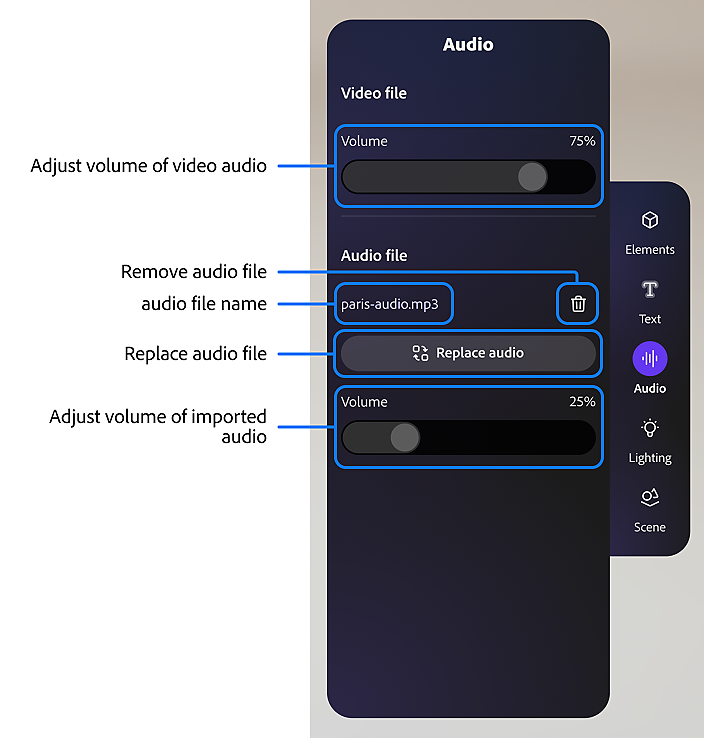
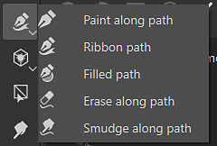
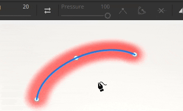
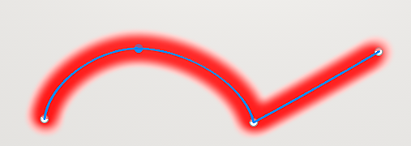
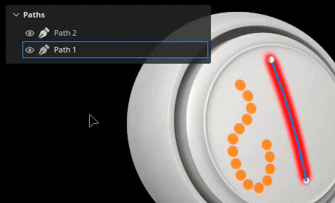

# 路徑工具概述

<table>
<tr style="border: 0;">
<td style="border: 0;" valign="top">

<b>音效</b>

調整或加入你的專案音訊。

* 如果有音訊，請調整原始影片的音量。
* 新增、移除或替換外部音訊檔案。
* 調整外部音訊檔案的音量。

</td>
<td style="border: 0;" valign="top">

</td>
</tr>
</table>

<b>路徑工具</b>允許你定義一條曲線，並在網格表面設置點。曲線建立後，不同的路徑工具允許你沿著曲線創造不同的效果。

## 建立路徑

路徑可以在繪圖層和繪圖效果上建立。 有兩種方式可以存取路徑工具：

* <b>透過介面</b>：從左側進入工具列，點擊倒數第三個圖示。
* <b>透過鍵盤快捷鍵：預設工具沒有指定快捷鍵</b>。 這可以透過在設定選單中編輯「選擇沿路徑繪製工具」的快捷鍵來更改。

選擇工具後，可以在 3D 視口中點擊 3D 模型的表面來放置點。至少需要兩個點（或頂點）才能建立一條路徑。

路徑工具有多種模式，這些模式可能與應用程式中其他可用的繪圖工具相似：

* 沿路徑作畫：沿著定義好的路徑畫一筆規則的筆觸。
* [帶狀路徑](ribbon-tool.md)：沿路徑繪製重複或拉伸的圖像。
* [填滿路徑](filled-path.md)：用均勻顏色填滿路徑內部。
* 沿路徑擦除：畫一條筆劃，沿著定義路徑抹除或移除資訊。
* 沿路徑模糊：畫一條筆劃，沿著定義路徑模糊或模糊資訊。

例如，以下是路徑工具 <b>在污漬</b> 模式下影響其他繪畫資訊：

>[!NOTE]
>
> <b>路徑工具</b>只能在幾何體的表面上使用 3D 空間。目前不支援在 UV 空間或螢幕空間投影中建立路徑。

### 編輯路徑

路徑點（或頂點）會自動附著在網格表面。 它們可以隨時移動和調整。 你可以點擊線上任意位置，為現有路徑新增頂點。 

* 按下 <b>Esc </b>或 <b>Enter </b>會退出路徑版。
* 退出後，點擊網格的空白表面即可開始新路徑。
* 滑鼠移鼠並點擊現有路徑即可選擇該路徑，允許繼續或編輯該路徑。 路徑也可以透過路徑</b>面板重新選擇<b>（見下文）。

有些屬性是針對整體路徑的特有屬性。 這適用於屬性視窗中的<b></b>選項。就像一般筆劃一樣（參見 [繪圖工具文件](paint-brush.md)），可以為路徑定義以下屬性：

* <b>刷子</b>
* <b>阿爾法</b>
* <b>材料</b>

<b>筆刷</b>區塊包含僅在路徑工具中提供的額外選項：

| <b>背景設定</b> | <b>描述</b> |
| --- | --- |
| <b>投影深度</b> | 它決定路徑與網格表面的距離，刷子印記才會出現。 若要直接在視窗中看到這些視覺回饋，可以在路徑顯示設定</b>中<b>啟用<b>法線</b>（見下文）。 |
| <b>上軸</b> | 當 <b>「跟隨路徑</b> 」偏離時，用來定位刷子印章的軸線。 在某些情境下，讓所有印章沿全局軸/方向排列，而不是沿著路徑排列，會更合理。 例如金屬表面上的鉚釘。 |

路徑上的點（頂點）定義了其他性質，例如壓力。 要編輯特定點，只要點擊它（或使用矩形選取）。 然後用上下文工具列編輯選取的點數值。

### 控制切線

有時候平滑的路徑並不理想，可能是因為它沒有跟隨最佳的 3D 模型表面，或是不符合特定的外觀。 為了解決這些問題，可以修改給定頂點的切線。 切線是控制路徑彎曲方向的點。

要在平滑或線性/斷裂切線間切換，只需雙擊頂點（或使用情境工具列中的專用按鈕）：

若要更精確地控制切線的方向，請使用情境工具列中的自訂切線按鈕手動覆寫：

如果移動時還沒切換到切線，可以用 <b>ALT</b> 鍵盤快捷鍵來斷開切線。

使用 <b>CTRL</b> 鍵盤的 Shorcut 同時縮放兩個切線。

>[!NOTE]
>
> 切線控制沿著平面圖定義，並與路徑中給定點的法線對齊。 這表示切線無法在某些方向彎曲。

### 情境工具列

當選擇路徑</b>工具時<b>，<b>情境工具列</b>提供多種設定，讓你可以控制目前所選的路徑：

| <b>參數</b> | <b>描述</b> |
| --- | --- |
| <b>顯示/隱藏視窗介面</b>  

 | 啟用後，路徑和頂點覆蓋層會在視窗中顯示。 |
| <b>顯示設定</b>  

 | 控制路徑視覺回饋的外觀：<ul data-preserve-html="true"> <li data-preserve-html="true"><b>把手大小</b>：控制路徑點的大小。</li> <li data-preserve-html="true"><b>路徑寬度</b>：控制路徑線的厚度。  </li> <li data-preserve-html="true"><b>路徑顏色</b>：控制路徑線的顏色。  </li> <li data-preserve-html="true"><b>未選取路徑顏色</b>：控制非啟用路徑的顏色。  </li> <li data-preserve-html="true"><b>法線：</b>若啟用，請顯示路徑中 eahc 點的投影方向。  </li> <li data-preserve-html="true"><b>切線</b>：若啟用，顯示路徑控制點的曲線方向。  </li> <li data-preserve-html="true"><b>路徑方向</b>：若啟用，請在路徑末端顯示一個小箭頭以指示其繪畫方向。 這有助於了解筆劃內印章的方向。</li> </ul>  

 |
| <b>反向路徑方向</b>  

 | 將當前路徑的方向反轉。 方向定義了在筆劃中繪製郵票的大致方向。 反轉路徑有助於重新調整繪製圖案的方向。 |
| <b>切換角落 / 平滑</b>  

 | 斷開或對齊目前選取頂點的切線，允許在平滑曲線或線性曲線間切換。  

  **注意：**  切換轉角/平滑行為也可以透過雙擊路徑上的某點來完成。 |
| <b>自訂切線</b>  

 | 若啟用，允許手動控制路徑上某點的切線。  

 |
| <b>開啟/關閉路徑</b>  

 | 開啟或關閉目前的路徑。 要關閉路徑，必須先選擇當前路徑的兩個端點之一。  

 |
| <b>刪除頂點</b>  

 | 移除目前選取的路徑頂點。 |
| <b>對稱性</b>  

 | 啟用或關閉目前路徑的對稱性。 更多資訊請參閱 [對稱性文件](../symmetry/symmetry.md) 。  

 |
| <b>隱藏/忽略排除的幾何</b>  

 | 如果啟用，讓目前路徑穿過隱藏幾何體。 更多資訊請參閱 [幾何遮罩文件](../../interface/layer-stack/geometry-mask.md) 。 |

### 路徑面板

>[!NOTE]
>
> 當目前的工具不是路徑工具，或選取填充圖層/資料夾時，面板會被隱藏。

視窗內有<b></b>路徑面板，列出目前所選繪畫圖層/效果的所有路徑。它提供了選擇和管理路徑的簡單方式。

透過此面板，可以：

* 雙擊路徑即可 <b>重新命名</b> 。
* <b>選取路徑後按下刪除鍵即可刪除</b> 。
* <b>用</b>專用鍵盤快捷鍵複製/<b>貼上</b>/<b>複製</b> 路徑。
* <b>用眼睛圖示顯示</b> 或 <b>隱藏</b> 路徑（控制路徑是否套用到貼圖上）。

為了方便起見，也可以右鍵點擊路徑以開啟上下文選單，該選單提供相同的操作：

右鍵選單也會開啟將路徑的屬性或位置複製到另一條路徑上的動作。 這讓功能能輕鬆地在不同路徑間共享或同步：

>[!NOTE]
>
> 複製貼上屬性只有在路徑基於相同繪製工具時才有效。 例如，無法在使用模糊設定的路徑與使用刷子設定的路徑間共享屬性。

## 工具預設

{width="400px"}

當選取路徑工具時，屬性面板頂端會有一個預設區段。 從這裡你可以快速存取各種路徑工具的預設。

### 最愛路徑預設

預設區的「最愛」選項只會保留你收藏的預設，這樣可以更快存取。 要開始新增收藏，請選擇收藏，然後選擇「在資產中顯示相容預設」，即可查看所有可用路徑預設的完整清單。

要收藏預設，請在資產面板或屬性面板的預設區塊中右鍵點擊該預設，然後選擇「新增到收藏夾」。 

你也可以從收藏清單中移除預設。 右鍵點擊「收藏」預設，然後選擇「從收藏夾移除」。

{width="400px"}

### 建立路徑預設

像其他工具一樣，可以建立預設來快速還原筆刷設定/設定。 操作方法是在屬性</b>視窗中右鍵點擊<b>，選擇<b>建立工具預設。</b> 這個新建立的預設會在資產</b>視窗中選擇<b>時自動切換到路徑工具。
