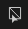

# 多邊形填充

**多邊形填充工具（Polygon Fill**）允許你快速繪製遮罩，方法是將選取的多邊形轉成像素遮罩。它看起來像是其他 3DCC 應用程式的 3D 選取工具，但其實是一個繪色填充工具，能產生像素資料。 也就是說，選擇和取消選取是用來塗成白色或黑色的。

多邊形填充工具在 [繪畫圖層上運作，](../../interface/layer-stack/layer-stack.md) 但僅限於底色，並非為此目的設計。 [只](../../interface/layer-stack/masking-and-effects.md)用來做面罩。

它有四種選擇模式：

* **三角形填充** - 填充單一網格三角形。
* **多邊形填充**——填滿整個多邊形。如果你的網格在匯出時已經三角化，這和三角形填充沒有什麼不同。
* **Mesh Fill** - 填滿整個連接的子網格。 就像 3D 應用程式中的「子物件」模式一樣，會填滿連接到該多邊形的每個多邊形。
* **UV 區塊填充** - 填滿整個 UV 區塊或「島嶼」。 它的運作方式類似 Mesh 填充，但透過觀察連接在 UV 空間中的多邊形。 補水會在紫外線邊界停止。

這四種模式可以組合和切換，聰明的使用方式讓你能快速標記和取消標記遮罩中的區域，使用網格和UV區塊模式。

與多邊形填充工具相關的（預設）快捷鍵有：

* *數字鍵 4* - 選擇多邊形填充工具。
* *X* - 在繪製遮罩時反轉當前顏色。 我會很快把黑色換成白色。 在材質塗裝模式下，這個快捷鍵沒有效果。
