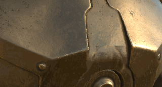

# 投射

{width="50px"}

投影是一種工具，允許透過投影在螢幕/視窗空間中來繪製材質。 它與模板共享類似的控制方式。

可透過按下 **快捷鍵 S** 來編輯投影變換：

* 用 **S + 左鍵點擊** 來旋轉模板。
* 用 **S + 左鍵點擊 + SHIFT** 鍵來吸附/限制模板的旋轉。
* 用 **S + 右鍵點擊** 來放大/縮放模板。
* 使用 **S + 中鍵** 點擊來翻譯模板。

<table>
<tr style="border: 0;">
<td style="border: 0;" valign="top">

</td>
<td style="border: 0;" valign="top">

</td>
<td style="border: 0;" valign="top">

</td>
</tr>
</table>

* **投影** ：基於螢幕空間投影的繪畫工具。 此工具會在視窗上顯示並重複一個圖案。
* **物理投影** ：基於粒子預設的物理屬性投影繪畫工具。
