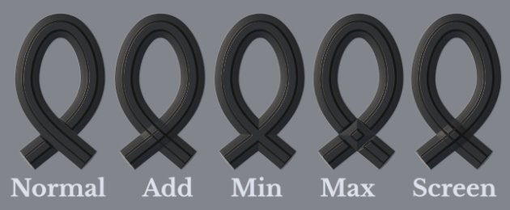

# 帶狀路徑

<b>Ribbon </b>路徑工具允許你在 3D 模型表面的點所定義的曲線上創造變形圖案。色帶也可以用來沿著曲線書寫文字。

可從工具列的路徑工具選單中選擇色帶工具：

或者透過 <b>路徑類型</b> 按鈕：

## 概觀

Ribbon 路徑工具與 Paint Along Path 工具不同，因為它繪製圖像和材質的方式不同。

使用繪畫/筆刷工具時，圖像會在路徑上重複多次，而在色帶工具中，圖像會沿著路徑重複並變形以符合路徑的曲線。 畫筆的單一組成部分稱為 <b>印章</b>，而緞帶中的部分稱為 <b>補丁</b>。

## 設定

### 大小

| 參數 | 說明 |
| --- | --- |
| <b>筆劃寬度</b> | 控制當前行程的全域寬度。 |

### 不透明度

| 參數 | 說明 |
| --- | --- |
| <b>筆劃不透明度</b> | 控制當前筆觸的最終不透明度。 |

### 中風

| 參數 | 說明 |
| --- | --- |
| <b>影像取向</b> | 定義輸入影像的方向。 這個方向控制影像在路徑上的擺放方式。 |
| <b>翻轉影像</b> | 將影像沿著路徑的軸/寬度翻轉。 |
| <b>角落</b> | 定義銳角（分裂切線）應該如何呈現在路徑上。 可能的行為包括：<ul data-preserve-html="true"> <li data-preserve-html="true"><b>斜接接頭</b>：尖銳/尖角</li> <li data-preserve-html="true"><b>圓接縫</b>：平滑/圓角</li> <li data-preserve-html="true"><b>斜角接合</b>：方角/平面角</li> <li data-preserve-html="true"><b>切割連接</b>：重新開始這條路。 此模式會創建一條新的路徑，並設有專屬的起終區段。</li> </ul>以下是角落的外觀，依序排列：  

 |
| <b>省略在關閉時結束</b> | 若啟用，當路徑關閉以形成連續迴圈時，起始/結束區段將被移除。 這適用於拉伸偏移和動態筆觸。 |

### 拉伸與鋪磚

色帶路徑可以使用兩種不同模式來控制影像在路徑上的重複與拉伸：

* <b>沿路徑</b>拉伸：（預設）沿路徑重複的影像會被拉伸以符合路徑長度
* <b>保持長寬比</b>：沿路徑重複的影像會保留其長寬比。 如果影像相對於路徑太長，就會被裁切。

#### 沿著小徑延伸

| 參數 | 說明 |
| --- | --- |
| <b>僅在偏移之間拉伸</b> | 啟用時，可以保留影像的起始和結尾部分，同時拉伸中間。 使用 <b>開始偏移</b> 和 <b>結束偏移</b> 參數來定義這些區段的大小。 中間部分會根據起點/結束自動計算。  

 |
| <b>平鋪模式</b> | 定義影像如何在路徑上重複出現。 可能的數值包括：<ul data-preserve-html="true"> <li data-preserve-html="true"><b>無</b>：該影像不會重複。 它將沿著整條路徑延伸。</li> <li data-preserve-html="true"><b>自動</b>：（預設）根據圖片大小和筆劃寬度自動重複一定次數。</li> <li data-preserve-html="true"><b>自訂</b>：影像依據鋪片量</b>參數定義<b>的次數重複。</li> </ul> |
| <b>鋪磚量</b> | 指定一張圖片在自訂</b>平鋪模式中重複<b>的次數。 |
| <b>每隔兩格鏡像一次</b> | 每隔一次重複，將路徑長度上的影像翻轉。 |
| <b>寬高比因子</b> | 拉伸或壓縮當前影像的畫面比例。 |

#### 保持長寬比

| 參數 | 說明 |
| --- | --- |
| <b>比率</b> | 定義如何在保持比例的情況下縮放影像：<ul data-preserve-html="true"> <li data-preserve-html="true"><b>擬合路徑寬度</b>：（預設）將影像縮放到路徑寬度。 如果畫面太長，可能會導致畫面被裁切。</li> <li data-preserve-html="true"><b>擬合路徑長度</b>：調整影像尺寸，使路徑上能精確排列數量，同時大致保持長寬比。</li> </ul> |
| <b>移除被夾斷的磁磚</b> | 啟用後，會移除路徑上無法完全顯示的重複（如果是裁切的）。 若 <b>Ratio 設定為 <b>Fit to 路徑長度</b>，此設定</b>將被禁用。 |
| <b>平鋪模式</b> | 定義影像如何在路徑上重複出現。 可能的數值包括：<ul data-preserve-html="true"> <li data-preserve-html="true"><b>無</b>：該影像不會重複。 它將沿著整條路徑延伸。</li> <li data-preserve-html="true"><b>自動</b>：（預設）根據圖片大小和筆劃寬度自動重複一定次數。</li> <li data-preserve-html="true"><b>自訂</b>：影像依據鋪片量</b>參數定義<b>的次數重複。</li> </ul> |
| <b>每隔兩格鏡像一次</b> | 每隔一次重複，將路徑長度上的影像翻轉。 |
| <b>路線</b> | 定義影像應該從路徑上開始的位置。 可能的數值包括：<ul data-preserve-html="true"> <li data-preserve-html="true"><b>起始</b>對齊：影像從路徑上的第一個點開始繪製。</li> <li data-preserve-html="true"><b>對齊</b>中心：影像繪製在路徑中央。</li> <li data-preserve-html="true"><b>對齊到終</b>點：影像從路徑上的最後一點開始繪製。</li> </ul> |
| <b>寬高比因子</b> | 拉伸或壓縮當前影像的畫面比例。 |

### 通道混合

此區塊控制路徑重疊時的混合結果。

| 參數 | 說明 |
| --- | --- |
| <b>阿爾法</b> | 控制 Alpha</b> 區段在<b>重疊區域的混合方式，這會影響其他通道的混合強度。可能的數值包括：<ul data-preserve-html="true"> <li data-preserve-html="true"><b>一般</b>：使用最頂層段的 alpha。</li> <li data-preserve-html="true"><b>Lighten （Max）：</b>（預設）使用最大 alpha 值，保留最不透明的區段。</li> <li data-preserve-html="true"><b>線性閃避（加法）：</b>將各段的 alpha 相加，使其累積，從而產生更飽和的值。</li> </ul> |
| <b>正常</b> | 定義法線</b>通道在路徑重疊區域的<b>混合方式。可能的數值包括：<ul data-preserve-html="true"> <li data-preserve-html="true"><b>一般</b>：使用最頂端段的結果。</li> <li data-preserve-html="true"><b>法線貼圖合併</b>：（預設）以相同強度合併這些區段。</li> <li data-preserve-html="true"><b>法線貼圖細節</b>：將最上方的部分視為額外細節，而下方區域則保留其強度。</li> </ul>此設定與 <b>整層定義的法線</b> 混合模式不同，後者是在路徑自身自我重疊混合後套用。 <b>注意</b>：若通道顏色均勻，此設定將被禁用。 它僅相容於點陣圖和 Substance 資源。 |
| <b>高度</b> | 定義 Height</b> 通道在路徑重疊區域的<b>混合方式。可能的數值包括：<ul data-preserve-html="true"> <li data-preserve-html="true"><b>一般</b>：使用最頂端段的結果。</li> <li data-preserve-html="true"><b>線性閃避（Add）：</b>將片段相加，同時保留其原始強度。</li> <li data-preserve-html="true"><b>變暗（最小值）：</b>只保留重疊區段中最暗/最低的值。</li> <li data-preserve-html="true"><b>Light（Max）：</b>（預設）保留重疊區段中最輕或最高的值。</li> <li data-preserve-html="true"><b>螢幕</b>：類似 <b>線性Doge</b>，但畫面飽和度較低。</li> </ul>此設定與<b>整個圖層定義的高度</b>混合模式是分開的，後者是在路徑自身自我重疊混合後套用。 <b>注意</b>：若通道顏色均勻，此設定將被禁用。 它僅相容於點陣圖和 Substance 資源。 |

與高度通道混合模式的範例：

## 文字與非方形影像

當使用 [文字資源](../text-resource.md)或非正方形長寬比的圖片時，畫面會自動縮放以符合排頁路徑。

這種行為使得文字或重複圖像如修剪圖案等路徑成為可能。

