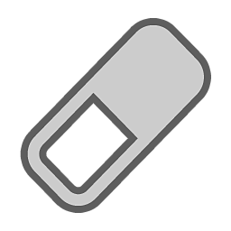
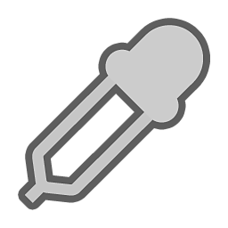

# 工具清單

本頁詳細介紹所有可用的繪畫工具及其使用方法。

| *工具* | *描述* |
| --- | --- |
| 

 | [Paint 工具](paint-brush.md)允許你在網格上用特定材質的筆觸。 |
| 

 | [橡皮擦](eraser.md)可以讓你移除任何現有的油漆資訊。 |
|  | [路徑工具](path.md) 允許你沿著模型表面定義一條曲線，可以創造幾種不同的效果。 可以加上筆觸、擦除顏料、模糊，甚至在路徑上加上完整的細節，比如拉鍊或裂縫。 |
| 

 | [投影](projection.md) 允許你套用對齊當前視角的材質或材質。 |
| 

 | [多邊形填充](polygon-fill.md) 允許你在 3D 網格上選擇多邊形，根據幾何體建立遮罩。 |
| 

 | [Smudge 工具](smudge-tool.md)可以拉伸、混合和模糊顏色及其他材質屬性。 |
| 

 | [Clone 工具](clone-tool.md)允許你複製或修補 3D 網格上現有材質的任何部分。 |
| 

 | 材質選擇器允許你從 3D 網格的表面複製專案中的材質屬性。  這是暫時的工具;一旦選定顏色，就會裝備上一個工具。 |
|  | [快速遮罩](quick-mask.md) 讓你能建立臨時遮罩，讓你更精確地控制塗色的位置。 |
