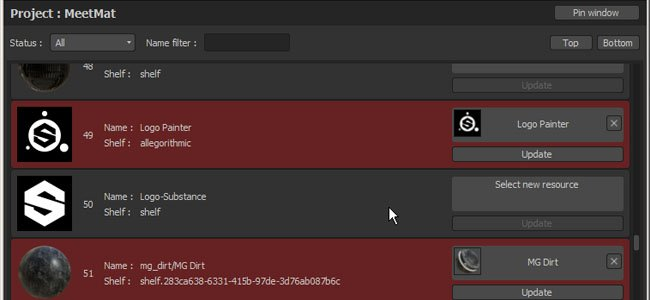
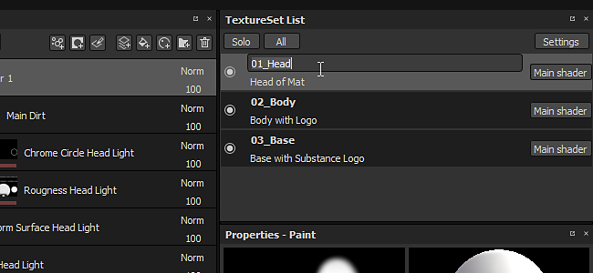
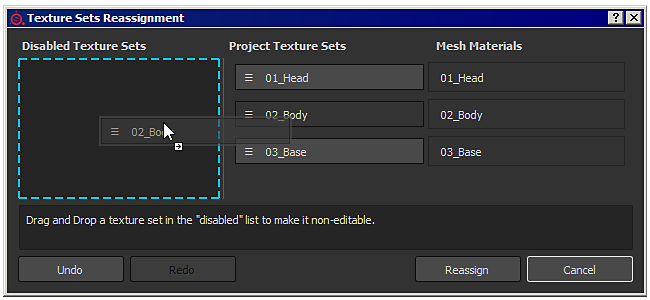

# 版本 2.6

在 Substance Painter 2.6 **中**，我們的重點是提供一種直接在 Substance Painter 內部管理材質集的方法，而不必重新建立專案或重新匯入包含更新材質名稱的網格。我們也希望提供一種更新專案中使用資源的方式，這是過去常被要求的功能。

上映日期： *2017年4月27日*

## 主要特色

### 全新範例專案「Meet Mat」

這個新的範例專案帶來了一個全新閃亮又可愛的角色，名叫「**Mat**」。 它包含三個貼圖集，準備上色。\
參加 **「Meet Mat** 」比賽，贏取一些超酷的獎品： <https://www.allegorithmic.com/contest/meet-mat-2017-substance-3d-painting-contest>

### 新的腳本 API 具備更新專案資源的能力

Substance Painter 的腳本 API 已改進，新增功能，允許 **以其他版本替換專案中的資源** 。 為了展示這項新功能，新增了一個 **用腳本 API 建立的外掛** ，允許瀏覽特定專案中包含的所有資源。 標示為紅色的資源會被偵測為「過時」，並可自動替換。 這個功能不僅限於「過時」的資源，任何資產都可以被其他東西取代。 這帶來了許多新的可能性，也更展現了 Substance Painter 作為 **一種非破壞性繪畫工具** 的本質！

這個 **外掛** 可以在 GitHub 上使用，如果你看到潛在改進，請隨時幫忙： <https://github.com/AllegorithmicSAS/painter-plugin-resources-updater>

### 新增重新命名與重新指派貼圖集的能力

現在可以直接在 Substance Painter 中更改材質集的名稱。 重新命名材質集會影響匯出到光碟上的材質名稱（視所使用的匯出預設而定）。\
要重新命名材質集，只需雙擊其名稱即可修改，或使用右鍵開啟右鍵選單。 也可以加入自訂描述，提供更多關於貼圖集功能的資訊。 這在做 [UDIM 專案](https://helpx.adobe.com/substance-3d/unlisted/documentation/spdoc/uv-tile-udim-legacy-144310352.html)時非常有幫助。 使用「**設定**」按鈕來設定描述在列表中的顯示方式。

貼圖集現在可以重新分配到不同的網格材質。 這表示你可以&#x200B;**恢復**&#x200B;先前因網格缺失而停用的貼圖集，甚至&#x200B;****&#x200B;交換材質集。只要在貼圖集清單視窗中點選新的「**設定**」按鈕，然後點選「**重新分配貼圖集**」條目即可。 它會開啟一個專門管理材質集及其與網格材質連結的新視窗。 管理可以透過拖放&#x200B;**材質集名稱到你想要的位置來完成**。

## 教學

我們最新的影片教學中涵蓋了這些新功能：

## 發行說明

### 2.6.2

（2017年10月20日發行）

**新增：**

* [貼圖集]允許刪除已停用的貼圖集
* [書架]允許多個使用者在同一書架資料夾中書寫
* [腳本]能夠重新載入插件資料夾
* [腳本]在外掛元資料中加入所需的最低 API 版本以確保相容性
* [IRay]匯出影像對話改進

**已修正：**

* [引擎]改變解析度時（4K>2K）行程消失的問題
* [烘焙師]啟用「按姓名配對」時，ID 地圖烘焙失敗
* [貝克]錯誤訊息不夠明確
* [3D 視圖]切空間與 baker 不同步
* [工具]使用污漬工具時出現黑色瑕疵
* [著色器]非 PBR 著色器已經無法運作了
* [著色器]「PBR塗層」已經破碎
* [著色器]塗層「pbr 塗層」著色器的粗糙度已經不影響了
* [著色器]Spec Gloss 著色器不匹配 Iray 和 SD
* [書架]載入兩個同名但副檔名不同的檔案時會當機
* [書架]書架裡的預設已經無法再編輯了
* [書架]無法為書架中匯入的資產設定自訂預覽
* 從快取載入的資源會失去使用量
* 在建立範本前儲存專案會回傳寫入權限錯誤
* 如果檔名包含兩個週期，則是錯誤的專案儲存
* 匯入多點檔案（.） 檔名會造成問題

### 2.6.1

（2017年5月12日發行）

**新增：**

* [TextureSet]不要允許將網格材質重新分配到零

**已修正：**

* 更換烘焙貼圖後切換 TextureSet 時會當機
* 在更換圖層混合模式後，執行「復原與重做」時會當機
* 使用「色彩選擇」效果搭配大 ID 映射時會當機或凍結
* [匯出]重新命名的貼圖集在匯出視窗中並未按字母順序排序
* [材質集]重置為預設名稱不會檢查統一性
* [TextureSet]重新命名的材質集在重新開啟專案後會被停用
* [書架]缺少預設範本內容
* [書架]非正方形的貼圖會以正方形形式顯示
* [著色器]一旦一個貼圖集被停用，相關的著色器就會被摧毀
* [腳本] alg.baking.setTextureSetBakingParameters（） 不再運作了
* [腳本]websocket 教學中錯字
* [腳本操作]AlgWidgets 中的各種問題
* [日誌]在某些情況下，虛擬記憶體的偵測不正確

### 2.6.0

（2017年4月27日發行）

**新增** ：

* 新增範例專案「Meet Mat」
* [外掛]全新「資源更新器」外掛
* [紋理集]允許重新命名並新增紋理集的描述
* [TextureSet]允許重新指派材質
* [TextureSet]在材質集列表視窗中新增設定按鈕
* [TextureSet]在列表底部顯示「停用」的材質集
* [Substance]使用目前材質集解析度的額外貼圖來提升效能
* [腳本]允許更新專案中使用的資源（材料、產生器等）
* [腳本]新增/移除書架
* [腳本操作]允許從專案中的資源查詢資訊
* [腳本操作]允許檢索可用書架清單
* [腳本操作]改進 AlgWidget 縮圖教學
* [匯出]根據檔案格式支援，啟用/啟用位元深度
* [日誌]新增插件名稱以在主控台列印
* [日誌]移除關於隱藏材質集的錯誤
* 更新「歡迎畫面」，加入新的圖示和文字範例

**已修正** ：

* 在特定專案更新網格時會當機
* [觀察窗]對稱平面內色已不再可見
* [視窗]使用單人視角時會啟用部分後製效果
* [著色器]「over\_premult」的混合效果不好
* [著色器]關於使用預設著色器進行 alpha 測試的警告
* [書架]Substances 標籤的錯誤解析
* [書架]MatFX 防鏽老化功能無法正常運作
* [Shelf]HSL 濾鏡預設在錯誤頻道啟用
* [書架]Sharpen 預設在 Height/Normal 頻道啟用
* [匯出]Vray 匯出預設不使用 OpenGL 法線貼圖
* [工具]複製/污漬工具的不精確問題會產生雜訊
